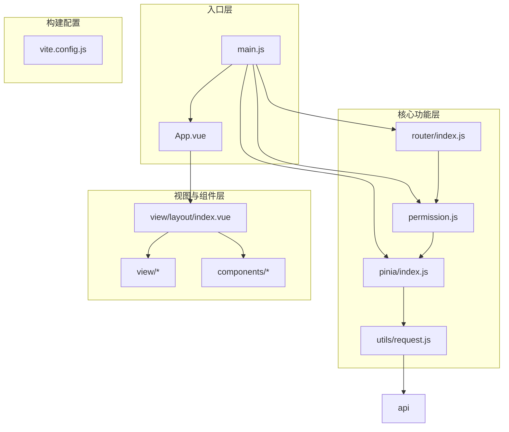
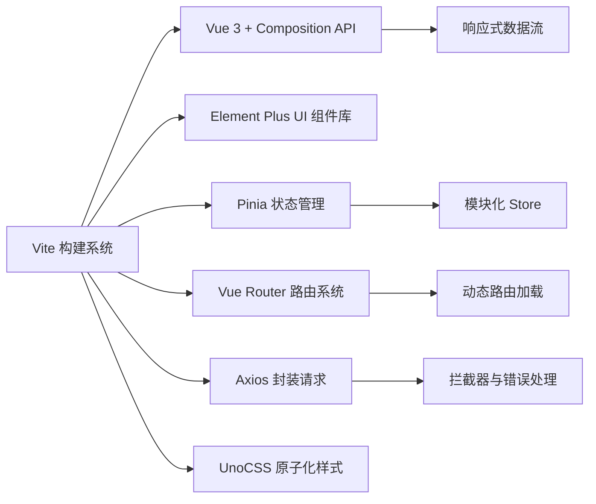
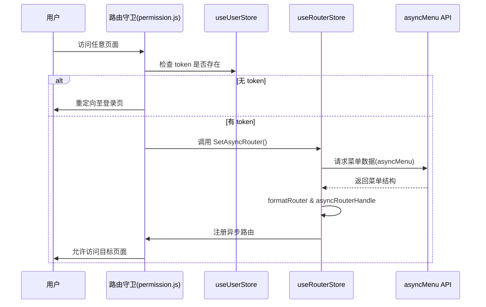
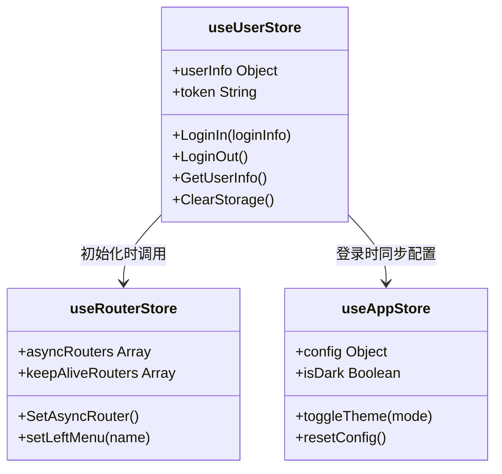
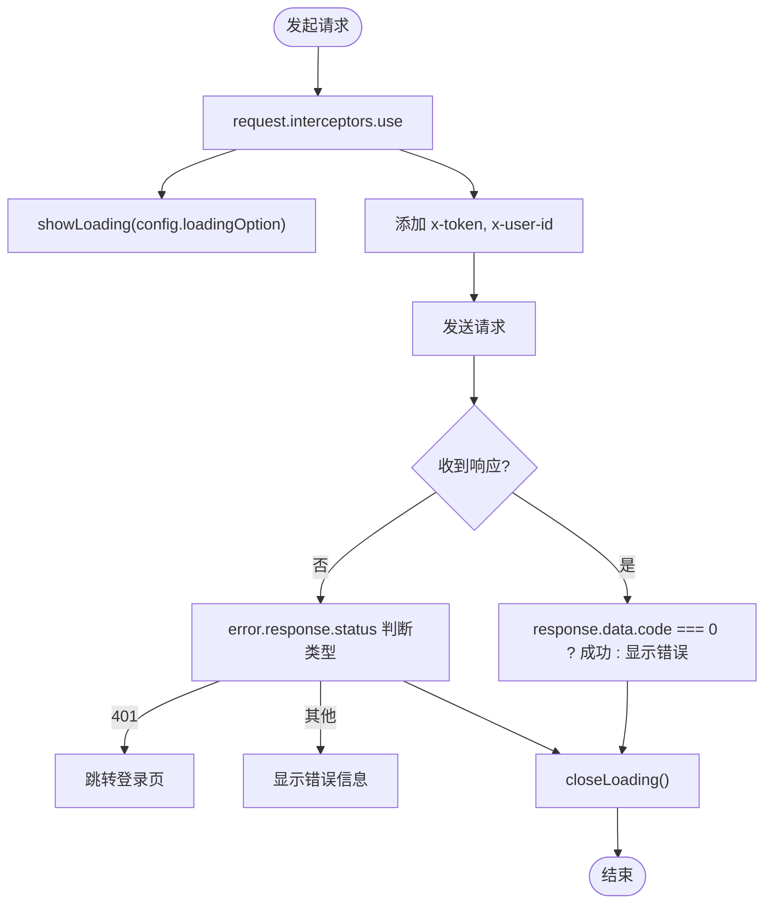

# 前端架构

<cite>
**本文档中引用的文件**  
- [main.js](file://web/src/main.js)
- [App.vue](file://web/src/App.vue)
- [router/index.js](file://web/src/router/index.js)
- [permission.js](file://web/src/permission.js)
- [pinia/index.js](file://web/src/pinia/index.js)
- [pinia/modules/user.js](file://web/src/pinia/modules/user.js)
- [pinia/modules/app.js](file://web/src/pinia/modules/app.js)
- [pinia/modules/router.js](file://web/src/pinia/modules/router.js)
- [utils/request.js](file://web/src/utils/request.js)
- [utils/asyncRouter.js](file://web/src/utils/asyncRouter.js)
- [view/layout/index.vue](file://web/src/view/layout/index.vue)
- [components/application/index.vue](file://web/src/components/application/index.vue)
- [vite.config.js](file://web/src/vite.config.js)
</cite>

## 目录
1. [介绍](#介绍)
2. [项目结构](#项目结构)
3. [核心组件](#核心组件)
4. [架构概览](#架构概览)
5. [详细组件分析](#详细组件分析)
6. [依赖分析](#依赖分析)
7. [性能考虑](#性能考虑)
8. [故障排除指南](#故障排除指南)
9. [结论](#结论)

## 介绍
gin-vue-admin 是一个基于 Vue 3 和 Vite 构建的现代化前端管理框架，旨在提供高效、可扩展的企业级后台管理系统解决方案。本项目采用模块化设计思想，结合 Pinia 进行状态管理，使用动态路由和权限控制实现灵活的页面访问机制，并通过封装 API 客户端提升开发效率与代码可维护性。整体架构注重用户体验与系统性能，在响应式布局、主题切换、懒加载等方面进行了深度优化。

## 项目结构
gin-vue-admin 的前端工程遵循清晰的功能划分原则，主要目录包括 `api`（接口定义）、`components`（通用组件）、`pinia`（状态管理模块）、`router`（路由配置）、`utils`（工具函数）、`view`（视图页面）等。这种分层结构有助于团队协作开发，提升代码组织性和可读性。

**Diagram sources**
- [main.js](file://web/src/main.js#L1-L23)
- [App.vue](file://web/src/App.vue#L1-L44)
- [router/index.js](file://web/src/router/index.js#L1-L42)
- [permission.js](file://web/src/permission.js#L1-L148)
- [pinia/index.js](file://web/src/pinia/index.js#L1-L9)
- [utils/request.js](file://web/src/utils/request.js#L1-L203)
- [view/layout/index.vue](file://web/src/view/layout/index.vue#L1-L115)
- [vite.config.js](file://web/src/vite.config.js#L1-L122)

**Section sources**
- [main.js](file://web/src/main.js#L1-L23)
- [App.vue](file://web/src/App.vue#L1-L44)
- [vite.config.js](file://web/src/vite.config.js#L1-L122)

## 核心组件

### 入口文件：main.js
`main.js` 是应用的启动入口，负责初始化 Vue 实例并挂载核心插件，如 Element Plus、Pinia 状态管理、自定义指令及路由系统。它通过引入 `gin-vue-admin` 初始化逻辑完成全局配置加载。

**Section sources**
- [main.js](file://web/src/main.js#L1-L23)

### 根组件：App.vue
`App.vue` 作为根组件，包裹整个应用界面，使用 `<router-view />` 渲染当前路由对应的视图，并注入全局应用组件 `Application` 处理错误提示。

**Section sources**
- [App.vue](file://web/src/App.vue#L1-L44)

## 架构概览

### 工程化结构
项目基于 Vite 构建，利用其高速热更新和按需编译特性提升开发体验。`vite.config.js` 配置了别名、代理、SVG 自动导入、UnoCSS 支持等功能，支持多环境变量管理与生产构建优化。

**Diagram sources**
- [vite.config.js](file://web/src/vite.config.js#L1-L122)
- [main.js](file://web/src/main.js#L1-L23)

## 详细组件分析

### 路由系统分析
路由系统采用静态+动态混合模式。初始路由在 `router/index.js` 中定义登录、初始化等白名单页面；真实业务路由由后端返回并通过 `permission.js` 中的守卫机制动态注册。

#### 动态路由加载流程

**Diagram sources**
- [permission.js](file://web/src/permission.js#L1-L148)
- [pinia/modules/router.js](file://web/src/pinia/modules/router.js#L1-L184)
- [utils/asyncRouter.js](file://web/src/utils/asyncRouter.js#L1-L30)

**Section sources**
- [permission.js](file://web/src/permission.js#L1-L148)
- [pinia/modules/router.js](file://web/src/pinia/modules/router.js#L1-L184)

### 权限路由过滤机制
通过 `WHITE_LIST` 白名单机制区分无需登录即可访问的页面（如登录页）。对于需要认证的页面，检查用户 Token 和角色权限，若未获取过动态路由则触发拉取流程。同时支持默认首页跳转与失效保护。

**Section sources**
- [permission.js](file://web/src/permission.js#L1-L148)

### 状态管理（Pinia）
采用模块化方式组织状态，主要包括：
- `user`: 用户信息、Token、登录登出逻辑
- `app`: 应用配置（主题、布局、动画等）
- `router`: 异步路由、菜单结构、KeepAlive 缓存列表

各模块独立封装，便于维护和测试。

#### Pinia 模块关系图

**Diagram sources**
- [pinia/modules/user.js](file://web/src/pinia/modules/user.js#L1-L153)
- [pinia/modules/app.js](file://web/src/pinia/modules/app.js#L1-L156)
- [pinia/modules/router.js](file://web/src/pinia/modules/router.js#L1-L184)

**Section sources**
- [pinia/index.js](file://web/src/pinia/index.js#L1-L9)
- [pinia/modules/user.js](file://web/src/pinia/modules/user.js#L1-L153)
- [pinia/modules/app.js](file://web/src/pinia/modules/app.js#L1-L156)

### API 客户端封装
`utils/request.js` 基于 Axios 封装统一请求客户端，具备以下特性：
- 自动携带 Token 和用户 ID
- 请求/响应拦截器处理加载状态
- 错误统一捕获并提示
- 支持不显示 Loading 的特殊请求
- 超时自动关闭 Loading 防止卡死

#### 请求拦截流程

**Diagram sources**
- [utils/request.js](file://web/src/utils/request.js#L1-L203)

**Section sources**
- [utils/request.js](file://web/src/utils/request.js#L1-L203)

