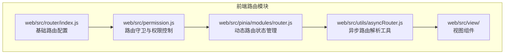
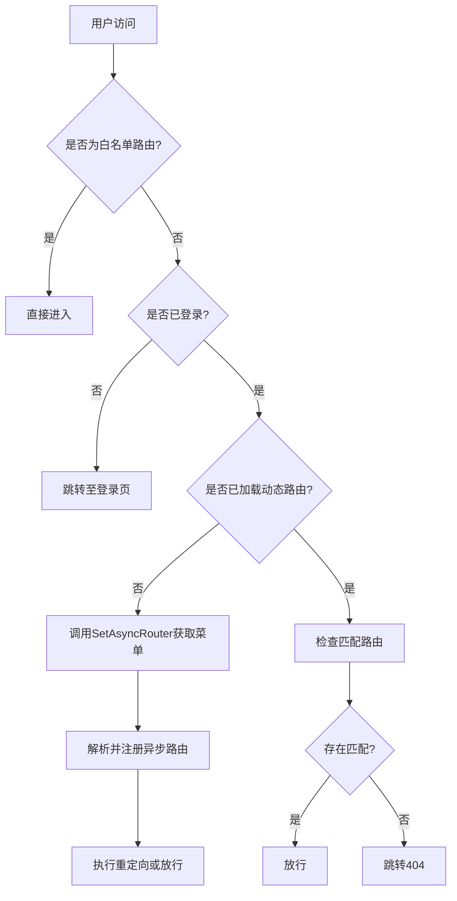
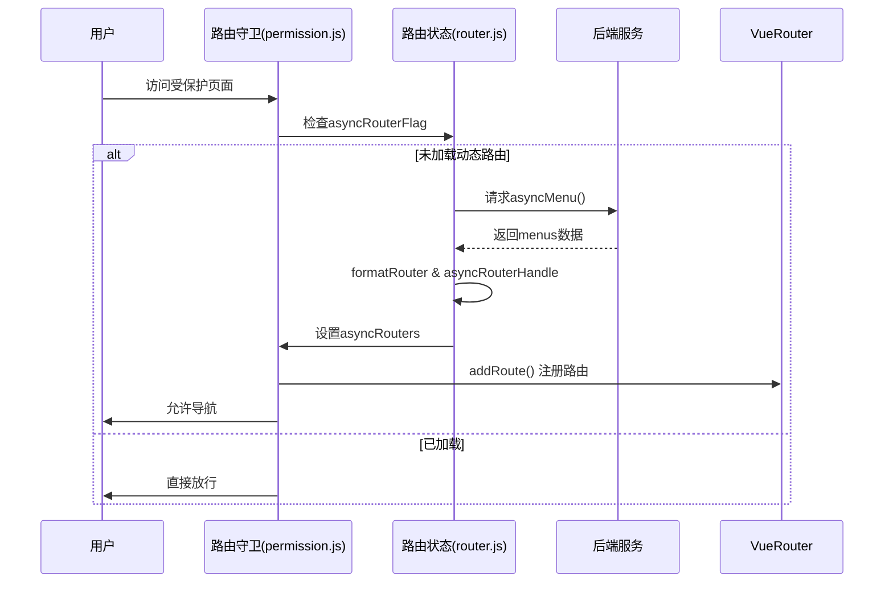
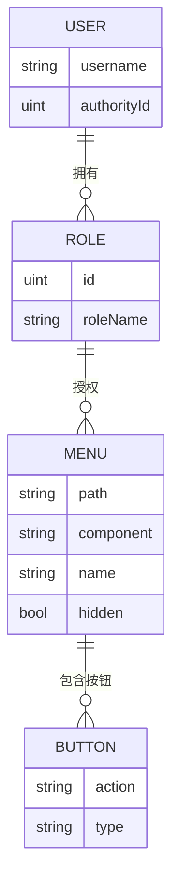
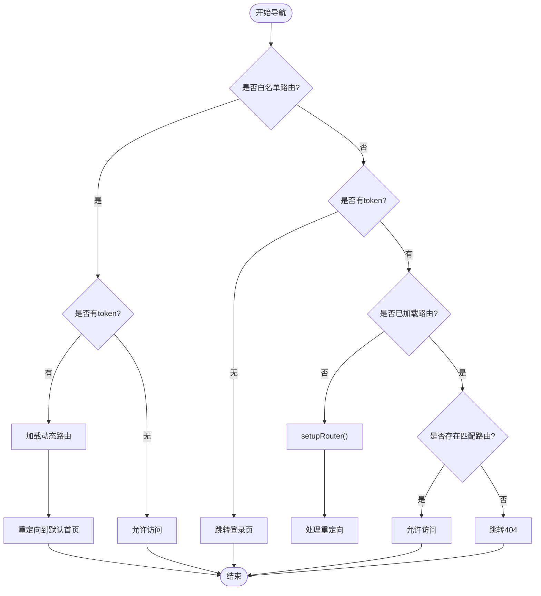

# 前端路由系统

<cite>
**本文档中引用的文件**  
- [index.js](file://web/src/router/index.js)
- [permission.js](file://web/src/permission.js)
- [asyncRouter.js](file://web/src/utils/asyncRouter.js)
- [router.js](file://web/src/pinia/modules/router.js)
- [menu.go](file://server/source/system/menu.go)
</cite>

## 目录
1. [简介](#简介)
2. [项目结构](#项目结构)
3. [核心组件](#核心组件)
4. [架构概述](#架构概述)
5. [详细组件分析](#详细组件分析)
6. [依赖分析](#依赖分析)
7. [性能考虑](#性能考虑)
8. [故障排除指南](#故障排除指南)
9. [结论](#结论)

## 简介
gin-vue-admin 是一个基于 Vue 3 和 Pinia 的现代化前端管理系统,其路由系统采用 Vue Router 实现动态权限控制。本系统通过用户角色和菜单权限动态生成可访问的路由列表,并结合路由守卫实现登录验证、页面重定向及无权限处理机制。整个流程从用户登录开始,经过后端返回菜单数据,前端解析并注册异步路由,最终完成菜单渲染与页面加载。

## 项目结构
前端路由相关代码主要集中在 `web/src` 目录下,涉及路由定义、权限控制、状态管理和异步加载逻辑。



**Diagram sources**
- [index.js](file://web/src/router/index.js#L1-L40)
- [permission.js](file://web/src/permission.js#L1-L147)
- [router.js](file://web/src/pinia/modules/router.js#L1-L183)
- [asyncRouter.js](file://web/src/utils/asyncRouter.js#L1-L29)

**Section sources**
- [index.js](file://web/src/router/index.js#L1-L40)
- [permission.js](file://web/src/permission.js#L1-L147)

## 核心组件
系统通过组合使用 Vue Router、Pinia 和自定义工具函数实现完整的权限路由体系。核心包括:静态路由配置、动态路由加载、权限过滤逻辑、路由元信息(meta)解析以及组件懒加载机制。

**Section sources**
- [index.js](file://web/src/router/index.js#L1-L40)
- [asyncRouter.js](file://web/src/utils/asyncRouter.js#L1-L29)
- [router.js](file://web/src/pinia/modules/router.js#L1-L183)

## 架构概述
整体路由架构分为三层:基础路由层、权限控制层和动态路由管理层。基础路由包含登录、初始化等公共页面；权限控制层通过路由守卫拦截导航请求；动态路由管理层则负责从后端获取菜单数据并构建用户专属路由表。



**Diagram sources**
- [permission.js](file://web/src/permission.js#L1-L147)
- [router.js](file://web/src/pinia/modules/router.js#L1-L183)

## 详细组件分析

### 动态路由加载机制
系统通过 `SetAsyncRouter` 方法从后端 `/api/v1/menu` 接口获取当前用户有权访问的菜单列表,并将其转换为 Vue Router 可识别的路由对象数组。

#### 路由数据流图


**Diagram sources**
- [permission.js](file://web/src/permission.js#L50-L140)
- [router.js](file://web/src/pinia/modules/router.js#L100-L180)

### 权限路由过滤逻辑
权限过滤在前端通过用户角色与菜单权限映射完成。后端根据用户所属角色查询关联菜单,前端仅渲染这些菜单对应的路由。

#### 菜单权限模型


**Diagram sources**
- [menu.go](file://server/source/system/menu.go#L53-L64)
- [sys_base_menu.go](file://server/model/system/sys_base_menu.go#L1-L40)

### 路由守卫作用分析
路由守卫(Navigation Guards)是权限控制的核心环节,主要在 `beforeEach` 钩子中实现。

#### 守卫执行流程


**Diagram sources**
- [permission.js](file://web/src/permission.js#L70-L130)

### 路由配置与 meta 字段用途
所有动态路由均携带 `meta` 字段用于控制界面行为和展示信息。

| meta字段 | 类型 | 说明 |
|---------|------|------|
| title | string | 页面标题,用于浏览器标签和面包屑 |
| icon | string | 菜单图标名称,对应 Element Plus 图标库 |
| keepAlive | boolean | 是否启用缓存,true时组件状态保留 |
| hidden | boolean | 是否在侧边栏隐藏该菜单项 |
| closeTab | boolean | 是否自动关闭tab页签 |
| defaultMenu | boolean | 是否为基础默认菜单 |

**Section sources**
- [menu.go](file://server/source/system/menu.go#L53-L64)
- [sys_base_menu.go](file://server/model/system/sys_base_menu.go#L22-L42)

### 异步路由解析流程
异步路由解析由 `asyncRouterHandle` 函数完成,它将字符串形式的组件路径转换为动态导入函数。

```mermaid
flowchart TD
    Input["输入路由数组<br/>(含字符串component)"] --> Loop{遍历每个路由}
    Loop --> HasComponent{"存在component字段?"}
    HasComponent -->|否| Next["继续下一个"]
    HasComponent -->|是| IsString{"component为字符串?"}
    IsString -->|否| Next
    IsString -->|是| SetPath["设置meta.path"]
    SetPath --> IsView{"属于view目录?"}
    IsView -->|是| ImportView["dynamicImport(viewModules)"]
    IsView -->|否| IsPlugin{"属于plugin目录?"}
    IsPlugin -->|是| ImportPlugin["dynamicImport(pluginModules)"]
    IsPlugin -->|否| Warn["警告:未知组件类型"]
    ImportView --> CheckChildren{"有子路由?"}
    ImportPlugin --> CheckChildren
    CheckChildren -->|是| Recurse["递归处理children"]
    CheckChildren -->|否| Next
    Next --> EndLoop{"遍历结束?"}
    EndLoop -->|