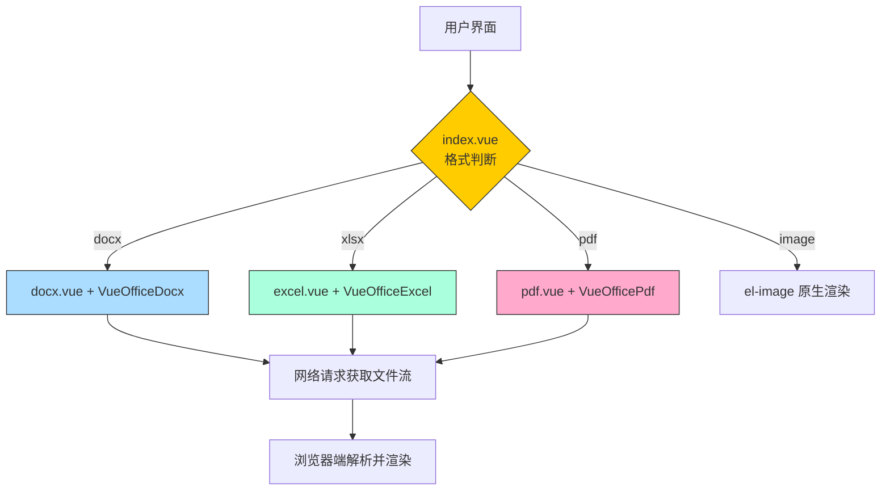
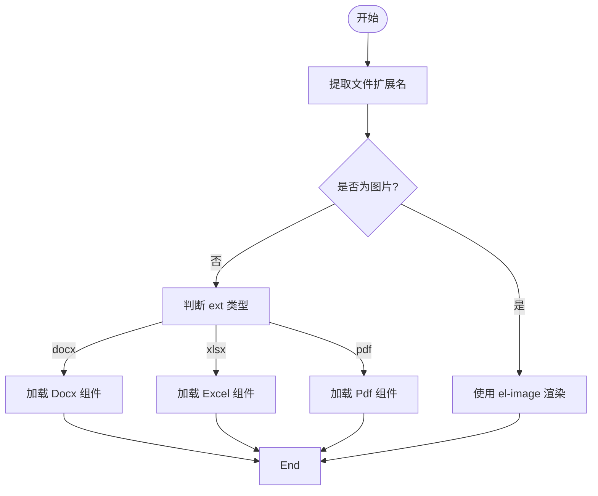

# Office文档预览组件

<cite>
**本文档引用的文件**  
- [docx.vue](file://web/src/components/office/docx.vue)
- [excel.vue](file://web/src/components/office/excel.vue)
- [pdf.vue](file://web/src/components/office/pdf.vue)
- [index.vue](file://web/src/components/office/index.vue)
- [openDocument.js](file://web/openDocument.js)
- [package.json](file://web/package.json)
</cite>

## 目录
1. [简介](#简介)
2. [项目结构](#项目结构)
3. [核心组件](#核心组件)
4. [架构概览](#架构概览)
5. [详细组件分析](#详细组件分析)
6. [依赖分析](#依赖分析)
7. [性能考虑](#性能考虑)
8. [故障排除指南](#故障排除指南)
9. [结论](#结论)

## 简介
本系统提供了一套完整的Office文档在线预览解决方案,支持Word(.docx)、Excel(.xlsx)和PDF(.pdf)格式的文件预览。通过统一的入口组件`index.vue`,结合VueOffice系列第三方库进行封装,实现了不同格式文档的自动识别与渲染。同时,系统集成了错误处理、资源加载控制等机制,确保预览功能的稳定性和用户体验。

## 项目结构
该预览功能位于前端项目的`components/office`目录下,包含多个独立的Vue组件,分别用于处理不同类型的文档格式,并由一个统一的入口组件协调调度。

```mermaid
graph TB
subgraph "Office预览组件"
Index[index.vue<br/>主入口]
Docx[docx.vue<br/>Word预览]
Excel[excel.vue<br/>Excel预览]
Pdf[pdf.vue<br/>PDF预览]
end
Index --> Docx : "ext === 'docx'"
Index --> Excel : "ext === 'xlsx'"
Index --> Pdf : "ext === 'pdf'"
Index --> Image : "图片扩展名"
style Index fill:#f9f,stroke:#333
style Docx fill:#bbf,stroke:#333
style Excel fill:#bfb,stroke:#333
style Pdf fill:#fbb,stroke:#333
```

**Diagram sources**
- [index.vue](file://web/src/components/office/index.vue#L1-L50)
- [docx.vue](file://web/src/components/office/docx.vue#L1-L32)
- [excel.vue](file://web/src/components/office/excel.vue#L1-L37)
- [pdf.vue](file://web/src/components/office/pdf.vue#L1-L40)

**Section sources**
- [index.vue](file://web/src/components/office/index.vue#L1-L50)

## 核心组件

各预览组件基于`@vue-office`生态库进行封装,实现对不同文档格式的支持:

- **docx.vue**: 使用 `@vue-office/docx` 渲染 Word 文档
- **excel.vue**: 使用 `@vue-office/excel` 渲n Excel 表格
- **pdf.vue**: 使用 `@vue-office/pdf` 渲染 PDF 文件
- **index.vue**: 统一入口,根据文件扩展名动态选择渲染组件

所有组件均通过 `v-model` 接收文件URL路径,并在内部监听变化以触发重新加载。

**Section sources**
- [docx.vue](file://web/src/components/office/docx.vue#L1-L32)
- [excel.vue](file://web/src/components/office/excel.vue#L1-L37)
- [pdf.vue](file://web/src/components/office/pdf.vue#L1-L40)
- [index.vue](file://web/src/components/office/index.vue#L1-L50)

## 架构概览

整个预览系统的架构分为三层:入口层、适配层和渲染层。



**Diagram sources**
- [index.vue](file://web/src/components/office/index.vue#L1-L50)
- [docx.vue](file://web/src/components/office/docx.vue#L1-L32)
- [excel.vue](file://web/src/components/office/excel.vue#L1-L37)
- [pdf.vue](file://web/src/components/office/pdf.vue#L1-L40)

## 详细组件分析

### docx.vue 分析
该组件专门用于预览 `.docx` 格式的 Word 文档。

#### 封装方式
使用 `@vue-office/docx` 第三方库进行封装,通过 `<vue-office-docx>` 组件标签加载文档内容。

```mermaid
classDiagram
class DocxComponent {
+model : String
-docx : Ref<String>
+rendered() : void
}
DocxComponent --> VueOfficeDocx : 使用
VueOfficeDocx --> "@vue-office/docx"
```

**Diagram sources**
- [docx.vue](file://web/src/components/office/docx.vue#L1-L32)

**Section sources**
- [docx.vue](file://web/src/components/office/docx.vue#L1-L32)

### excel.vue 分析
该组件用于预览 `.xlsx` 格式的 Excel 文件。

#### 封装方式
基于 `@vue-office/excel` 库构建,使用 `<VueOfficeExcel>` 组件完成表格渲染。

```mermaid
classDiagram
class ExcelComponent {
+modelValue : String
-excel : Ref<String>
+renderedHandler() : void
+errorHandler() : void
}
ExcelComponent --> VueOfficeExcel : 使用
VueOfficeExcel --> "@vue-office/excel"
```

**Diagram sources**
- [excel.vue](file://web/src/components/office/excel.vue#L1-L37)

**Section sources**
- [excel.vue](file://web/src/components/office/excel.vue#L1-L37)

### pdf.vue 分析
该组件负责 `.pdf` 文件的在线预览。

#### 封装方式
集成 `@vue-office/pdf` 实现PDF渲染,支持成功与错误事件回调。

```mermaid
classDiagram
class PdfComponent {
+modelValue : String
-pdf : Ref<String>
+renderedHandler() : void
+errorHandler() : void
}
PdfComponent --> VueOfficePdf : 使用
VueOfficePdf --> "@vue-office/pdf"
```

**Diagram sources**
- [pdf.vue](file://web/src/components/office/pdf.vue#L1-L40)

**Section sources**
- [pdf.vue](file://web/src/components/office/pdf.vue#L1-L40)

### index.vue 统一入口分析
作为所有文档预览的统一入口,`index.vue` 负责根据文件扩展名路由到对应的子组件。

#### 功能逻辑
- 解析传入的文件路径
- 提取文件扩展名
- 判断是否为图片类型(png/jpg/jpeg/gif)
- 动态挂载相应的预览组件



**Diagram sources**
- [index.vue](file://web/src/components/office/index.vue#L1-L50)

**Section sources**
- [index.vue](file://web/src/components/office/index.vue#L1-L50)

## 依赖分析

系统依赖于 `@vue-office` 系列库来实现跨格式文档渲染能力。

```mermaid
dependency-graph
package.json --> @vue-office/docx : "^1.6.2"
package.json --> @vue-office/excel : "^1.7.11"
package.json --> @vue-office/pdf : "^2.0.2"
@vue-office/docx --> vue : "^3.x"
@vue-office/excel --> vue : "^3.x"
@vue-office/pdf --> vue : "^3.x"
```

**Diagram sources**
- [package.json](file://web/package.json#L1-L86)

**Section sources**
- [package.json](file://web/package.json#L1-L86)

## 性能考虑

### 资源加载策略
- 所有文档通过HTTP请求从服务端获取,路径拼接自 `VITE_BASE_API` 环境变量
- 使用 `computed` 属性生成完整URL,避免重复计算
- 图片启用懒加载(lazy)

### 错误处理机制
- 每个组件均注册了 `@error` 事件处理器(如 `errorHandler`)
- 控制台输出错误日志便于调试
- 可扩展为弹窗提示或降级显示方案

### 内存与渲染优化
- `excel.vue` 设置固定宽高(100vh),防止布局抖动
- 所有组件采用 `watch` 监听模型变化并立即响应
- 第三方库已内置分页加载与虚拟滚动机制

## 故障排除指南

### 常见问题及解决方案
| 问题现象 | 可能原因 | 解决方法 |
|--------|--------|--------|
| 文档无法加载 | URL路径错误或权限不足 | 检查 `fullFileURL` 是否正确拼接 |
| PDF预览空白 | 浏览器不支持或CORS限制 | 确保后端允许跨域访问静态资源 |
| Excel卡顿 | 文件过大 | 启用分页加载或建议用户下载查看 |
| 样式丢失 | CSS未正确引入 | 确认 `@vue-office/*/lib/index.css` 已导入 |

### 日志调试
- `pdf.vue` 中包含 `console.log('pdf===>')` 可用于确认组件初始化
- `renderedHandler` 和 `errorHandler` 提供生命周期钩子输出

**Section sources**
- [pdf.vue](file://web/src/components/office/pdf.vue#L1-L40)
- [excel.vue](file://web/src/components/office/excel.vue#L1-L37)
- [docx.vue](file://web/src/components/office/docx.vue#L1-L32)

## 结论

Office文档预览组件通过模块化设计和第三方库封装,实现了对多种办公文档格式的安全、高效预览。其核心优势在于:
- 统一入口管理,易于维护
- 基于标准Vue组合式API开发,兼容性强
- 支持扩展更多格式(如pptx)
- 具备良好的错误处理与日志追踪能力

建议在实际部署中配合CDN加速文档资源加载,并对大文件设置预览限制,以提升整体系统性能。