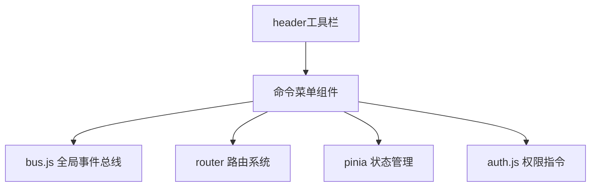
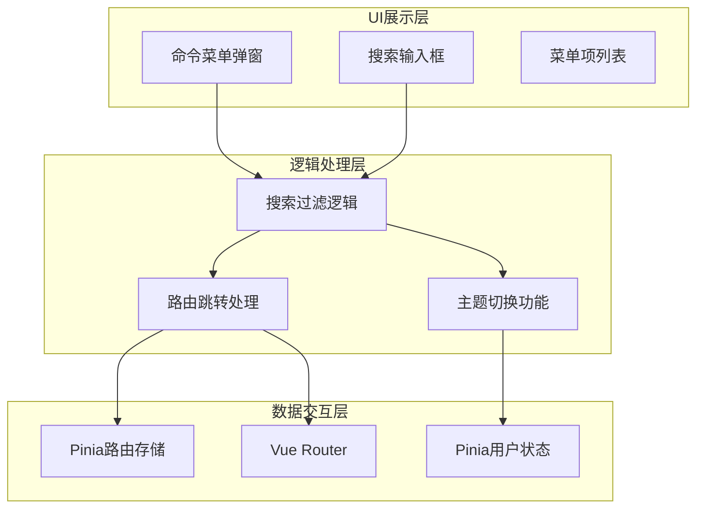
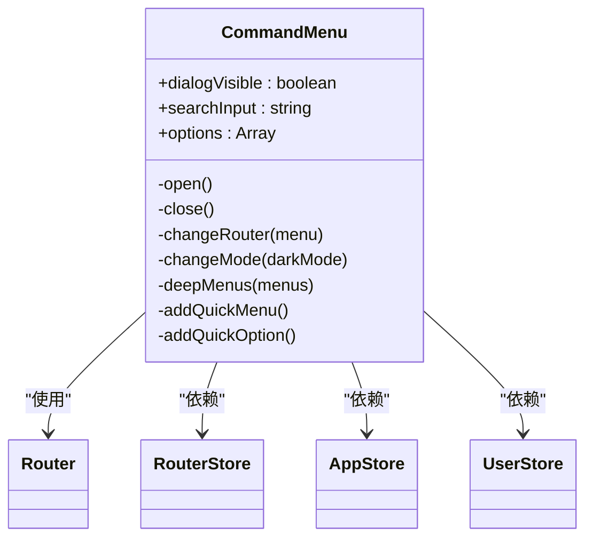
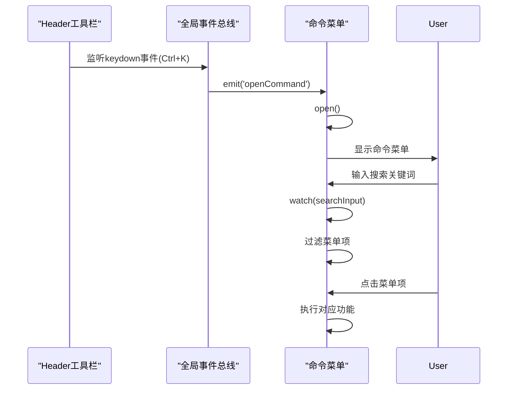
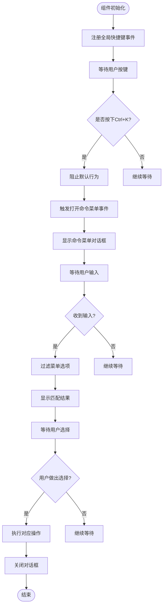
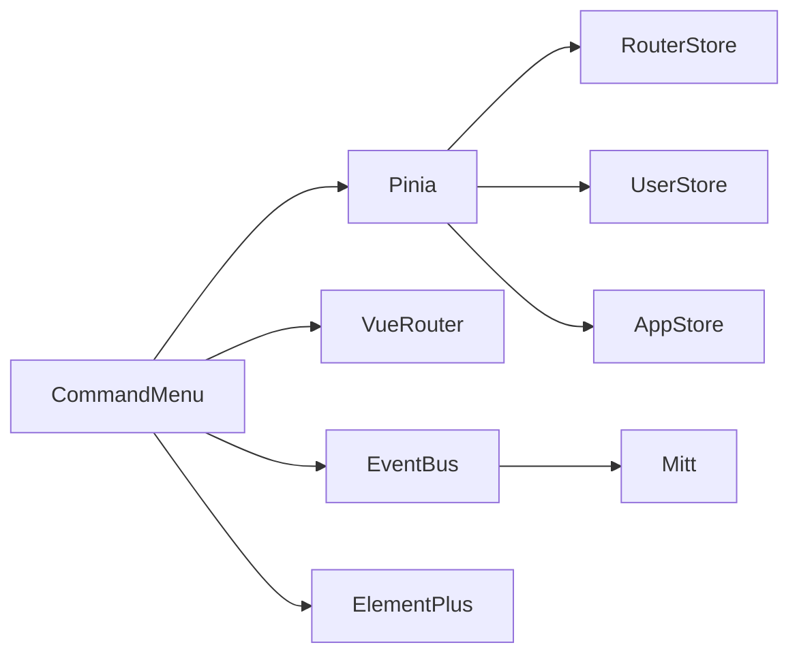

# 命令菜单组件

<cite>
**本文档中引用的文件**
- [index.vue](file://web/src/components/commandMenu/index.vue)
- [bus.js](file://web/src/utils/bus.js)
- [auth.js](file://web/src/directive/auth.js)
- [tools.vue](file://web/src/view/layout/header/tools.vue)
</cite>

## 目录
1. [简介](#简介)
2. [项目结构](#项目结构)
3. [核心组件](#核心组件)
4. [架构概述](#架构概述)
5. [详细组件分析](#详细组件分析)
6. [依赖分析](#依赖分析)
7. [性能考虑](#性能考虑)
8. [故障排除指南](#故障排除指南)
9. [结论](#结论)

## 简介
命令菜单组件是系统中的一个快捷功能面板，允许用户通过快捷键快速访问常用功能和页面跳转。该组件通过全局事件总线实现跨组件通信，并集成了权限控制机制，确保不同角色用户只能访问其权限范围内的功能。

## 项目结构
命令菜单组件位于前端源码的组件目录中，作为独立的Vue组件实现。它通过全局事件总线与其他组件进行通信，并依赖于系统的路由、状态管理和权限控制模块。

**图示来源**
- [index.vue](file://web/src/components/commandMenu/index.vue)
- [bus.js](file://web/src/utils/bus.js)
- [tools.vue](file://web/src/view/layout/header/tools.vue)

**本节来源**
- [index.vue](file://web/src/components/commandMenu/index.vue)
- [bus.js](file://web/src/utils/bus.js)

## 核心组件
命令菜单组件的核心功能包括：快捷指令触发、菜单项动态注册、权限控制集成以及通过全局事件总线实现的跨组件通信。组件支持模糊搜索功能，用户可以通过输入关键词快速定位所需功能。

**本节来源**
- [index.vue](file://web/src/components/commandMenu/index.vue)
- [tools.vue](file://web/src/view/layout/header/tools.vue)

## 架构概述
命令菜单采用分层架构设计，包含UI展示层、逻辑处理层和数据交互层。UI层负责菜单的视觉呈现和用户交互；逻辑层处理搜索过滤、路由跳转和主题切换等业务逻辑；数据层则与系统的路由存储和用户状态进行交互。

**图示来源**
- [index.vue](file://web/src/components/commandMenu/index.vue)

## 详细组件分析

### 命令菜单组件分析
命令菜单组件实现了完整的快捷操作体系，包含功能跳转和系统操作两大类别。组件通过响应式数据绑定实现动态更新，当用户输入搜索内容时，菜单项会实时过滤显示。

#### 对象导向组件：

**图示来源**
- [index.vue](file://web/src/components/commandMenu/index.vue)

#### API/服务组件：

**图示来源**
- [tools.vue](file://web/src/view/layout/header/tools.vue)
- [index.vue](file://web/src/components/commandMenu/index.vue)

#### 复杂逻辑组件：

**图示来源**
- [index.vue](file://web/src/components/commandMenu/index.vue)
- [tools.vue](file://web/src/view/layout/header/tools.vue)

**本节来源**
- [index.vue](file://web/src/components/commandMenu/index.vue)
- [tools.vue](file://web/src/view/layout/header/tools.vue)

### 权限控制集成
系统通过自定义指令实现细粒度的权限控制，确保命令菜单中的操作符合用户的权限级别。权限指令在DOM渲染时进行权限验证，自动隐藏用户无权访问的功能项。

**本节来源**
- [auth.js](file://web/src/directive/auth.js)

## 依赖分析
命令菜单组件依赖于多个核心模块，形成了紧密的耦合关系。组件通过Pinia状态管理库获取路由信息和用户状态，通过Vue Router实现页面跳转，通过全局事件总线接收打开指令。

**图示来源**
- [index.vue](file://web/src/components/commandMenu/index.vue)
- [bus.js](file://web/src/utils/bus.js)

**本节来源**
- [index.vue](file://web/src/components/commandMenu/index.vue)
- [bus.js](file://web/src/utils/bus.js)
- [auth.js](file://web/src/directive/auth.js)

## 性能考虑
命令菜单组件在设计时充分考虑了性能优化。通过响应式监听器的合理使用，避免了不必要的重新渲染；菜单项的过滤采用惰性计算方式，在用户停止输入后才执行过滤操作；组件采用按需加载策略，仅在需要时才实例化。

## 故障排除指南
当命令菜单无法正常工作时，可按照以下步骤进行排查：检查全局快捷键是否被其他应用占用；确认事件总线是否正确初始化；验证用户权限设置是否正确；检查浏览器控制台是否有JavaScript错误。

**本节来源**
- [index.vue](file://web/src/components/commandMenu/index.vue)
- [tools.vue](file://web/src/view/layout/header/tools.vue)

## 结论
命令菜单组件通过简洁的设计和高效的实现，为用户提供了一种快速访问系统功能的方式。组件充分体现了用户体验一致性与访问效率的平衡设计，通过全局事件总线实现了松耦合的跨组件通信，结合权限控制机制确保了系统的安全性。