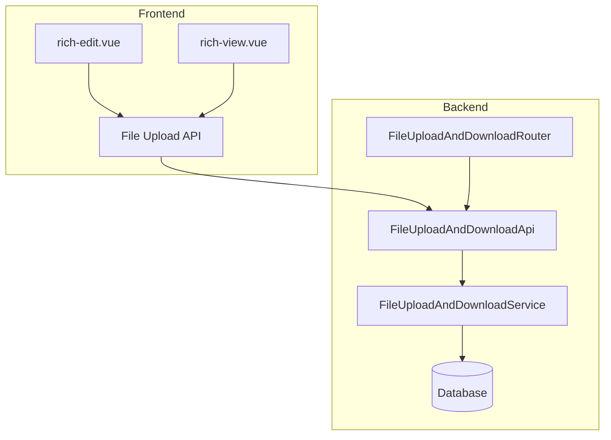
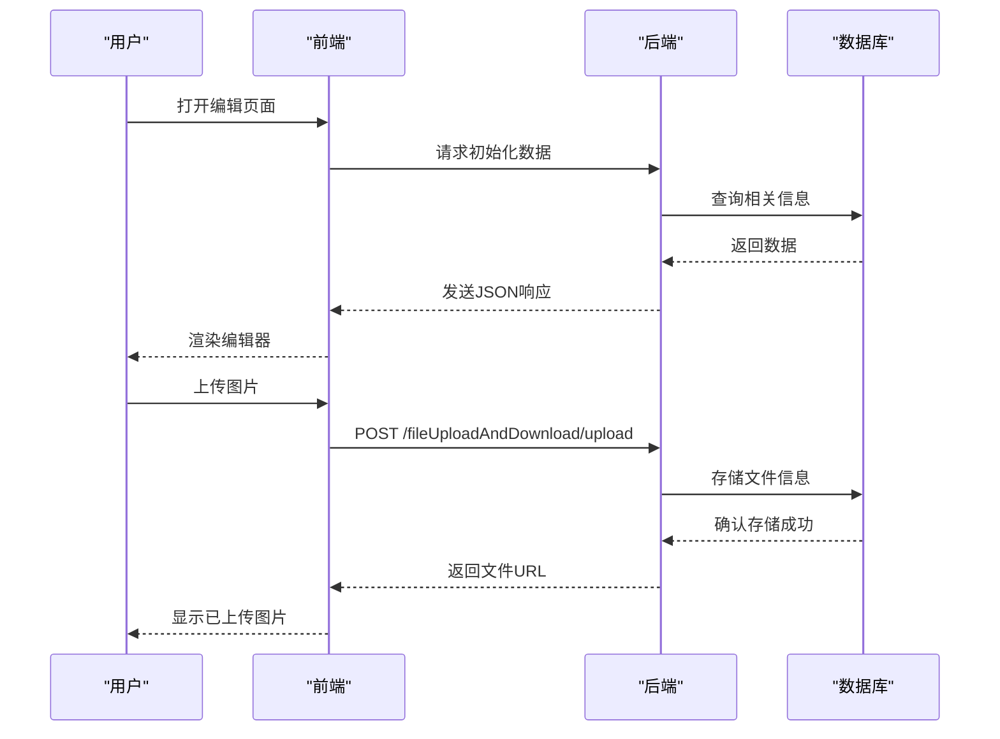
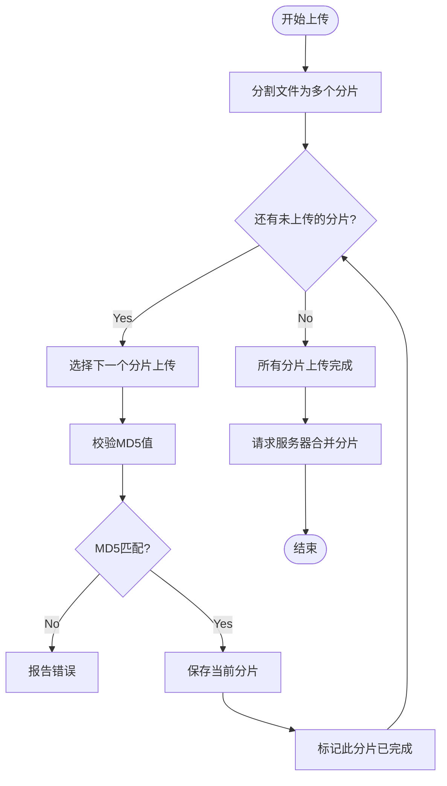
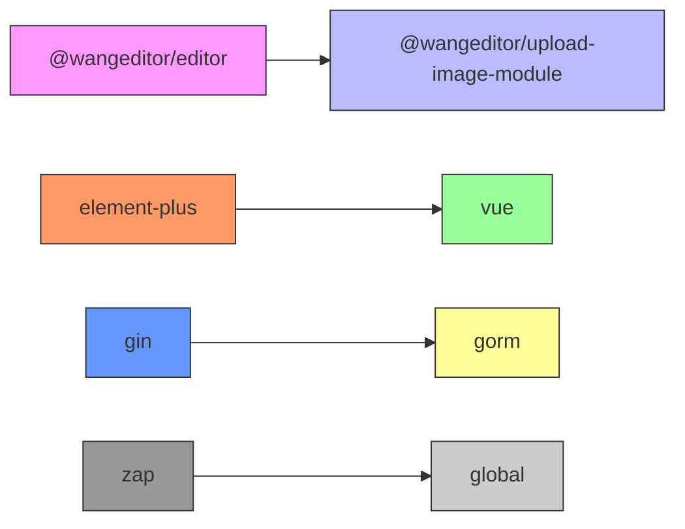

# 富文本编辑与预览组件

<cite>
**本文档引用文件**
- [rich-edit.vue](file://web/src/components/richtext/rich-edit.vue)
- [rich-view.vue](file://web/src/components/richtext/rich-view.vue)
- [exa_file_upload_download.go](file://server/api/v1/example/exa_file_upload_download.go)
- [exa_breakpoint_continue.go](file://server/api/v1/example/exa_breakpoint_continue.go)
- [file_upload_and_download.go](file://server/router/example/exa_file_upload_and_download.go)
- [package-lock.json](file://web/package-lock.json)
</cite>

## 目录
1. [简介](#简介)
2. [项目结构](#项目结构)
3. [核心组件](#核心组件)
4. [架构概述](#架构概述)
5. [详细组件分析](#详细组件分析)
6. [依赖分析](#依赖分析)
7. [性能考虑](#性能考虑)
8. [故障排除指南](#故障排除指南)
9. [结论](#结论)

## 简介
本项目包含两个主要的富文本组件:`rich-edit`(编辑器)和`rich-view`(预览器),它们基于WangEditor构建,支持所见即所得(WYSIWYG)编辑、图片上传集成、HTML内容安全过滤机制(XSS防护)以及与文件上传服务的对接。这些组件广泛应用于公告发布、内容管理等业务场景中。

## 项目结构
该项目分为前端和后端两大部分:
- **前端**位于`web`目录下,使用Vue 3框架开发。
- **后端**位于`server`目录下,采用Gin框架实现RESTful API接口。

### 前端关键路径
- `web/src/components/richtext/`: 包含`rich-edit.vue`和`rich-view.vue`两个核心组件。
- `web/src/api/fileUploadAndDownload.js`: 提供文件上传下载相关的API调用方法。

### 后端关键路径
- `server/api/v1/example/exa_file_upload_download.go`: 实现文件上传、获取列表、删除等功能。
- `server/router/example/exa_file_upload_and_download.go`: 定义了文件操作相关的路由规则。
- `server/service/example/exa_breakpoint_continue.go`: 处理断点续传逻辑的服务层代码。



**图表来源**
- [rich-edit.vue](file://web/src/components/richtext/rich-edit.vue)
- [rich-view.vue](file://web/src/components/richtext/rich-view.vue)
- [exa_file_upload_download.go](file://server/api/v1/example/exa_file_upload_download.go)
- [exa_breakpoint_continue.go](file://server/api/v1/example/exa_breakpoint_continue.go)
- [file_upload_and_download.go](file://server/router/example/exa_file_upload_and_download.go)

**章节来源**
- [rich-edit.vue](file://web/src/components/richtext/rich-edit.vue)
- [rich-view.vue](file://web/src/components/richtext/rich-view.vue)

## 核心组件

### rich-edit 组件
`rich-edit.vue` 是一个功能完整的富文本编辑器组件,它允许用户通过直观的界面进行文本格式化,并支持图片上传。该组件利用WangEditor提供的强大API实现了丰富的编辑功能。

#### 主要特性
- 支持基本的文字样式设置(加粗、斜体、下划线等)
- 插入链接、图片、表格等多媒体元素
- 内容双向绑定,确保数据同步更新
- 配置灵活,可通过属性控制是否启用特定功能

### rich-view 组件
`rich-view.vue` 则是一个只读模式下的富文本展示组件,用于呈现经过编辑的内容。此组件特别适用于需要查看但不允许修改的情况,如文章详情页或公告栏。

#### 主要特性
- 只读模式,防止意外更改
- 自动解析并渲染HTML内容
- 保持原始排版样式的一致性

**章节来源**
- [rich-edit.vue](file://web/src/components/richtext/rich-edit.vue)
- [rich-view.vue](file://web/src/components/richtext/rich-view.vue)

## 架构概述

整个系统的架构设计遵循前后端分离的原则,前端负责UI展示及交互逻辑处理,而后端则专注于提供稳定可靠的数据接口服务。两者之间通过HTTP协议通信,具体流程如下:

1. 用户在浏览器中打开页面,加载`rich-edit`或`rich-view`组件。
2. 当执行某些操作时(例如上传图片),前端会向后端发送请求。
3. 后端接收到请求后,根据业务需求调用相应的方法完成任务,并将结果返回给前端。
4. 前端接收响应数据,更新视图状态以反映最新变化。



**图表来源**
- [rich-edit.vue](file://web/src/components/richtext/rich-edit.vue)
- [exa_file_upload_download.go](file://server/api/v1/example/exa_file_upload_download.go)

**章节来源**
- [rich-edit.vue](file://web/src/components/richtext/rich-edit.vue)
- [exa_file_upload_download.go](file://server/api/v1/example/exa_file_upload_download.go)

## 详细组件分析

### 编辑器配置详解
`rich-edit.vue` 中的关键配置项包括:
- `toolbarConfig`: 工具栏配置对象,可以自定义显示哪些按钮。
- `editorConfig`: 编辑器主体配置,比如占位符文字、菜单配置等。
- `uploadImage`: 图片上传相关设置,指定服务器地址、字段名、头部信息等。

其中,图片上传功能通过以下方式实现:
```javascript
editorConfig.MENU_CONF['uploadImage'] = {
  fieldName: 'file',
  server: basePath + '/fileUploadAndDownload/upload?noSave=1',
  headers: {
    'x-token': userStore.token,
  },
  customInsert(res, insertFn) {
    if (res.code === 0) {
      const urlPath = getUrl(res.data.file.url)
      insertFn(urlPath, res.data.file.name)
      return
    }
    ElMessage.error(res.msg)
  }
}
```
这段代码定义了如何处理从服务器返回的上传结果,并将其插入到编辑区域内。

### 内容安全过滤
为了防止XSS攻击,系统采用了多种措施来保证内容的安全性:
- 在后端对所有输入进行严格的验证和清理。
- 使用WangEditor内置的过滤机制自动转义潜在危险字符。
- 对于外部资源链接,仅允许白名单内的域名访问。

### 文件上传服务对接
文件上传服务由`FileUploadAndDownloadApi`类提供支持,其主要功能包括:
- 单个文件上传
- 分页查询文件列表
- 删除指定文件
- 断点续传支持

此外,还提供了导入URL的功能,使得可以从远程位置直接添加资源而无需本地上传过程。

#### 断点续传机制
断点续传是提高大文件传输效率的重要手段之一。其实现原理为:
1. 将大文件分割成多个小块分别上传。
2. 每次上传前先检查该分片是否已经存在,避免重复工作。
3. 所有分片上传完毕后,通知服务器合并所有片段形成完整文件。

相关API接口如下所示:
- `/fileUploadAndDownload/breakpointContinue`: 上传单个分片
- `/fileUploadAndDownload/findFile`: 查找已有分片记录
- `/fileUploadAndDownload/breakpointContinueFinish`: 完成分片合并



**图表来源**
- [exa_breakpoint_continue.go](file://server/api/v1/example/exa_breakpoint_continue.go)
- [exa_file_upload_download.go](file://server/api/v1/example/exa_file_upload_download.go)

**章节来源**
- [exa_breakpoint_continue.go](file://server/api/v1/example/exa_breakpoint_continue.go)
- [exa_file_upload_download.go](file://server/api/v1/example/exa_file_upload_download.go)

## 依赖分析

### 前端依赖
前端项目依赖于以下几个关键库:
- `@wangeditor/editor`: 富文本编辑器核心库
- `@wangeditor/upload-image-module`: 图片上传模块
- `element-plus`: UI组件库
- `vue`: JavaScript框架

这些依赖关系可以在`web/package-lock.json`文件中找到详细信息。

### 后端依赖
后端服务依赖的主要第三方包有:
- `github.com/gin-gonic/gin`: Web框架
- `gorm.io/gorm`: ORM工具
- `github.com/flipped-aurora/gin-vue-admin/server/global`: 全局变量定义
- `zap`: 日志记录库



**图表来源**
- [package-lock.json](file://web/package-lock.json)
- [go.mod](file://server/go.mod)

**章节来源**
- [package-lock.json](file://web/package-lock.json)
- [go.mod](file://server/go.mod)

## 性能考虑
考虑到用户体验和系统稳定性,在设计时充分考虑了性能优化问题:
- **前端方面**:采用虚拟滚动技术减少DOM节点数量；合理缓存静态资源以加快加载速度。
- **后端方面**:利用Redis作为中间件加速频繁访问的数据读取；实施合理的数据库索引策略提升查询效率。

## 故障排除指南
当遇到问题时,请按照以下步骤排查:
1. 检查网络连接是否正常。
2. 确认服务器端口是否正确开放且防火墙规则允许通行。
3. 查看日志文件(`logs/`)寻找异常信息。
4. 如果涉及文件上传失败,检查磁盘空间是否充足。
5. 验证认证令牌的有效性,确保拥有足够的权限执行所需操作。

常见错误及其解决方案:
- **上传超时**:增加超时时间限制或减小单次上传文件大小。
- **权限不足**:确认当前登录账户具有相应角色授权。
- **数据库连接失败**:核实数据库配置参数无误,并确保服务正在运行。

**章节来源**
- [error.go](file://server/middleware/error.go)
- [logger.go](file://server/middleware/logger.go)

## 结