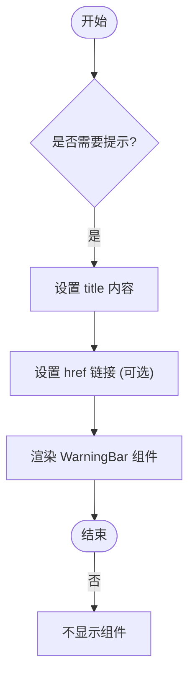

# 警告条组件

<cite>
**本文档引用文件**  
- [warningBar.vue](file://web/src/components/warningBar/warningBar.vue)
- [index.vue](file://web/src/view/init/index.vue)
</cite>

## 目录
1. [简介](#简介)
2. [视觉样式与状态类型](#视觉样式与状态类型)
3. [动态显示控制逻辑](#动态显示控制逻辑)
4. [关键场景提示作用](#关键场景提示作用)
5. [主题适配机制](#主题适配机制)
6. [在init页面的应用示例](#在init页面的应用示例)

## 简介
警告条组件(WarningBar)是系统中用于向用户展示重要通知、配置缺失或系统异常信息的UI元素。该组件通过简洁明了的视觉设计和交互逻辑,确保用户能够及时获取关键信息,并在必要时跳转至相关文档或操作页面。

**Section sources**
- [warningBar.vue](file://web/src/components/warningBar/warningBar.vue#L1-L32)

## 视觉样式与状态类型
警告条组件采用统一的视觉风格,使用琥珀色作为主色调,以突出其警示性质。组件包含一个警告图标和一段可自定义的文字内容。根据应用场景的不同,虽然当前实现未显式区分多种状态类型(如error、warning、info),但其样式设计符合通用的警告提示规范。

在深色模式下,组件自动切换为暗色调背景(`dark:bg-amber-700`)和浅色文字(`dark:text-gray-200`),保证在不同主题下的可读性和一致性。

**Section sources**
- [warningBar.vue](file://web/src/components/warningBar/warningBar.vue#L1-L10)

## 动态显示控制逻辑
警告条的显示内容由`title`属性控制,支持动态绑定文本内容。当需要引导用户查看更多信息时,可通过设置`href`属性指定外部链接地址。点击警告条后,若存在`href`值,则会调用`window.open()`方法打开新页面；否则无任何响应,适用于仅作提示的场景。

此逻辑封装于`open()`函数中,实现了简单而有效的交互控制。

**Section sources**
- [warningBar.vue](file://web/src/components/warningBar/warningBar.vue#L18-L25)

## 关键场景提示作用
在系统初始化等关键流程中,警告条被用来强调必须注意的事项。例如,在`init`页面中,虽然未直接使用`WarningBar`组件,但其设计理念体现在对数据库引擎要求的高亮提示(如innoDB需为红色加粗字体)。这种设计确保用户不会忽略可能影响系统正常运行的关键配置项。

此外,警告条还可用于提示配置缺失、权限不足或服务不可用等情况,帮助用户快速定位问题。

**Section sources**
- [index.vue](file://web/src/view/init/index.vue#L1-L387)

## 主题适配机制
警告条组件利用Tailwind CSS的暗色模式支持,通过`dark:`前缀类名实现主题适配。当系统处于深色模式时,组件的背景色和文字颜色将自动调整,无需额外JavaScript逻辑干预。这种基于CSS变量和框架能力的主题切换方式,提升了性能并简化了代码维护。

**Section sources**
- [warningBar.vue](file://web/src/components/warningBar/warningBar.vue#L1-L10)

## 在init页面的应用示例
尽管`init`页面目前未直接引入`WarningBar`组件,但从其结构可以看出类似的提示设计思想。例如,在初始化须知部分,明确列出五条注意事项,并通过超链接引导用户阅读官方文档或观看初始化视频。未来可将此类静态提示重构为使用`WarningBar`组件,从而实现更一致的用户体验。

编程上,可通过Vue的响应式数据控制`WarningBar`的显隐。例如,在表单验证失败或初始化完成后,动态更新`title`和`href`属性,并结合条件渲染指令(如`v-if`)控制组件是否显示。

**Diagram sources**
- [warningBar.vue](file://web/src/components/warningBar/warningBar.vue#L1-L32)
- [index.vue](file://web/src/view/init/index.vue#L1-L387)

**Section sources**
- [warningBar.vue](file://web/src/components/warningBar/warningBar.vue#L1-L32)
- [index.vue](file://web/src/view/init/index.vue#L1-L387)