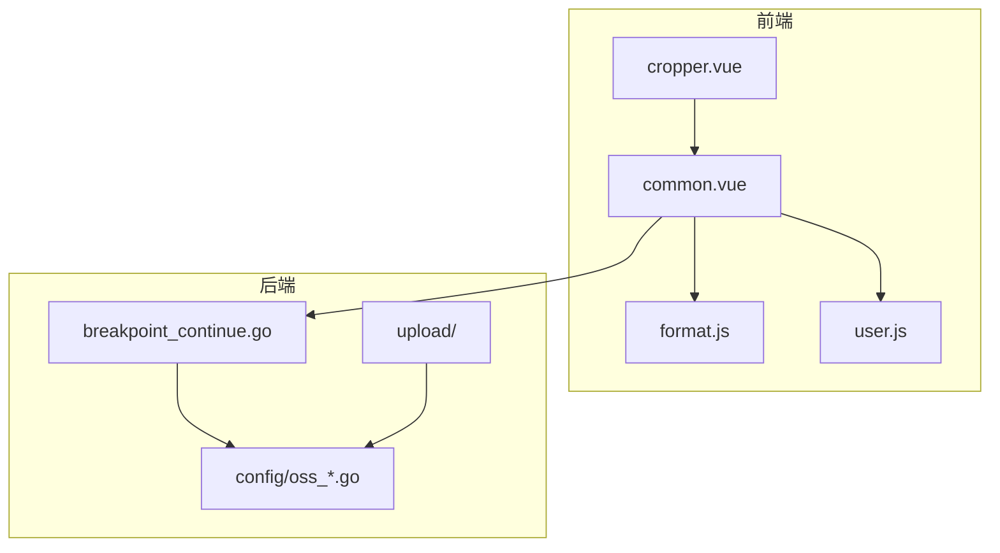
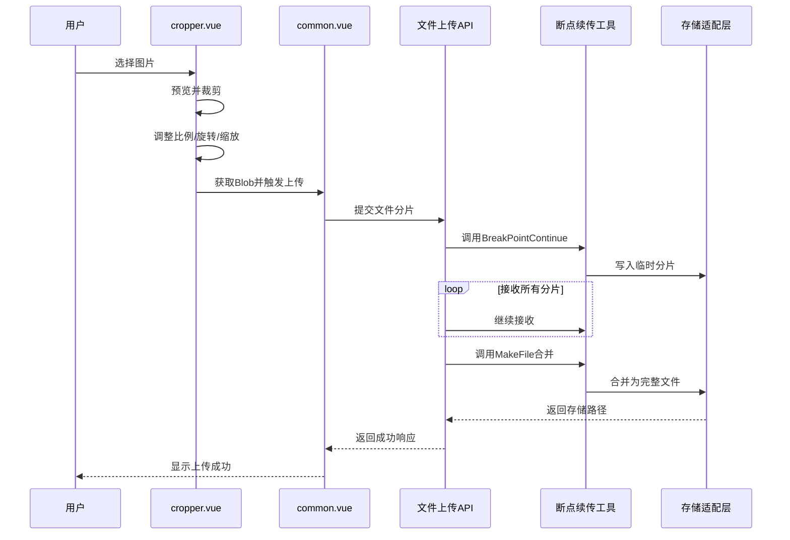
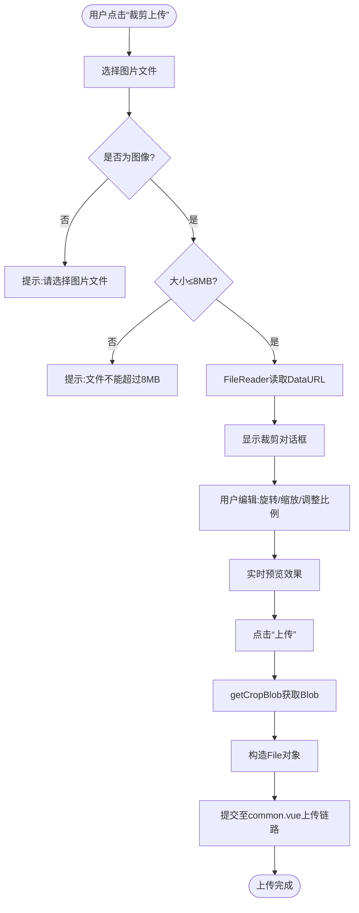
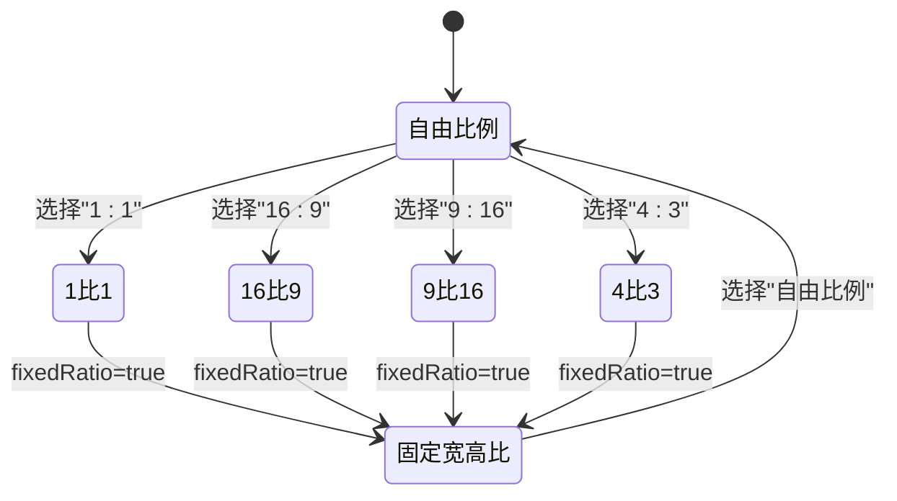
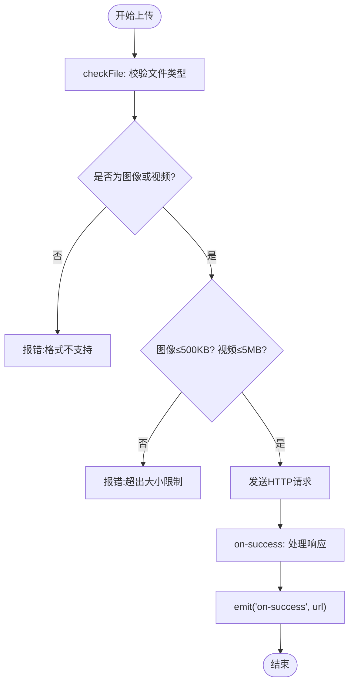

# 图片裁剪上传组件 (cropper.vue)

<cite>
**本文档引用文件**  
- [cropper.vue](file://web/src/components/upload/cropper.vue)
- [common.vue](file://web/src/components/upload/common.vue)
- [breakpoint_continue.go](file://server/utils/breakpoint_continue.go)
- [oss_local.go](file://server/config/oss_local.go)
- [oss_minio.go](file://server/config/oss_minio.go)
- [local.go](file://server/utils/upload/local.go)
- [minio_oss.go](file://server/utils/upload/minio_oss.go)
- [getBaseUrl.js](file://web/src/utils/format.js)
- [user.js](file://web/src/pinia/modules/user.js)
</cite>

## 目录
1. [简介](#简介)
2. [项目结构](#项目结构)
3. [核心组件](#核心组件)
4. [架构概览](#架构概览)
5. [详细组件分析](#详细组件分析)
6. [依赖分析](#依赖分析)
7. [性能考虑](#性能考虑)
8. [故障排除指南](#故障排除指南)
9. [结论](#结论)

## 简介
`cropper.vue` 是一个集成图片裁剪与上传功能的前端组件,基于 `vue-cropper` 实现可视化图像处理,支持比例锁定、旋转、缩放等交互操作。该组件将裁剪后的图像以 Blob 形式传递至 `common.vue` 的上传链路,并继承断点续传机制(参考后端 `breakpoint_continue.go` 分片策略)。通过抽象 OSS 存储适配层,实现对本地存储、MinIO 及主流云存储服务的无缝对接。适用于用户头像设置等典型场景,提供灵活的初始化配置选项。

## 项目结构
该组件位于前端 `web/src/components/upload/` 目录下,与后端 `server/utils/upload/` 和 `server/config/` 模块协同工作,形成完整的裁剪上传解决方案。



**Diagram sources**
- [cropper.vue](file://web/src/components/upload/cropper.vue)
- [common.vue](file://web/src/components/upload/common.vue)
- [breakpoint_continue.go](file://server/utils/breakpoint_continue.go)
- [oss_local.go](file://server/config/oss_local.go)
- [oss_minio.go](file://server/config/oss_minio.go)

**Section sources**
- [cropper.vue](file://web/src/components/upload/cropper.vue)
- [common.vue](file://web/src/components/upload/common.vue)

## 核心组件

`cropper.vue` 组件封装了图像裁剪界面与上传逻辑,利用 `VueCropper` 提供丰富的编辑能力,包括自由或固定比例裁剪、旋转、缩放。用户选择图片后,通过 FileReader 转换为 DataURL 加载至裁剪器。裁剪完成后,调用 `getCropBlob` 获取二进制数据并构造 File 对象,交由 `el-upload` 提交至服务器。`common.vue` 则作为通用上传入口,负责文件类型校验与上传状态反馈。

**Section sources**
- [cropper.vue](file://web/src/components/upload/cropper.vue#L0-L237)
- [common.vue](file://web/src/components/upload/common.vue#L0-L90)

## 架构概览

系统采用前后端分离架构,前端完成图像可视化裁剪,后端实现分片上传与多存储适配。



**Diagram sources**
- [cropper.vue](file://web/src/components/upload/cropper.vue)
- [common.vue](file://web/src/components/upload/common.vue)
- [breakpoint_continue.go](file://server/utils/breakpoint_continue.go)
- [local.go](file://server/utils/upload/local.go)
- [minio_oss.go](file://server/utils/upload/minio_oss.go)

## 详细组件分析

### cropper.vue 分析

该组件基于 Element Plus 的 `el-upload` 和 `el-dialog` 构建交互界面,内嵌 `VueCropper` 实现核心裁剪功能。

#### 功能流程图


**Diagram sources**
- [cropper.vue](file://web/src/components/upload/cropper.vue#L0-L237)

#### 比例控制逻辑


**Diagram sources**
- [cropper.vue](file://web/src/components/upload/cropper.vue#L50-L85)

**Section sources**
- [cropper.vue](file://web/src/components/upload/cropper.vue#L0-L237)

### common.vue 分析

作为通用上传组件,`common.vue` 负责文件合法性校验与上传流程控制。



**Diagram sources**
- [common.vue](file://web/src/components/upload/common.vue#L0-L90)

**Section sources**
- [common.vue](file://web/src/components/upload/common.vue#L0-L90)

## 依赖分析

系统各模块间存在清晰的依赖关系,从前端到后端形成完整调用链。

```mermaid
graph TD
cropper.vue --> common.vue
common.vue --> getBaseUrl
common.vue --> userStore
common.vue --> server/api/v1/example/exa_file_upload_download.go
server/api/v1/example@FileUploadAndDownloadApi.BreakpointContinue --> server/utils@BreakPointContinue
server/utils@BreakPointContinue --> server/utils@makeFileContent
server/utils@BreakPointContinue --> server/utils@CheckMd5
server/utils@CheckMd5 --> server/utils@MD5V
server/api/v1/example@FileUploadAndDownloadApi.BreakpointContinueFinish --> server/utils@MakeFile
server/api/v1/example@FileUploadAndDownloadApi.RemoveChunk --> server/utils@RemoveChunk
server/utils/upload@Local --> server/config@Local
server/utils/upload@Minio --> server/config@Minio
server/utils/upload@NewOss --> server/utils/upload@Local
server/utils/upload@NewOss --> server/utils/upload@Minio
```

**Diagram sources**
- [cropper.vue](file://web/src/components/upload/cropper.vue)
- [common.vue](file://web/src/components/upload/common.vue)
- [breakpoint_continue.go](file://server/utils/breakpoint_continue.go)
- [local.go](file://server/utils/upload/local.go)
- [minio_oss.go](file://server/utils/upload/minio_oss.go)
- [oss_local.go](file://server/config/oss_local.go)
- [oss_minio.go](file://server/config/oss_minio.go)

**Section sources**
- [breakpoint_continue.go](file://server/utils/breakpoint_continue.go#L0-L112)
- [local.go](file://server/utils/upload/local.go#L0-L109)
- [minio_oss.go](file://server/utils/upload/minio_oss.go#L0-L99)

## 性能考虑

- **前端内存优化**:使用 `FileReader` 异步加载大图,避免阻塞主线程。
- **分片传输**:通过断点续传机制提升大文件上传稳定性,减少失败重传成本。
- **并发控制**:`sync.Mutex` 防止本地文件并发写入冲突。
- **连接复用**:MinIO 客户端单例模式提升上传效率。
- **路径缓存**:`getBaseUrl()` 缓存基础地址避免重复计算。

## 故障排除指南

常见问题及解决方案:

| 问题现象 | 可能原因 | 解决方案 |
|--------|--------|--------|
| 裁剪后无法上传 | Blob 获取失败 | 检查 `cropperRef.getCropBlob` 是否正确调用 |
| 上传提示“切片不完整” | MD5 校验失败 | 确保前端分片完整性,检查网络稳定性 |
| MinIO 上传失败 | Bucket 不存在或权限不足 | 检查配置项 AccessKey、SecretKey 及 BucketName |
| 文件名乱码 | 特殊字符未处理 | 前端应对文件名进行 URL 编码 |
| 预览图模糊 | 输出质量默认较低 | 可扩展 `outputQuality` 参数