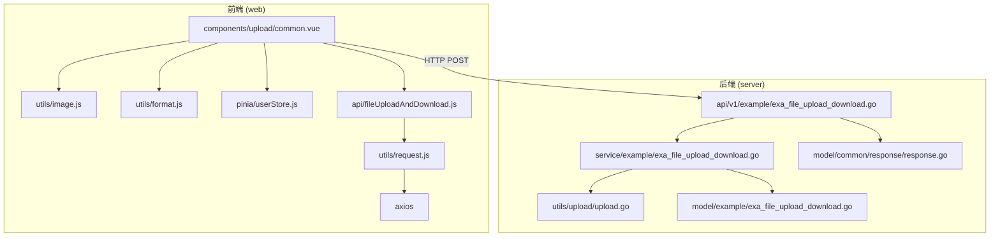
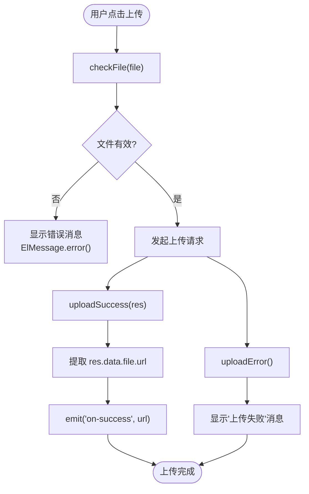
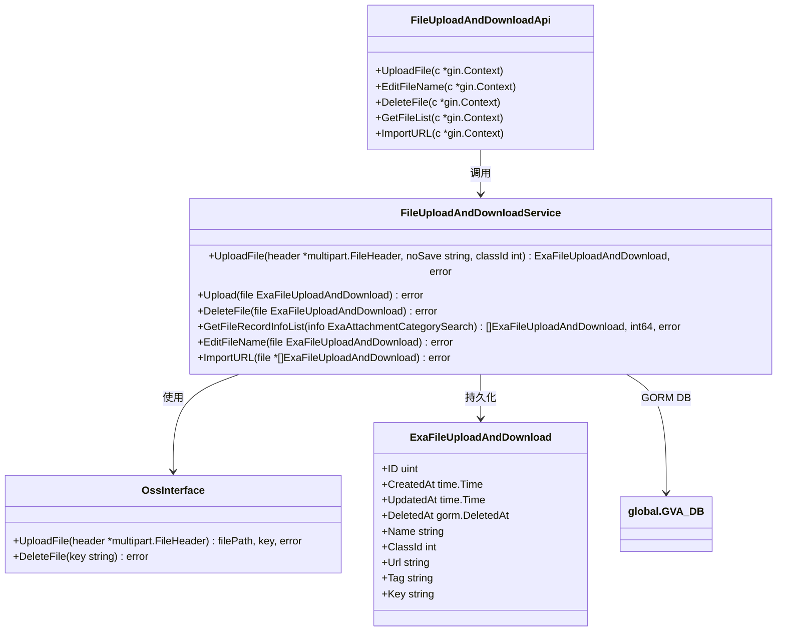
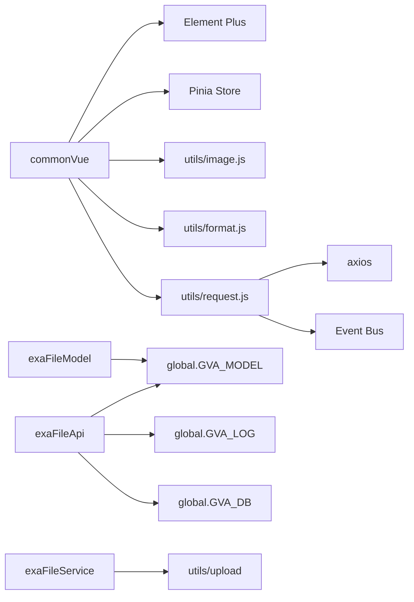

# 基础上传组件 (common.vue)

<cite>
**本文档中引用的文件**  
- [common.vue](file://web/src/components/upload/common.vue)
- [exa_file_upload_download.go](file://server/api/v1/example/exa_file_upload_download.go)
- [exa_file_upload_download.go](file://server/service/example/exa_file_upload_download.go)
- [exa_file_upload_download.go](file://server/model/example/exa_file_upload_download.go)
- [exa_file_upload_download.go](file://server/model/example/response/exa_file_upload_download.go)
- [response.go](file://server/model/common/response/response.go)
- [request.js](file://web/src/utils/request.js)
</cite>

## 目录
1. [简介](#简介)
2. [项目结构](#项目结构)
3. [核心功能分析](#核心功能分析)
4. [架构概述](#架构概述)
5. [详细组件分析](#详细组件分析)
6. [依赖分析](#依赖分析)
7. [性能考虑](#性能考虑)
8. [故障排除指南](#故障排除指南)
9. [结论](#结论)

## 简介
`common.vue` 是 `gin-vue-admin` 项目中所有文件上传功能的基础组件,封装了通用的上传逻辑。该组件通过 props 接收配置参数(如分类 ID),利用 Element Plus 的 `el-upload` 组件实现文件选择与上传,并集成 axios 进行 HTTP 请求。它实现了文件类型校验、大小限制、上传成功/失败处理,并通过 `$emit` 向父组件传递事件。后端接口 `/fileUploadAndDownload/upload` 定义在 Go 文件中,使用 GORM 操作数据库并支持多种对象存储(OSS)。前后端通过约定的 JSON 格式 `{code, msg, data}` 进行通信。

## 项目结构



**Diagram sources**
- [common.vue](file://web/src/components/upload/common.vue)
- [exa_file_upload_download.go](file://server/api/v1/example/exa_file_upload_download.go)

**Section sources**
- [common.vue](file://web/src/components/upload/common.vue)
- [exa_file_upload_download.go](file://server/api/v1/example/exa_file_upload_download.go)

## 核心功能分析

`common.vue` 组件作为基础上传模块,提供了可复用的文件上传能力。它通过 `props` 接收外部配置(如 `classId`),并通过 `defineEmits` 定义了 `on-success` 事件用于通知父组件上传结果。组件内部集成了文件类型和大小的前置校验逻辑,支持图片(jpg, png, svg, webp)和视频(mp4, webm)格式,并分别设置了 500KB 和 5MB 的大小限制。上传过程由 `el-upload` 触发,自动携带 JWT 令牌(x-token)和自定义数据(classId),成功后解析响应数据并通过 `$emit` 抛出文件 URL。

**Section sources**
- [common.vue](file://web/src/components/upload/common.vue#L1-L90)

## 架构概述

```mermaid
sequenceDiagram
participant 用户
participant commonVue as common.vue
participant Axios
participant 后端API
participant OSS
participant 数据库
用户->>commonVue : 选择文件
commonVue->>commonVue : checkFile() 校验类型/大小
alt 校验失败
commonVue-->>用户 : 显示错误消息
stop
end
commonVue->>Axios : 发起POST请求 /upload
Axios->>后端API : 调用 UploadFile 方法
后端API->>OSS : 上传文件到对象存储
OSS-->>后端API : 返回文件路径(filePath)和键(key)
后端API->>数据库 : 保存文件元信息(name, url, classId, tag, key)
数据库-->>后端API : 保存成功
后端API-->>Axios : 返回 {code : 0, msg : "上传成功", data : {file : {url}}}
Axios-->>commonVue : uploadSuccess() 处理响应
commonVue->>commonVue : emit('on-success', file.url)
commonVue-->>用户 : 上传完成
```

**Diagram sources**
- [common.vue](file://web/src/components/upload/common.vue#L1-L90)
- [exa_file_upload_download.go](file://server/api/v1/example/exa_file_upload_download.go#L1-L30)

## 详细组件分析

### 前端组件分析

#### 功能流程图


**Diagram sources**
- [common.vue](file://web/src/components/upload/common.vue#L50-L90)

**Section sources**
- [common.vue](file://web/src/components/upload/common.vue#L1-L90)

### 后端接口分析

#### API 与服务层交互


**Diagram sources**
- [exa_file_upload_download.go](file://server/api/v1/example/exa_file_upload_download.go)
- [exa_file_upload_download.go](file://server/service/example/exa_file_upload_download.go)
- [exa_file_upload_download.go](file://server/model/example/exa_file_upload_download.go)

### 响应格式约定

前后端通过统一的 JSON 格式进行通信,确保接口的一致性。

| 字段 | 类型 | 描述 |
|------|------|------|
| code | int | 响应状态码,0 表示成功,非0表示失败 |
| msg | string | 响应消息,描述操作结果 |
| data | object | 成功时返回的数据对象 |

当上传成功时,`data` 字段包含一个 `file` 对象,其结构如下:

| 子字段 | 类型 | 描述 |
|--------|------|------|
| file.id | uint | 文件记录的唯一标识符 |
| file.fileName | string | 文件原始名称 |
| file.filePath | string | 文件在服务器或OSS上的访问路径 |

此格式由 `response.OkWithDetailed()` 函数生成,定义在 `response.go` 中。

**Section sources**
- [response.go](file://server/model/common/response/response.go#L1-L72)
- [exa_file_upload_download.go](file://server/api/v1/example/exa_file_upload_download.go#L20-L30)

## 依赖分析



**Diagram sources**
- [common.vue](file://web/src/components/upload/common.vue)
- [request.js](file://web/src/utils/request.js)
- [exa_file_upload_download.go](file://server/api/v1/example/exa_file_upload_download.go)
- [exa_file_upload_download.go](file://server/service/example/exa_file_upload_download.go)
- [exa_file_upload_download.go](file://server/model/example/exa_file_upload_download.go)

**Section sources**
- [common.vue](file://web/src/components/upload/common.vue)
- [request.js](file://web/src/utils/request.js)
- [exa_file_upload_download.go](file://server/api/v1/example/exa_file_upload_download.go)

## 性能考虑

该上传组件在设计上考虑了基本的用户体验和资源消耗:
- **客户端校验**:在上传前进行文件类型和大小检查,避免无效请求占用服务器带宽。
- **Loading 状态**:通过 `fullscreenLoading` 变量控制加载状态,防止用户重复提交。
- **HTTP 拦截器**:`request.js` 中的拦截器统一管理 loading 效果,避免多个请求同时触发多个 loading 弹窗。
- **超时机制**:axios 配置了 99999ms 的超时时间,并设有 30 秒强制关闭 loading 的保护机制,防止界面卡死。
- **OSS 支持**:后端通过 `upload.NewOss()` 支持多种对象存储,减轻本地服务器压力。

然而,对于大文件上传,当前实现缺乏分片上传和断点续传的支持,这可能影响大文件的上传成功率和效率。

## 故障排除指南

| 问题现象 | 可能原因 | 解决方案 |
|---------|---------|---------|
| 上传按钮无反应 | 浏览器兼容性或 JavaScript 错误 | 检查浏览器控制台是否有报错,确认 Vue 和 Element Plus 正常加载 |
| 提示"接收文件失败" | 后端无法读取 multipart/form-data | 检查请求 Content-Type 是否正确,确认后端路由 `/fileUploadAndDownload/upload` 可达 |
| 提示"上传文件失败" | OSS 配置错误或权限不足 |