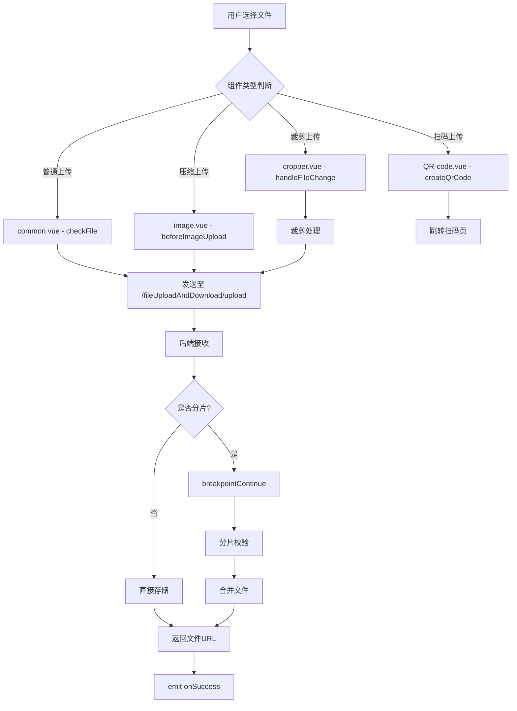
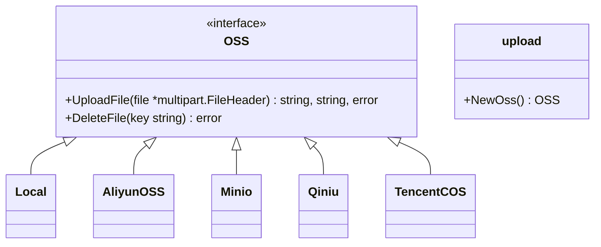

# 文件上传组件 (upload)

<cite>
**本文档引用文件**   
- [common.vue](file://web/src/components/upload/common.vue)
- [image.vue](file://web/src/components/upload/image.vue)
- [cropper.vue](file://web/src/components/upload/cropper.vue)
- [QR-code.vue](file://web/src/components/upload/QR-code.vue)
- [exa_breakpoint_continue.go](file://server/api/v1/example/exa_breakpoint_continue.go)
- [upload.go](file://server/utils/upload/upload.go)
- [local.go](file://server/utils/upload/local.go)
- [aliyun_oss.go](file://server/utils/upload/aliyun_oss.go)
- [minio_oss.go](file://server/utils/upload/minio_oss.go)
- [exa_file_upload_download.go](file://server/api/v1/example/exa_file_upload_download.go)
- [fileUploadAndDownload.js](file://web/src/api/fileUploadAndDownload.js)
</cite>

## 目录
1. [简介](#简介)
2. [核心组件功能分工](#核心组件功能分工)
3. [协作机制与数据流](#协作机制与数据流)
4. [断点续传实现方案](#断点续传实现方案)
5. [多存储后端抽象适配](#多存储后端抽象适配)
6. [表单调用示例与交互细节](#表单调用示例与交互细节)
7. [前后端数据交互格式](#前后端数据交互格式)

## 简介
本组件库提供了一套完整的文件上传解决方案,包含基础上传、图片压缩、裁剪上传、二维码扫码上传等多种场景支持。组件基于Element Plus构建,通过统一的接口规范与后端服务进行通信,实现了对本地存储、MinIO、阿里云OSS等多种存储后端的无缝切换。

## 核心组件功能分工

### common.vue:基础上传逻辑封装
作为所有上传组件的基础,`common.vue` 封装了最基础的文件上传功能,包括:
- 文件类型校验(仅允许图片和视频)
- 文件大小限制(图片500KB,视频5MB)
- 上传前检查与错误提示
- 成功回调事件触发

该组件通过 `checkFile` 方法在上传前对文件进行验证,并通过 `uploadSuccess` 和 `uploadError` 处理上传结果。

**Section sources**
- [common.vue](file://web/src/components/upload/common.vue#L1-L91)

### image.vue:集成图片预览与压缩上传
`image.vue` 组件专注于图片文件的上传,在继承基础功能的同时增加了智能压缩能力:
- 限定仅接受JPG/PNG格式图片
- 当文件超过设定大小(默认2MB)时自动执行前端压缩
- 使用 `ImageCompress` 工具类进行图像尺寸和质量优化
- 支持设置最大宽高限制(默认1920px)

其核心在于 `beforeImageUpload` 钩子中判断是否需要压缩并返回处理后的文件对象。

**Section sources**
- [image.vue](file://web/src/components/upload/image.vue#L1-L103)

### cropper.vue:图片裁剪与OSS对接
`cropper.vue` 提供了完整的图片裁剪功能,结合 `vue-cropper` 实现可视化编辑:
- 支持旋转、缩放、比例锁定等操作
- 实时预览裁剪效果
- 可选择多种预设比例(1:1, 16:9, 9:16, 4:3)
- 裁剪完成后生成Blob对象并提交上传

组件通过 `handleUpload` 方法获取裁剪后的Blob,转换为File对象后由el-upload提交至服务器。

**Section sources**
- [cropper.vue](file://web/src/components/upload/cropper.vue#L1-L238)

### QR-code.vue:二维码生成与扫码上传
`QR-code.vue` 实现了独特的扫码上传流程:
- 动态生成包含token和classId的二维码
- 跳转至 `/scanUpload` 页面完成实际上传
- 支持移动端扫码上传场景
- 通过 `createQrCode` 构造带身份认证信息的URL

此组件不直接上传文件,而是引导用户进入专门的扫码上传页面。

**Section sources**
- [QR-code.vue](file://web/src/components/upload/QR-code.vue#L1-L66)

## 协作机制与数据流



**Diagram sources**
- [common.vue](file://web/src/components/upload/common.vue#L1-L91)
- [image.vue](file://web/src/components/upload/image.vue#L1-L103)
- [cropper.vue](file://web/src/components/upload/cropper.vue#L1-L238)
- [QR-code.vue](file://web/src/components/upload/QR-code.vue#L1-L66)
- [exa_file_upload_download.go](file://server/api/v1/example/exa_file_upload_download.go#L1-L137)

## 断点续传实现方案

### 前端逻辑(对应 breakpoint_continue.go)
前端通过以下步骤实现断点续传:
1. 计算文件MD5值用于唯一标识
2. 将大文件切分为多个chunk
3. 每个chunk独立上传并携带元数据(chunkNumber, chunkTotal, chunkMd5)
4. 上传失败可从断点继续,无需重新上传已成功部分
5. 所有分片上传完成后调用finish接口合并文件

关键参数:
- `fileMd5`: 文件唯一标识
- `chunkNumber`: 当前分片序号
- `chunkTotal`: 总分片数
- `chunkMd5`: 分片内容校验码

后端通过 `BreakpointContinue` 接口接收分片,`FindFile` 查询已有进度,`BreakpointContinueFinish` 触发最终合并。

**Section sources**
- [exa_breakpoint_continue.go](file://server/api/v1/example/exa_breakpoint_continue.go#L1-L151)

## 多存储后端抽象适配

### 存储抽象层设计
系统通过OSS接口实现多存储后端的统一访问:



**Diagram sources**
- [upload.go](file://server/utils/upload/upload.go#L1-L47)

### 具体实现
- **本地存储 (Local)**: 将文件保存到指定目录,路径由时间戳+MD5构成
- **阿里云OSS (AliyunOSS)**: 上传至指定Bucket,支持CDN加速
- **MinIO**: 兼容S3协议的对象存储,支持分布式部署
- **其他**: 七牛、腾讯云、AWS S3等均有对应实现

运行时根据配置 `global.GVA_CONFIG.System.OssType` 动态实例化具体存储客户端。

**Section sources**
- [upload.go](file://server/utils/upload/upload.go#L1-L47)
- [local.go](file://server/utils/upload/local.go#L1-L110)
- [aliyun_oss.go](file://server/utils/upload/aliyun_oss.go#L1-L76)
- [minio_oss.go](file://server/utils/upload/minio_oss.go#L1-L100)

## 表单调用示例与交互细节

### 基础调用方式
```vue
<template>
  <el-form>
    <el-form-item label="上传文件">
      <UploadCommon @on-success="handleSuccess" :classId="1" />
    </el-form-item>
  </el-form>
</template>

<script setup>
const handleSuccess = (url) => {
  ElMessage.success('上传成功')
  // 处理返回的文件URL
}
</script>
```

### 进度监听与错误重试
虽然当前组件未显式暴露进度条,但可通过以下方式增强用户体验:
- 在 `before-upload` 中显示加载状态
- `uploadError` 中提供重试按钮
- 结合全局loading提示长时间操作

### 文件校验扩展建议
当前校验规则可在项目中进一步定制:
- 图片大小限制应从配置读取而非硬编码
- 可增加更多文件类型支持
- 支持自定义校验函数注入

**Section sources**
- [common.vue](file://web/src/components/upload/common.vue#L1-L91)
- [fileUploadAndDownload.js](file://web/src/api/fileUploadAndDownload.js#L1-L66)

## 前后端数据交互格式

### 上传请求 (/fileUploadAndDownload/upload)
**请求方式**: POST  
**Content-Type**: multipart/form-data

| 参数 | 类型 | 必填 | 说明 |
|------|------|------|------|
| file | File | 是 | 文件对象 |
| classId | Number | 否 | 分类ID,默认0 |
| noSave | String | 否 | 是否仅上传不入库,"1"表示不保存记录 |

**Headers**:
- `x-token`: 用户认证令牌

### 响应格式
```json
{
  "success": true,
  "data": {
    "file": {
      "id": 123,
      "name": "example.jpg",
      "url": "https://cdn.example.com/uploads/2024/01/01/md5_20240101.jpg",
      "tag": "jpg",
      "classId": 1
    }
  },
  "msg": "上传成功"
}
```

### 断点续传专用接口
| 接口 | 方法 | 参数 | 说明 |
|------|------|------|------|
| /fileUploadAndDownload/breakpointContinue | POST | file, fileMd5, fileName, chunkNumber, chunkTotal, chunkMd5 | 上传分片 |
| /fileUploadAndDownload/findFile | GET | fileMd5, fileName, chunkTotal | 查询已上传分片 |
| /fileUploadAndDownload/breakpointContinueFinish | POST | fileMd5, fileName | 合并文件 |

**Section sources**
- [exa_file_upload_download.go](file://server/api/v1/example/exa_file_upload_download.go#L1-L137)
- [exa_breakpoint_continue.go](file://server/api/v1/example/exa_breakpoint_continue.go#L1-L151)
- [fileUploadAndDownload.js](file://web/src/api/fileUploadAndDownload.js#L1-L66)