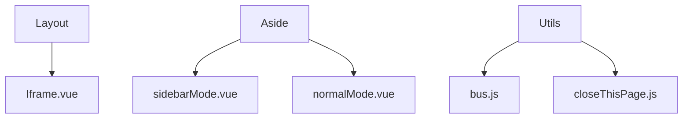
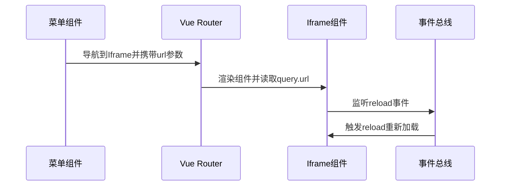
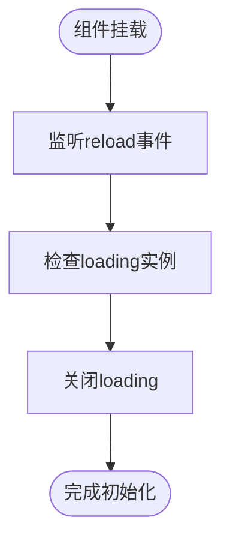
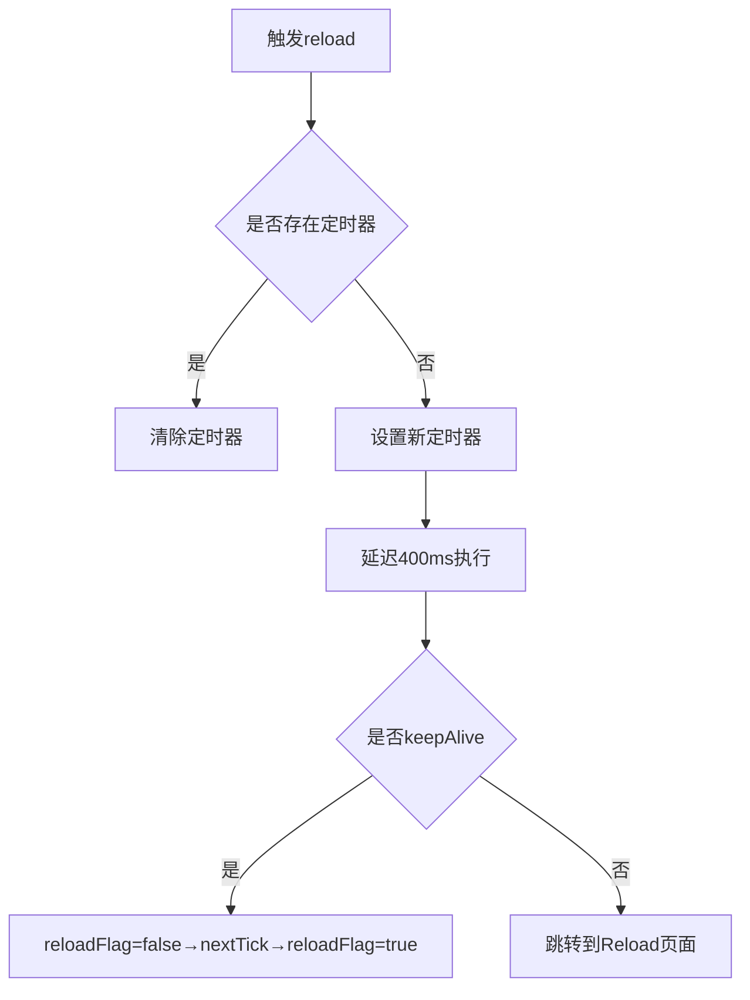
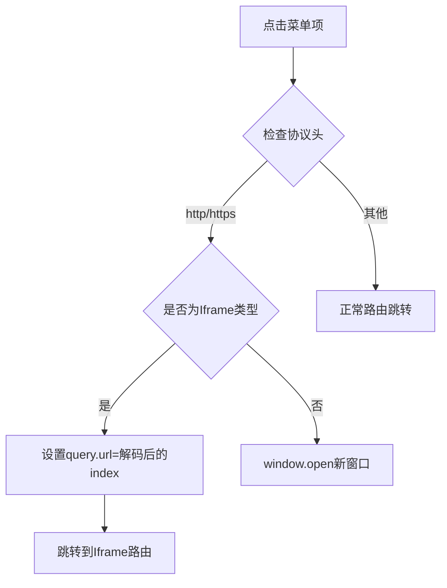
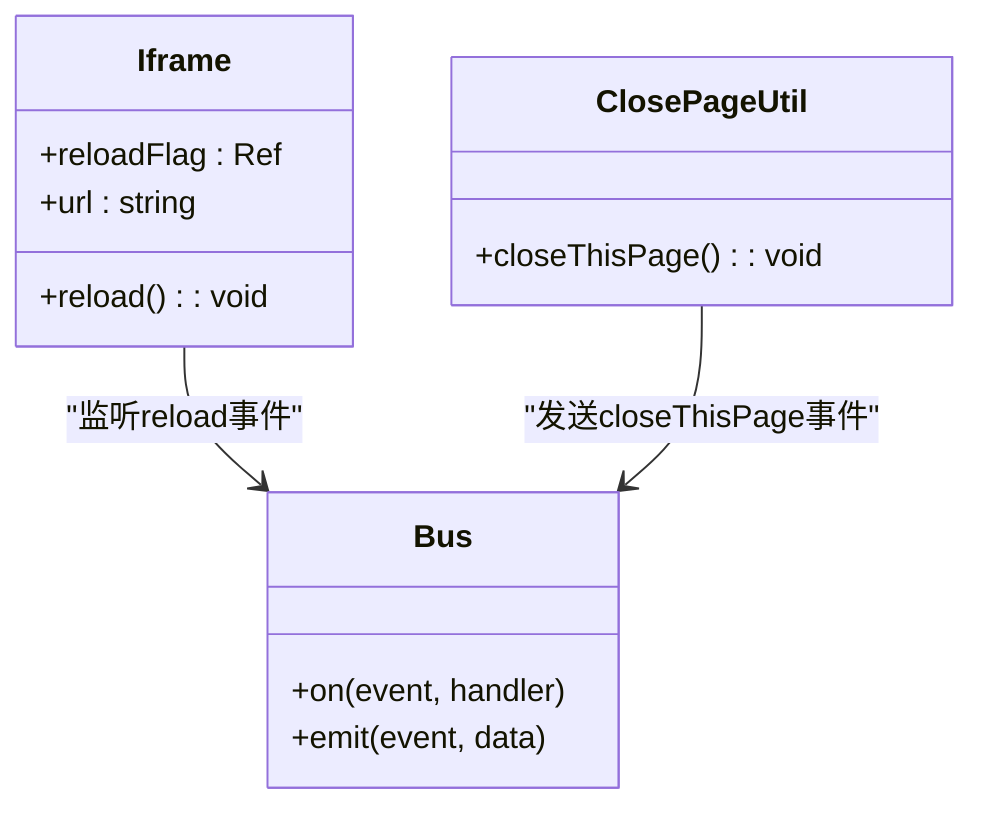

# 内嵌页面容器

<cite>
**本文档引用的文件**
- [iframe.vue](file://web/src/view/layout/iframe.vue)
- [sidebarMode.vue](file://web/src/view/layout/aside/sidebarMode.vue)
- [normalMode.vue](file://web/src/view/layout/aside/normalMode.vue)
- [bus.js](file://web/src/utils/bus.js)
- [closeThisPage.js](file://web/src/utils/closeThisPage.js)
</cite>

## 目录
1. [简介](#简介)
2. [项目结构](#项目结构)
3. [核心组件](#核心组件)
4. [架构概述](#架构概述)
5. [详细组件分析](#详细组件分析)
6. [依赖分析](#依赖分析)
7. [性能考虑](#性能考虑)
8. [故障排除指南](#故障排除指南)
9. [结论](#结论)

## 简介
本系统通过 iframe 容器组件实现外部网页或遗留系统的安全集成。该组件支持动态加载、状态管理、跨域通信和安全策略配置，为系统扩展提供了灵活的解决方案。

## 项目结构
内嵌页面功能主要分布在前端布局与路由模块中，通过事件总线实现组件间通信。

**Diagram sources**
- [iframe.vue](file://web/src/view/layout/iframe.vue)
- [sidebarMode.vue](file://web/src/view/layout/aside/sidebarMode.vue)
- [normalMode.vue](file://web/src/view/layout/aside/normalMode.vue)
- [bus.js](file://web/src/utils/bus.js)

**Section sources**
- [iframe.vue](file://web/src/view/layout/iframe.vue)
- [sidebarMode.vue](file://web/src/view/layout/aside/sidebarMode.vue)

## 核心组件
Iframe 组件作为系统集成的核心，实现了外部内容的安全嵌入和动态加载机制。

**Section sources**
- [iframe.vue](file://web/src/view/layout/iframe.vue#L1-L74)

## 架构概述
系统采用基于 Vue Router 的路由驱动模式，通过查询参数传递目标 URL，结合 Pinia 状态管理和 mitt 事件总线实现完整的内嵌页面解决方案。

**Diagram sources**
- [iframe.vue](file://web/src/view/layout/iframe.vue#L1-L74)
- [sidebarMode.vue](file://web/src/view/layout/aside/sidebarMode.vue#L169-L223)
- [bus.js](file://web/src/utils/bus.js#L1-L3)

## 详细组件分析

### Iframe容器分析
组件通过 v-if 控制 iframe 实例的销毁与重建实现重载，利用路由 query 参数动态设置 src 属性。

#### 组件生命周期

**Diagram sources**
- [iframe.vue](file://web/src/view/layout/iframe.vue#L30-L52)

#### 重载机制

**Diagram sources**
- [iframe.vue](file://web/src/view/layout/iframe.vue#L53-L73)

**Section sources**
- [iframe.vue](file://web/src/view/layout/iframe.vue#L1-L74)

### 菜单集成分析
侧边栏菜单组件负责生成包含外部链接的导航项，支持直接打开或在 iframe 中加载。

#### 菜单导航流程

**Diagram sources**
- [sidebarMode.vue](file://web/src/view/layout/aside/sidebarMode.vue#L169-L223)
- [normalMode.vue](file://web/src/view/layout/aside/normalMode.vue#L82-L119)

**Section sources**
- [sidebarMode.vue](file://web/src/view/layout/aside/sidebarMode.vue#L1-L301)
- [normalMode.vue](file://web/src/view/layout/aside/normalMode.vue#L1-L119)

## 依赖分析
组件间通过事件总线进行松耦合通信，降低了模块间的直接依赖。

**Diagram sources**
- [iframe.vue](file://web/src/view/layout/iframe.vue)
- [bus.js](file://web/src/utils/bus.js)
- [closeThisPage.js](file://web/src/utils/closeThisPage.js)

**Section sources**
- [bus.js](file://web/src/utils/bus.js#L1-L3)
- [closeThisPage.js](file://web/src/utils/closeThisPage.js#L1-L4)

## 性能考虑
- 使用防抖定时器避免频繁重载
- 通过 keepAlive 判断选择最优重载策略
- 利用 nextTick 确保 DOM 更新完成
- 懒加载外部资源减少初始加载压力

## 故障排除指南
常见问题及解决方案：
- **页面不显示**：检查 url 参数是否正确编码
- **无法重载**：确认事件总线连接正常
- **样式错乱**：检查父页面与子页面的 CSS 隔离
- **跨域限制**：确保目标站点允许被嵌套

**Section sources**
- [iframe.vue](file://web/src/view/layout/iframe.vue)
- [bus.js](file://web/src/utils/bus.js)

## 结论
该 iframe 容器组件提供了一套完整的外部内容集成方案，具备良好的扩展性和维护性。建议在使用时注意安全策略配置，合理利用预加载和懒加载优化用户体验。