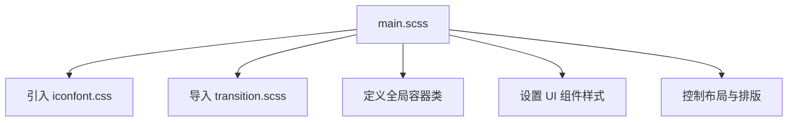
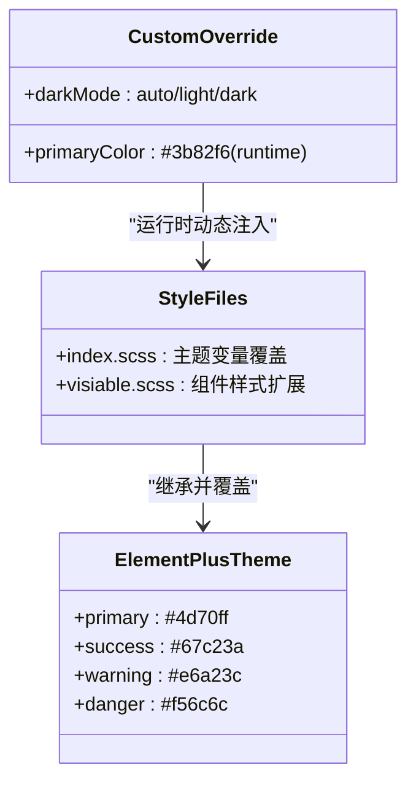
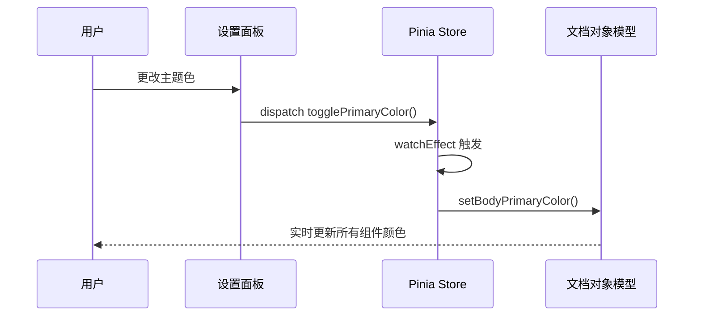

# 布局样式与主题

<cite>
**本文档引用文件**  
- [main.scss](file://web/src/style/main.scss)
- [reset.scss](file://web/src/style/reset.scss)
- [transition.scss](file://web/src/style/transition.scss)
- [index.scss](file://web/src/style/element/index.scss)
- [app.js](file://web/src/pinia/modules/app.js)
- [format.js](file://web/src/utils/format.js)
</cite>

## 目录
1. [项目结构](#项目结构)  
2. [核心样式组织结构](#核心样式组织结构)  
3. [SCSS 样式体系详解](#scss-样式体系详解)  
4. [Element Plus 组件库样式定制](#element-plus-组件库样式定制)  
5. [运行时主题切换机制](#运行时主题切换机制)  
6. [响应式断点与移动端适配](#响应式断点与移动端适配)

## 项目结构

本项目的前端样式文件集中于 `web/src/style` 目录下,主要包含以下核心 SCSS 文件:

- `main.scss`:主样式入口文件,整合所有全局样式
- `reset.scss`:CSS 重置样式,统一浏览器默认样式差异
- `transition.scss`:页面及元素过渡动画定义
- `element/index.scss`:Element Plus 组件库的主题变量覆盖配置
- `element_visiable.scss`:可见性相关样式扩展

此外,Pinia 状态管理模块(`pinia/modules/app.js`)负责维护用户界面的视觉偏好设置,与样式系统深度集成。

**Section sources**  
- [main.scss](file://web/src/style/main.scss#L1-L60)
- [reset.scss](file://web/src/style/reset.scss#L1-L470)
- [transition.scss](file://web/src/style/transition.scss#L1-L69)
- [index.scss](file://web/src/style/element/index.scss#L1-L25)

## 核心样式组织结构

`main.scss` 作为整个前端应用的样式入口文件,采用模块化方式引入并组织各类样式资源。其主要职责包括:

1. 引入图标字体文件(`iconfont.css`)
2. 导入自定义过渡动画(`transition.scss`)
3. 定义全局 CSS 类,如 `.gva-table-box`、`.gva-form-box` 等容器类
4. 设置 NProgress 进度条样式
5. 控制滚动条隐藏(`::-webkit-scrollbar { hidden }`)

该文件通过 `@apply` 指令结合 Tailwind CSS 实用类,实现高效、语义化的样式编写,提升开发效率与可维护性。



**Diagram sources**  
- [main.scss](file://web/src/style/main.scss#L1-L60)

**Section sources**  
- [main.scss](file://web/src/style/main.scss#L1-L60)

## SCSS 样式体系详解

### 变量定义与混合宏

项目中未直接在 SCSS 中定义大量变量或混合宏,而是通过 Element Plus 的主题变量机制进行覆盖。核心变量定义位于 `element/index.scss`,使用 `@forward` 指令重写 `$colors` 映射,实现对主色、成功、警告、危险等颜色的全局定制。

### 重置样式(reset.scss)

`reset.scss` 文件基于主流重置策略,消除不同浏览器间的默认样式差异,确保跨浏览器一致性。其主要功能包括:

- 修正 HTML 元素的行高与字体大小
- 清除 `body`、`ul`、`ol` 等元素的默认外边距
- 统一表单元素(`input`, `button`, `select`)的字体继承与外观
- 隐藏 `img` 边框与 `list-style`
- 处理占位符文字颜色(`::placeholder`)

此文件为后续样式构建提供一致的基础环境。

### 过渡动画(transition.scss)

`transition.scss` 定义了多种常用的页面与组件过渡效果,支持 Vue 的 `<transition>` 组件使用。主要包括:

- `fade`:淡入淡出动画
- `zoom`:缩放动画
- `slide`:滑动进入/退出动画
- `slideDown` 与 `fadeIn`:关键帧动画,用于特定场景的动态展示

这些动画提升了用户交互体验,使界面变化更加自然流畅。

**Section sources**  
- [reset.scss](file://web/src/style/reset.scss#L1-L470)
- [transition.scss](file://web/src/style/transition.scss#L1-L69)
- [main.scss](file://web/src/style/main.scss#L1-L60)

## Element Plus 组件库样式定制

通过 `element/index.scss` 文件,项目实现了对 Element Plus 组件库的深度样式定制。具体方式如下:

```scss
@forward 'element-plus/theme-chalk/src/common/var.scss' with (
  $colors: (
    'primary': ('base': #4d70ff),
    'success': ('base': #67c23a),
    ...
  )
);
```

该配置覆盖了 Element Plus 的默认颜色变量,确保组件(如按钮、标签、输入框等)的颜色风格与项目整体设计保持一致。同时,`element_visiable.scss` 文件进一步扩展了分页器、菜单、标签页等组件的视觉表现,例如:

- 修改 `.el-pagination` 的边框与圆角
- 调整 `.el-menu-item.is-active` 的激活状态背景色
- 自定义深色模式下的背景颜色变量(`--el-bg-color`, `--el-bg-color-overlay` 等)

这种分层覆盖机制既保留了组件库的强大功能,又实现了高度的视觉个性化。



**Diagram sources**  
- [index.scss](file://web/src/style/element/index.scss#L1-L25)
- [element_visiable.scss](file://web/src/style/element_visiable.scss#L1-L136)

**Section sources**  
- [index.scss](file://web/src/style/element/index.scss#L1-L25)
- [element_visiable.scss](file://web/src/style/element_visiable.scss#L1-L136)

## 运行时主题切换机制

项目通过 Pinia 状态管理实现运行时主题切换,核心逻辑位于 `pinia/modules/app.js` 中的 `useAppStore`。

### 主题色动态更新

当用户在设置面板中更改主题色时,触发 `togglePrimaryColor` 方法,调用 `setBodyPrimaryColor(primaryColor, darkMode)` 工具函数。该函数通过 JavaScript 动态修改 CSS 自定义属性(CSS Variables),实现无需刷新的即时换肤:

```js
document.documentElement.style.setProperty('--el-color-primary', primaryColor)
document.documentElement.style.setProperty('--el-color-primary-light-1', '...')
```

同时,根据明暗模式自动选择不同的颜色生成算法(`generateAllColors` 或 `generateAllLightColors`),确保颜色在不同背景下具有良好的可读性与美观性。

### 深色模式同步

使用 `useDark()` 和 `usePreferredDark()`(来自 @vueuse/core)监听系统偏好,并结合用户手动选择,动态切换 `html` 元素的 `class` 为 `dark` 或 `light`,从而激活对应的深色/浅色样式规则。

### 特殊视觉模式

支持“灰色模式”与“色弱模式”,通过 `watchEffect` 监听 `config.grey` 和 `config.weakness` 状态,动态添加 `html-grey` 或 `html-weakenss` 类名,应用全局滤镜效果。



**Diagram sources**  
- [app.js](file://web/src/pinia/modules/app.js#L5-L154)
- [format.js](file://web/src/utils/format.js#L100-L127)

**Section sources**  
- [app.js](file://web/src/pinia/modules/app.js#L5-L154)
- [format.js](file://web/src/utils/format.js#L100-L127)

## 响应式断点与移动端适配

项目通过 `hooks/responsive.js` 实现响应式布局适配。其核心逻辑如下:

- 定义断点阈值 `WIDTH = 992px`
- 监听窗口 `resize` 事件(使用防抖优化性能)
- 根据当前视口宽度判断设备类型(`mobile` 或 `desktop`)
- 将结果提交至 `appStore.toggleDevice()`,更新全局设备状态

此状态被布局组件(如侧边栏、抽屉)消费,从而动态调整 UI 结构。例如,在移动端显示全屏抽屉,在桌面端显示固定侧边栏。

最佳实践建议:
- 使用相对单位(`rem`, `em`, `%`)替代绝对单位(`px`)
- 利用 CSS 媒体查询处理极端尺寸(如 `max-width: 750px`)
- 在关键组件中订阅设备状态,实现布局重构而非简单隐藏
- 优先保证移动端操作便捷性与信息密度

**Section sources**  
- [responsive.js](file://web/src/hooks/responsive.js#L1-L35)
- [app.js](file://web/src/pinia/modules/app.js#L5-L154)