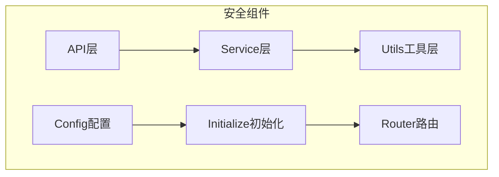
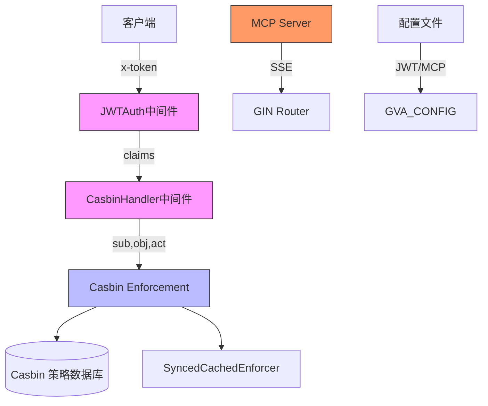
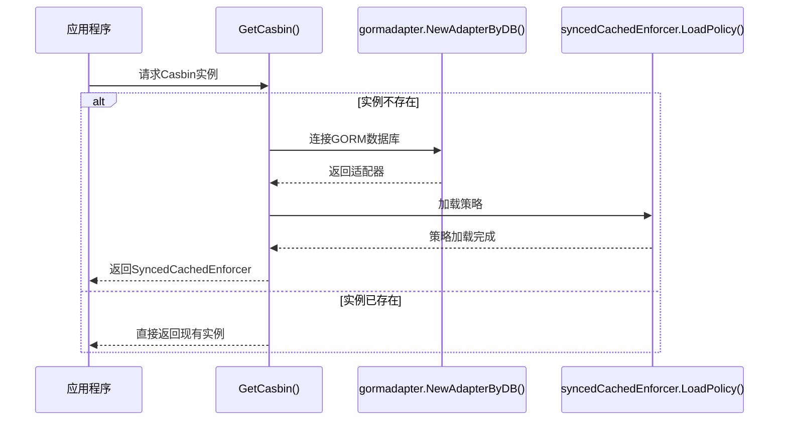
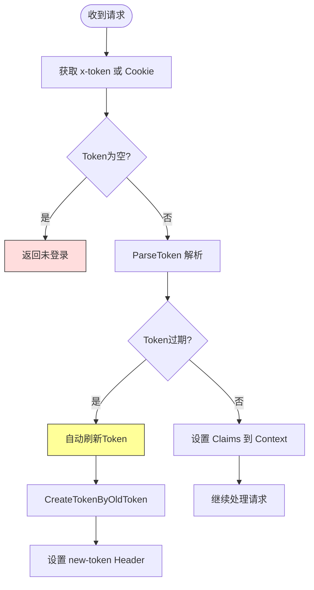
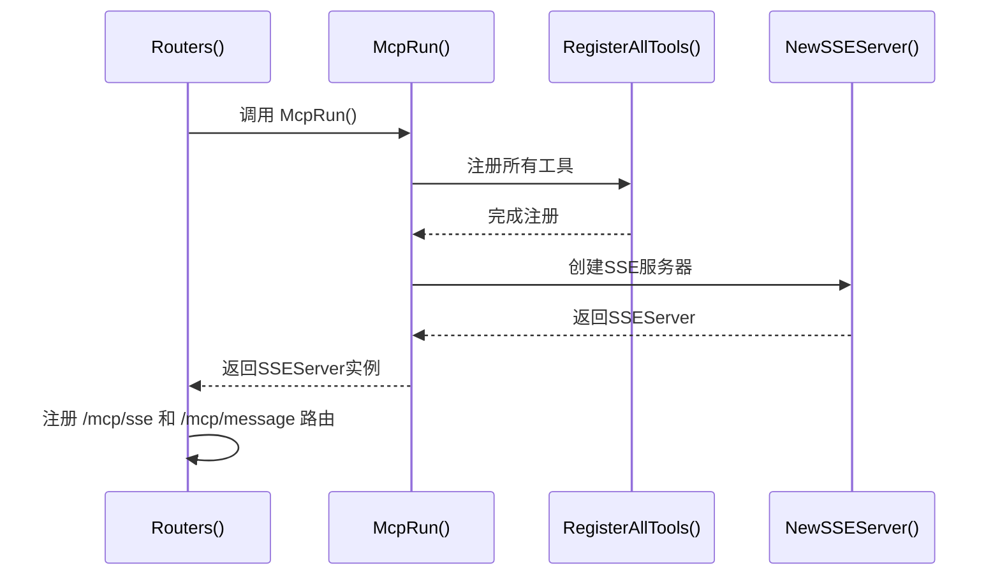
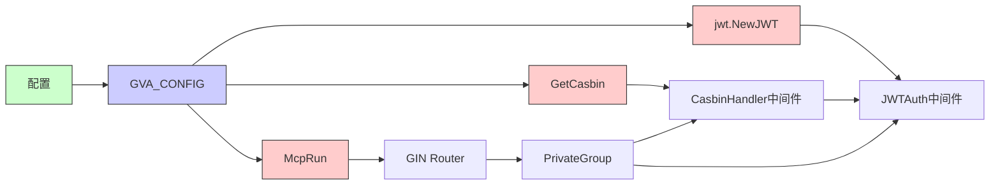

# 安全组件初始化

<cite>
**本文档引用文件**  
- [sys_casbin.go](file://server/service/system/sys_casbin.go)
- [jwt.go](file://server/utils/jwt.go)
- [casbin_util.go](file://server/utils/casbin_util.go)
- [mcp.go](file://server/initialize/mcp.go)
- [config.go](file://server/config/config.go)
- [router.go](file://server/initialize/router.go)
- [sys_casbin.go](file://server/api/v1/system/sys_casbin.go)
- [sys_casbin.go](file://server/router/system/sys_casbin.go)
- [global.go](file://server/global/global.go)
- [jwt.go](file://server/config/jwt.go)
- [mcp.go](file://server/config/mcp.go)
</cite>

## 目录
1. [引言](#引言)
2. [项目结构概览](#项目结构概览)
3. [核心安全组件](#核心安全组件)
4. [架构概述](#架构概述)
5. [详细组件分析](#详细组件分析)
6. [依赖关系分析](#依赖关系分析)
7. [性能考量](#性能考量)
8. [故障排查指南](#故障排查指南)
9. [结论](#结论)

## 引言
本文件全面介绍 gin-vue-admin 项目中关键安全组件的初始化流程，重点涵盖 Casbin RBAC 权限引擎、JWT 认证中间件以及 MCP（Model Context Protocol）安全上下文的启动与配置机制。文档将深入解析 `sys_casbin.go` 服务层如何实现权限策略的持久化同步，并提供缓存更新策略与调试技巧。

## 项目结构概览
系统采用分层架构设计，安全相关代码主要分布在以下目录：
- `server/api/v1/system/`: Casbin API 接口定义
- `server/service/system/`: Casbin 核心业务逻辑 (`sys_casbin.go`)
- `server/utils/`: JWT 和 Casbin 工具类 (`jwt.go`, `casbin_util.go`)
- `server/initialize/`: 初始化入口 (`mcp.go`, `router.go`)
- `server/config/`: 安全组件配置 (`jwt.go`, `mcp.go`)

**Diagram sources**
- [sys_casbin.go](file://server/api/v1/system/sys_casbin.go#L1-L70)
- [sys_casbin.go](file://server/service/system/sys_casbin.go#L1-L173)
- [jwt.go](file://server/utils/jwt.go#L1-L105)
- [config.go](file://server/config/config.go#L1-L3)
- [router.go](file://server/initialize/router.go#L1-L123)

**Section sources**
- [project_structure](file://project_structure)

## 核心安全组件

本文档的核心是分析三大安全组件的初始化与交互：
1. **Casbin RBAC引擎**: 负责基于角色的访问控制。
2. **JWT认证中间件**: 处理用户身份验证和令牌管理。
3. **MCP安全上下文**: 提供模型上下文协议的安全通信。

这些组件通过全局配置和初始化流程紧密集成，确保系统的安全性与可扩展性。

**Section sources**
- [sys_casbin.go](file://server/service/system/sys_casbin.go#L1-L173)
- [jwt.go](file://server/utils/jwt.go#L1-L105)
- [mcp.go](file://server/initialize/mcp.go#L1-L25)

## 架构概述

系统安全架构遵循典型的分层模式，各组件协同工作以保障应用安全。

**Diagram sources**
- [jwt.go](file://server/middleware/jwt.go#L1-L88)
- [casbin_util.go](file://server/utils/casbin_util.go#L1-L52)
- [mcp.go](file://server/initialize/mcp.go#L1-L25)
- [router.go](file://server/initialize/router.go#L1-L123)

## 详细组件分析

### Casbin RBAC 权限引擎初始化

#### 初始化流程
Casbin 实例通过单例模式在首次调用时创建，确保全局唯一性。

**Diagram sources**
- [casbin_util.go](file://server/utils/casbin_util.go#L1-L52)
- [global.go](file://server/global/global.go#L1-L68)

#### 权限策略加载与同步机制
`sys_casbin.go` 服务层提供了完整的策略管理接口：

- `UpdateCasbin`: 更新指定角色的权限，先清除旧策略再批量添加新策略。
- `SyncPolicy`: 同步数据库策略，需配合 `FreshCasbin` 生效。
- `FreshCasbin`: 从数据库重新加载所有策略到内存。

该机制实现了数据库持久化与内存高速校验的结合，保证了权限变更的实时性与一致性。

**Section sources**
- [sys_casbin.go](file://server/service/system/sys_casbin.go#L1-L173)
- [casbin_util.go](file://server/utils/casbin_util.go#L1-L52)

### JWT 认证中间件

#### 密钥配置与Token解析
JWT 中间件的密钥来源于全局配置 `GVA_CONFIG.JWT.SigningKey`。

**Diagram sources**
- [jwt.go](file://server/middleware/jwt.go#L1-L88)
- [jwt.go](file://server/utils/jwt.go#L1-L105)
- [config.go](file://server/config/jwt.go#L1-L8)

#### Token生命周期管理
系统实现了自动续签机制。当检测到Token即将过期（剩余时间小于BufferTime），会生成一个新的Token并通过响应头 `new-token` 返回给客户端，同时在Redis中记录新Token（如果启用了多点登录）。

**Section sources**
- [jwt.go](file://server/middleware/jwt.go#L1-L88)
- [jwt.go](file://server/utils/jwt.go#L1-L105)

### MCP 安全上下文初始化

#### 初始化流程
MCP服务器在 `Routers()` 函数中被初始化并注册到GIN路由。

**Diagram sources**
- [mcp.go](file://server/initialize/mcp.go#L1-L25)
- [router.go](file://server/initialize/router.go#L1-L123)
- [mcp.go](file://server/config/mcp.go#L1-L9)

#### 配置参数
MCP的运行参数（名称、版本、SSE路径等）均来自 `GVA_CONFIG.MCP`，实现了配置驱动的初始化。

**Section sources**
- [mcp.go](file://server/initialize/mcp.go#L1-L25)
- [mcp.go](file://server/config/mcp.go#L1-L9)

## 依赖关系分析

安全组件间的依赖关系清晰，形成了一个稳固的信任链。

**Diagram sources**
- [config.go](file://server/config/config.go#L1-L3)
- [global.go](file://server/global/global.go#L1-L68)
- [jwt.go](file://server/utils/jwt.go#L1-L105)
- [casbin_util.go](file://server/utils/casbin_util.go#L1-L52)
- [mcp.go](file://server/initialize/mcp.go#L1-L25)
- [router.go](file://server/initialize/router.go#L1-L123)
- [jwt.go](file://server/middleware/jwt.go#L1-L88)
- [casbin_handler.go](file://server/middleware/casbin_rbac.go#L1-L30) <!-- 假设存在此文件 -->

**Section sources**
- [global.go](file://server/global/global.go#L1-L68)
- [router.go](file://server/initialize/router.go#L1-L123)

## 性能考量

- **Casbin 缓存**: 使用 `SyncedCachedEnforcer` 并设置一小时过期时间，有效减少数据库查询压力。
- **JWT 解析**: 将解析结果存储在 Gin Context 中，避免重复解析。
- **MCP 初始化**: 在应用启动时一次性完成，不影响运行时性能。
- **并发控制**: 使用 `singleflight.Group` 防止 JWT 刷新时的并发攻击。

## 故障排查指南

### 常见问题与解决方法

| 问题现象 | 可能原因 | 解决方案 |
| :--- | :--- | :--- |
| 权限修改后不生效 | 未调用 `FreshCasbin` | 调用 `/api/freshCasbin` API 或重启服务 |
| Token频繁过期 | BufferTime 设置过短 | 检查 `jwt.buffer-time` 配置 |
| MCP连接失败 | SSE路径配置错误 | 检查 `mcp.sse_path` 配置并与前端匹配 |
| 数据库连接失败 | Casbin适配器初始化失败 | 确认数据库为InnoDB引擎并检查连接信息 |

### 调试技巧
1. **日志监控**: 关注 `zap.L().Error` 输出，特别是适配器和模型加载错误。
2. **API测试**: 使用 `UpdateCasbin` 和 `GetPolicyPathByAuthorityId` 验证策略是否正确同步。
3. **配置验证**: 确保 `config.yaml` 中的 `jwt` 和 `mcp` 配置项完整且格式正确。

**Section sources**
- [casbin_util.go](file://server/utils/casbin_util.go#L1-L52)
- [jwt.go](file://server/utils/jwt.go#L1-L105)
- [sys_casbin.go](file://server/api/v1/system/sys_casbin.go#L1-L70)

## 结论

gin-vue-admin 的安全组件初始化设计合理，通过模块化、配置化的方式实现了高内聚低耦合。Casbin RBAC 提供了灵活的权限控制，JWT 中间件保障了身份认证的安全性，MCP 则为未来AI功能扩展奠定了基础。开发者应重点关注配置的准确性与组件间的初始化顺序，以确保整个安全体系的稳定运行。