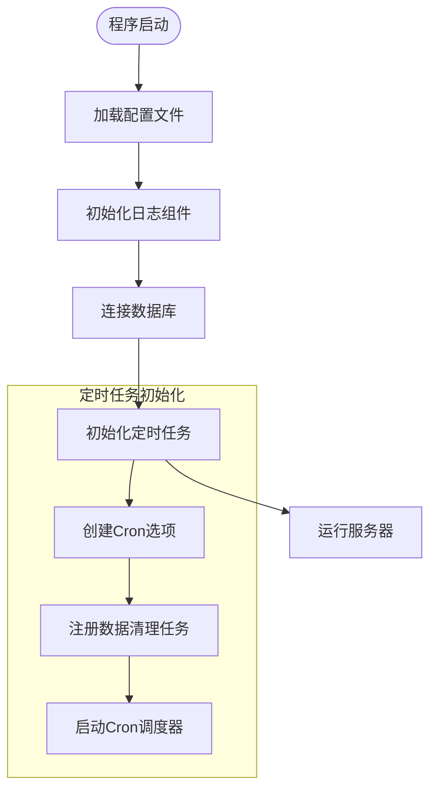
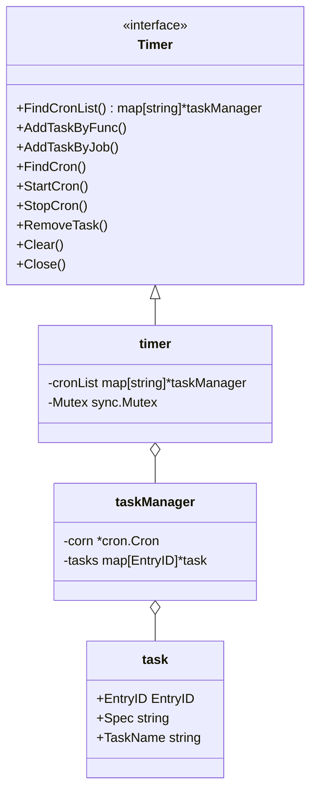
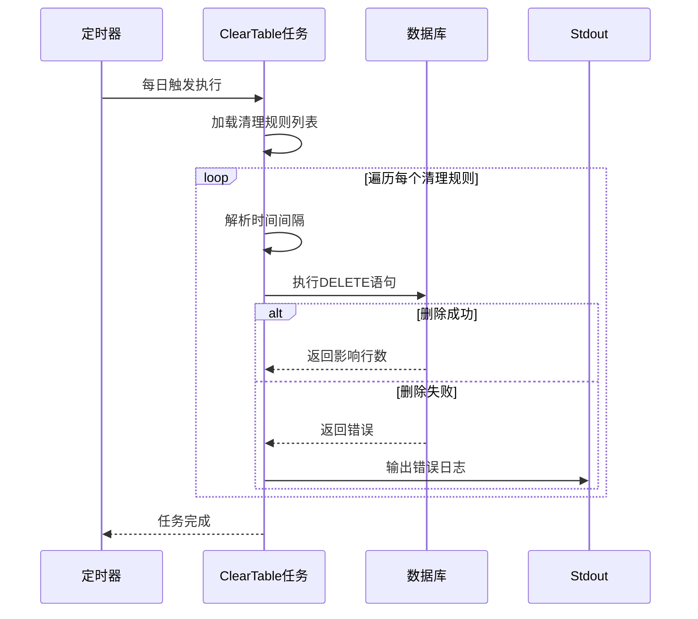
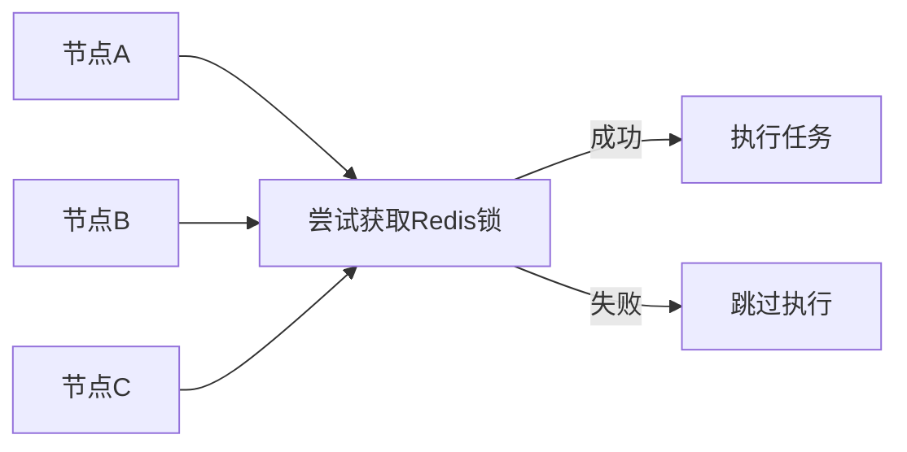

# 定时任务初始化

<cite>
**本文档中引用的文件**
- [timer.go](file://server/initialize/timer.go)
- [timed_task.go](file://server/utils/timer/timed_task.go)
- [clearTable.go](file://server/task/clearTable.go)
- [global.go](file://server/global/global.go)
- [main.go](file://server/main.go)
</cite>

## 目录
1. [简介](#简介)
2. [定时任务系统初始化流程](#定时任务系统初始化流程)
3. [可编程任务管理器实现机制](#可编程任务管理器实现机制)
4. [数据清理任务示例分析](#数据清理任务示例分析)
5. [任务执行日志与异常处理](#任务执行日志与异常处理)
6. [并发控制与分布式协调扩展思路](#并发控制与分布式协调扩展思路)
7. [结论](#结论)

## 简介
本项目基于 `robfig/cron/v3` 实现了一套灵活的定时任务调度系统,通过封装 `Timer` 接口提供动态添加、删除和执行周期性任务的能力。系统在服务启动时完成初始化,并支持运行时动态管理多个独立的 cron 任务组。以数据库表数据清理为例,展示了如何注册并执行具体任务逻辑。

## 定时任务系统初始化流程

定时任务系统的初始化由 `main.go` 中的 `initializeSystem()` 函数触发,调用 `initialize.Timer()` 启动任务调度器。该过程采用 goroutine 异步执行,确保不影响主服务启动流程。



**Diagram sources**
- [main.go](file://server/main.go#L38-L50)
- [timer.go](file://server/initialize/timer.go#L11-L36)

**Section sources**
- [main.go](file://server/main.go#L38-L50)
- [timer.go](file://server/initialize/timer.go#L11-L36)

## 可编程任务管理器实现机制

`timed_task.go` 文件定义了 `Timer` 接口及其实现类 `timer`,提供了完整的任务生命周期管理能力。核心结构包括:

- **Timer 接口**:定义了任务查找、添加、删除、启停等操作
- **taskManager 结构体**:封装单个 Cron 实例及其关联的任务列表
- **timer 结构体**:维护所有命名 Cron 组的映射关系,使用互斥锁保证线程安全

任务可通过函数或接口形式注册,支持秒级精度调度(通过 `cron.WithSeconds()` 选项)。每个任务包含唯一标识、CRON 表达式、任务名称和执行体。



**Diagram sources**
- [timed_task.go](file://server/utils/timer/timed_task.go#L15-L230)

**Section sources**
- [timed_task.go](file://server/utils/timer/timed_task.go#L15-L230)

## 数据清理任务示例分析

`clearTable.go` 实现了一个典型的数据归档任务,用于定期清理过期的日志和黑名单记录。任务通过 `common.ClearDB` 结构体配置清理规则,支持多表批量处理。

```go
type ClearDB struct {
	TableName    string
	CompareField string
	Interval     string
}
```

任务注册发生在 `timer.go` 中,使用 `@daily` CRON 表达式每日执行一次。执行逻辑如下:
1. 构造待清理表清单(操作记录表、JWT 黑名单表)
2. 解析保留时间间隔(如 90 天、7 天)
3. 执行 DELETE SQL 删除早于指定时间的数据



**Diagram sources**
- [clearTable.go](file://server/task/clearTable.go#L15-L51)
- [timer.go](file://server/initialize/timer.go#L15-L25)

**Section sources**
- [clearTable.go](file://server/task/clearTable.go#L15-L51)
- [timer.go](file://server/initialize/timer.go#L15-L25)

## 任务执行日志与异常处理

系统对任务执行过程中的异常进行了基本捕获和输出。当 `ClearTable` 函数返回错误时,会在标准输出打印 `"timer error:"` 日志。但当前实现未集成到 zap 日志系统,建议改进为使用 `global.GVA_LOG.Error()` 记录详细上下文。

异常类型主要包括:
- 数据库连接为空
- 时间间隔解析失败(非合法 duration 字符串)
- SQL 执行错误(权限不足、表不存在等)

建议增强点:
- 增加任务执行耗时监控
- 支持失败重试机制
- 提供邮件或 webhook 告警通知

**Section sources**
- [clearTable.go](file://server/task/clearTable.go#L35-L51)
- [timer.go](file://server/initialize/timer.go#L20-L22)

## 并发控制与分布式环境下任务协调扩展思路

当前定时任务系统为单实例模式,在分布式部署场景下可能导致同一任务被多次执行。可行的扩展方案包括:

### 分布式锁方案
利用 Redis 或数据库实现分布式互斥锁,确保仅一个节点获得执行权。



### 单中心调度模式
设立专用调度服务,其他节点作为执行器接收指令,实现调度与执行分离。

### 基于数据库状态标记
在数据库中维护任务最后执行时间戳,各节点竞争更新,成功者执行任务。

### 使用专业调度框架
引入 Quartz、XXL-JOB 等成熟分布式调度中间件替代内置 cron。

此外,应考虑增加以下功能:
- 动态调整任务频率(通过 API 修改 spec)
- 任务执行历史查询
- Web 控制台可视化管理界面
- 任务依赖与编排支持

**Section sources**
- [timed_task.go](file://server/utils/timer/timed_task.go#L15-L230)
- [clearTable.go](file://server/task/clearTable.go#L15-L51)

## 结论
该项目实现了基于 cron 的轻量级定时任务系统,具备良好的可扩展性和易用性。通过 `Timer` 接口抽象,支持动态管理多种类型的周期性任务。以数据清理为例,展示了从任务定义、注册到执行的完整链路。未来可在日志集成、分布式协调和运维监控方面进一步优化,提升系统的健壮性和可观测性。