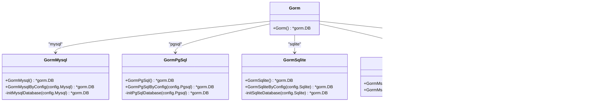

# 数据库驱动初始化

<cite>
**本文档中引用的文件**
- [gorm.go](file://server/initialize/gorm.go)
- [gorm_mysql.go](file://server/initialize/gorm_mysql.go)
- [gorm_pgsql.go](file://server/initialize/gorm_pgsql.go)
- [gorm_oracle.go](file://server/initialize/gorm_oracle.go)
- [gorm_mssql.go](file://server/initialize/gorm_mssql.go)
- [gorm_sqlite.go](file://server/initialize/gorm_sqlite.go)
- [internal/gorm.go](file://server/initialize/internal/gorm.go)
- [internal/gorm_logger_writer.go](file://server/initialize/internal/gorm_logger_writer.go)
- [config/db_list.go](file://server/config/db_list.go)
- [config/gorm_mysql.go](file://server/config/gorm_mysql.go)
- [config/gorm_pgsql.go](file://server/config/gorm_pgsql.go)
- [config/config.go](file://server/config/config.go)
- [global/global.go](file://server/global/global.go)
</cite>

## 目录
1. [引言](#引言)
2. [项目结构](#项目结构)
3. [核心组件](#核心组件)
4. [架构概览](#架构概览)
5. [详细组件分析](#详细组件分析)
6. [依赖分析](#依赖分析)
7. [性能考虑](#性能考虑)
8. [故障排除指南](#故障排除指南)
9. [结论](#结论)

## 引言
本文档详细说明了 `gin-vue-admin` 项目中 GORM 框架对多数据库驱动的初始化机制。重点阐述了如何根据配置中的 `DBType` 动态调用对应的数据库初始化函数(如 `GormMysql`、`GormPgSql` 等),并解析各数据库适配器在连接参数、驱动注册和方言处理上的实现差异。同时,解释了 `initDB` 函数如何封装通用初始化逻辑,并集成日志写入器以统一输出 SQL 执行日志。

## 项目结构
该项目采用分层模块化设计,主要分为前端 (`web`) 和后端 (`server`) 两大部分。后端服务基于 Gin 框架构建,使用 GORM 作为 ORM 层支持多种数据库。数据库相关的初始化逻辑集中在 `server/initialize` 目录下,每个数据库类型有独立的初始化文件(如 `gorm_mysql.go`, `gorm_pgsql.go` 等)。配置信息通过 `server/config` 包管理,全局变量存储于 `server/global` 中。


**图示来源**
- [gorm.go](file://server/initialize/gorm.go)
- [gorm_mysql.go](file://server/initialize/gorm_mysql.go)
- [gorm_pgsql.go](file://server/initialize/gorm_pgsql.go)
- [gorm_sqlite.go](file://server/initialize/gorm_sqlite.go)
- [gorm_mssql.go](file://server/initialize/gorm_mssql.go)
- [gorm_oracle.go](file://server/initialize/gorm_oracle.go)
- [internal/gorm.go](file://server/initialize/internal/gorm.go)
- [internal/gorm_logger_writer.go](file://server/initialize/internal/gorm_logger_writer.go)
- [config/db_list.go](file://server/config/db_list.go)
- [config/config.go](file://server/config/config.go)
- [global/global.go](file://server/global/global.go)

**本节来源**
- [server/initialize/gorm.go](file://server/initialize/gorm.go)
- [server/config/config.go](file://server/config/config.go)
- [server/global/global.go](file://server/global/global.go)

## 核心组件
系统的核心是 `Gorm()` 函数,它位于 `server/initialize/gorm.go` 文件中,负责根据当前配置的 `DbType` 动态选择并调用相应的数据库初始化函数。这些函数包括 `GormMysql()`, `GormPgSql()`, `GormSqlite()`, `GormMssql()`, 和 `GormOracle()`,分别对应不同的数据库类型。所有初始化函数最终都返回一个 `*gorm.DB` 实例,并将其赋值给全局变量 `GVA_DB`。

此外,`RegisterTables()` 函数用于自动迁移数据表结构,确保数据库模式与 Go 结构体保持一致。该过程依赖于 GORM 的 `AutoMigrate` 方法。

**本节来源**
- [server/initialize/gorm.go](file://server/initialize/gorm.go#L10-L79)
- [server/initialize/gorm_mysql.go](file://server/initialize/gorm_mysql.go#L10-L48)
- [server/initialize/gorm_pgsql.go](file://server/initialize/gorm_pgsql.go#L10-L43)

## 架构概览
整个数据库初始化流程遵循“配置驱动 + 工厂模式”的设计理念。首先从配置文件加载数据库类型 (`DbType`),然后通过 `switch-case` 判断语句决定调用哪个具体的初始化函数。每个初始化函数内部会构造特定数据库的 DSN 字符串,导入对应的 GORM 驱动程序,设置连接池参数,并应用统一的日志记录策略。

```mermaid
sequenceDiagram
participant Main as main.go
participant Init as initialize.Gorm()
participant Config as global.GVA_CONFIG.System.DbType
participant Mysql as GormMysql()
participant Pgsql as GormPgSql()
participant Sqlite as GormSqlite()
participant Mssql as GormMssql()
participant Oracle as GormOracle()
participant Logger as internal.Gorm.Config()
Main->>Init : 调用 Gorm()
Init->>Config : 获取 DbType
alt 如果 DbType 是 mysql
Init->>Mysql : 调用 GormMysql()
Mysql->>Logger : 获取 GORM 配置
Mysql-->>Init : 返回 *gorm.DB
elif 如果 DbType 是 pgsql
Init->>Pgsql : 调用 GormPgSql()
Pgsql->>Logger : 获取 GORM 配置
Pgsql-->>Init : 返回 *gorm.DB
elif 如果 DbType 是 sqlite
Init->>Sqlite : 调用 GormSqlite()
Sqlite->>Logger : 获取 GORM 配置
Sqlite-->>Init : 返回 *gorm.DB
elif 如果 DbType 是 mssql
Init->>Mssql : 调用 GormMssql()
Mssql->>Logger : 获取 GORM 配置
Mssql-->>Init : 返回 *gorm.DB
else 如果 DbType 是 oracle
Init->>Oracle : 调用 GormOracle()
Oracle->>Logger : 获取 GORM 配置
Oracle-->>Init : 返回 *gorm.DB
end
Init-->>Main : 返回初始化后的 DB 实例
```

**图示来源**
- [server/initialize/gorm.go](file://server/initialize/gorm.go#L10-L38)
- [server/initialize/internal/gorm.go](file://server/initialize/internal/gorm.go#L10-L31)

## 详细组件分析

### GORM 初始化主控逻辑分析
`Gorm()` 函数是整个数据库初始化流程的入口点。它读取全局配置中的 `DbType` 字段,依据其值跳转到相应数据库的初始化函数。若未匹配任何已知类型,则默认使用 MySQL。此设计实现了良好的扩展性,便于未来添加新的数据库支持。

#### 主控逻辑类图


**图示来源**
- [server/initialize/gorm.go](file://server/initialize/gorm.go#L10-L38)
- [server/initialize/gorm_mysql.go](file://server/initialize/gorm_mysql.go#L10-L48)
- [server/initialize/gorm_pgsql.go](file://server/initialize/gorm_pgsql.go#L10-L43)
- [server/initialize/gorm_sqlite.go](file://server/initialize/gorm_sqlite.go#L10-L38)
- [server/initialize/gorm_mssql.go](file://server/initialize/gorm_mssql.go#L10-L64)
- [server/initialize/gorm_oracle.go](file://server/initialize/gorm_oracle.go#L10-L37)

**本节来源**
- [server/initialize/gorm.go](file://server/initialize/gorm.go#L10-L38)

### 各数据库适配器实现差异分析
不同数据库的初始化函数虽然结构相似,但在 DSN 构建方式、驱动导入和连接选项上存在显著差异。

#### MySQL 初始化流程
MySQL 使用 `github.com/go-sql-driver/mysql` 驱动,DSN 格式为标准的用户名密码加 TCP 地址形式。支持设置表引擎(ENGINE)等高级选项。

```go
func (m *Mysql) Dsn() string {
	return m.Username + ":" + m.Password + "@tcp(" + m.Path + ":" + m.Port + ")/" + m.Dbname + "?" + m.Config
}
```

#### PostgreSQL 初始化流程
PostgreSQL 使用 `gorm.io/driver/postgres` 驱动,DSN 采用键值对格式,更接近原生 libpq 连接字符串。

```go
func (p *Pgsql) Dsn() string {
	return "host=" + p.Path + " user=" + p.Username + " password=" + p.Password + " dbname=" + p.Dbname + " port=" + p.Port + " " + p.Config
}
```

#### SQLite 初始化流程
SQLite 使用 `github.com/glebarez/sqlite` 驱动,DSN 即为数据库文件路径,无需网络地址或端口。

```go
if db, err := gorm.Open(sql