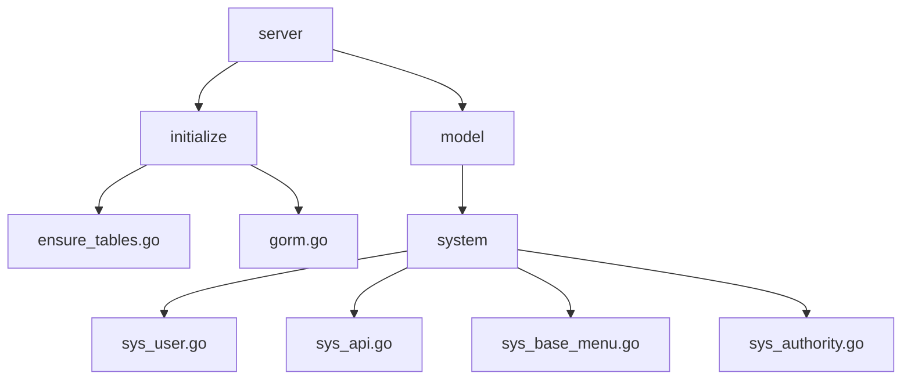
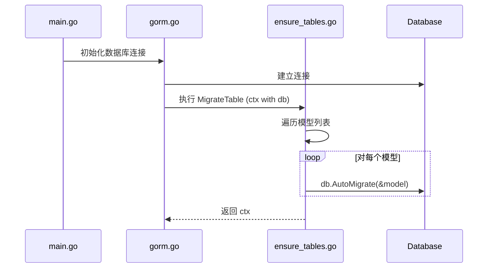
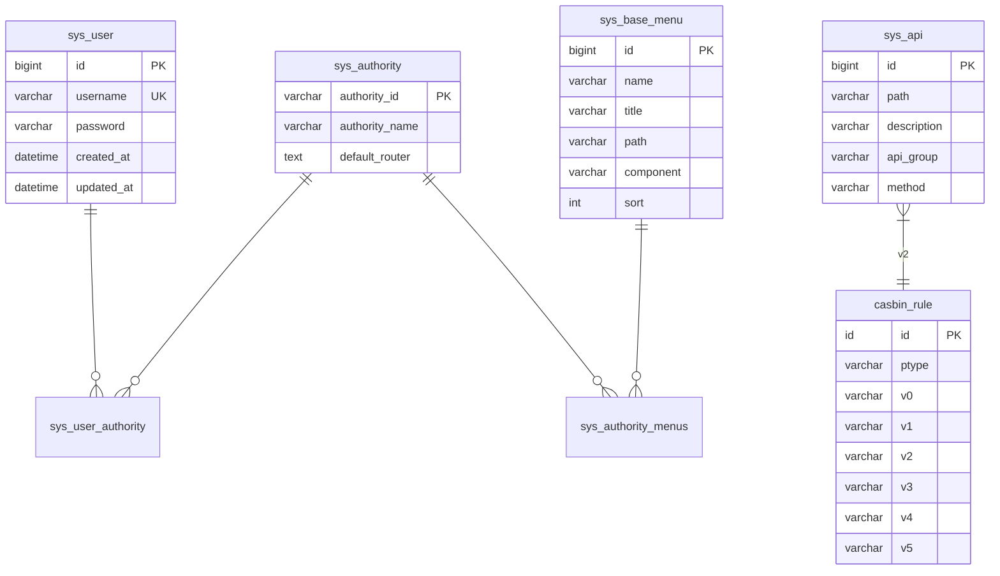

# 表结构迁移与确保

<cite>
**本文档引用的文件**
- [ensure_tables.go](file://server/initialize/ensure_tables.go)
- [sys_user.go](file://server/model/system/sys_user.go)
- [sys_api.go](file://server/model/system/sys_api.go)
- [sys_menu.go](file://server/model/system/sys_base_menu.go)
- [sys_authority.go](file://server/model/system/sys_authority.go)
- [gorm.go](file://server/initialize/gorm.go)
- [casbin.go](file://server/source/system/casbin.go)
</cite>

## 目录
1. [简介](#简介)
2. [项目结构分析](#项目结构分析)
3. [核心组件分析](#核心组件分析)
4. [架构概览](#架构概览)
5. [详细组件分析](#详细组件分析)
6. [依赖关系分析](#依赖关系分析)
7. [性能考量](#性能考量)
8. [故障排除指南](#故障排除指南)
9. [结论](#结论)

## 简介
本文件深入分析 gin-vue-admin 项目中 `ensure_tables.go` 文件所实现的自动表结构管理机制。重点阐述了基于 GORM 模型定义(如 sys_user、sys_api)在服务启动时如何通过 AutoMigrate 功能自动创建或更新数据库表结构。文档详细描述了关键系统表之间的关系(用户-角色-菜单-权限),并提供了字段索引、唯一约束和外键设置的最佳实践建议。同时,涵盖了自定义 migrate 钩子函数的使用方法,以及如何安全地执行生产环境下的 schema 变更操作。最后列举了常见的迁移失败场景及其解决方案。

## 项目结构分析
gin-vue-admin 是一个基于 Gin 和 Vue 的前后端分离管理系统,其后端代码位于 server 目录下。数据库初始化和表结构管理相关逻辑主要集中在 `server/initialize` 包中,其中 `ensure_tables.go` 负责处理所有模型对应的数据库表的自动迁移工作。GORM 模型定义分散在 `server/model/system` 和 `server/model/example` 等目录中,这些结构体通过标签(tags)声明了数据库列名、类型、索引等元信息。



**Diagram sources**
- [ensure_tables.go](file://server/initialize/ensure_tables.go#L1-L113)
- [sys_user.go](file://server/model/system/sys_user.go#L1-L20)
- [sys_api.go](file://server/model/system/sys_api.go#L1-L20)

**Section sources**
- [ensure_tables.go](file://server/initialize/ensure_tables.go#L1-L113)
- [project_structure](file://project_structure#L1-L500)

## 核心组件分析
`ensure_tables.go` 实现了一个符合 `system.SubInitializer` 接口的初始化器,该初始化器在系统启动流程中优先级较高(initOrderEnsureTables),确保在其他数据插入操作之前完成表结构的创建或更新。其核心功能是调用 GORM 的 `AutoMigrate` 方法,传入一系列系统模型实例,由 GORM 自动比对现有数据库模式与 Go 结构体定义,并执行必要的 DDL 语句以使数据库结构保持最新。

**Section sources**
- [ensure_tables.go](file://server/initialize/ensure_tables.go#L15-L113)

## 架构概览
整个表结构管理机制依托于 GORM 的强大 ORM 能力和 gin-vue-admin 定义的初始化系统。当应用启动时,`gorm.go` 中的初始化逻辑会构建数据库连接,并将 `*gorm.DB` 实例放入上下文(context)。随后,注册到初始化系统的 `ensureTables` 实例会在 `MigrateTable` 阶段从上下文中取出数据库连接,并对预定义的模型列表执行 `AutoMigrate`。



**Diagram sources**
- [gorm.go](file://server/initialize/gorm.go#L1-L50)
- [ensure_tables.go](file://server/initialize/ensure_tables.go#L50-L90)

## 详细组件分析

### 表结构自动迁移机制分析
`ensureTables` 结构体实现了 `MigrateTable` 方法,该方法从上下文获取 `*gorm.DB` 实例,并遍历一个包含所有核心系统模型的切片。对于每一个模型,都调用 `db.AutoMigrate(&t)`。GORM 会检查数据库中是否存在对应表,如果不存在则创建；如果存在,则尝试添加缺失的列、索引等,但不会删除已存在的列(防止数据丢失)。

#### 关键系统表关系分析
系统中的权限控制基于 RBAC(基于角色的访问控制)模型,涉及多个核心表:
- `sys_user`: 用户表,存储用户基本信息。
- `sys_authority`: 角色(权限组)表,定义不同级别的权限集合。
- `sys_base_menu`: 菜单表,定义系统内的导航菜单项。
- `sys_api`: API 接口表,记录所有可被访问的后端接口。
- `casbin_rule`: 使用 Casbin 进行细粒度权限控制的规则存储表。

这些表之间通过关联表建立多对多关系,例如 `sys_user_authority` 记录用户与角色的归属,`sys_authority_menus` 记录角色可访问的菜单。



**Diagram sources**
- [sys_user.go](file://server/model/system/sys_user.go#L10-L40)
- [sys_authority.go](file://server/model/system/sys_authority.go#L8-L30)
- [sys_base_menu.go](file://server/model/system/sys_base_menu.go#L12-L50)
- [sys_api.go](file://server/model/system/sys_api.go#L10-L35)
- [casbin.go](file://server/source/system/casbin.go#L15-L25)

**Section sources**
- [ensure_tables.go](file://server/initialize/ensure_tables.go#L60-L90)
- [sys_user.go](file://server/model/system/sys_user.go#L1-L100)
- [sys_authority.go](file://server/model/system/sys_authority.go#L1-L80)

### 字段索引、唯一约束与外键最佳实践
在 GORM 模型定义中,通过结构体标签(struct tags)来指定数据库约束:
- **唯一约束**: 使用 `uniqueIndex` 或 `unique` 标签,例如 `username` 字段通常需要唯一性保证。
- **索引**: 使用 `index` 标签为经常用于查询条件的字段(如 `created_at`, `status`)创建索引,提升查询性能。
- **外键**: GORM 支持通过关联关系自动管理外键,但在某些数据库(如 SQLite)上可能需要手动启用外键支持。建议在生产环境中明确使用 `constraint` 标签定义外键行为(如 `OnDelete:CASCADE`)。

虽然 `AutoMigrate` 可以创建索引和唯一约束,但对于复杂的外键关系变更,建议结合使用数据库迁移工具(如 Goose、Flyway)进行版本化管理,避免自动迁移带来的潜在风险。

**Section sources**
- [sys_user.go](file://server/model/system/sys_user.go#L20-L30)
- [sys_api.go](file://server/model/system/sys_api.go#L15-L25)

### 自定义 Migrate 钩子函数使用方法
GORM 提供了钩子(Hooks)机制,允许在迁移过程的不同阶段插入自定义逻辑。例如,可以在 `BeforeAutoMigrate` 钩子中记录迁移日志,在 `AfterAutoMigrate` 钩子中执行数据初始化或清理任务。要使用钩子,需在模型结构体中定义相应的方法,如 `func (u *SysUser) BeforeAutoMigrate(tx *gorm.DB) error`。

此外,gin-vue-admin 的初始化系统本身也是一种高级“钩子”,允许开发者在 `MigrateTable` 之后、`InitializeData` 之前执行特定的表结构调整逻辑。

**Section sources**
- [gorm.go](file://server/initialize/gorm.go#L30-L40)
- [ensure_tables.go](file://server/initialize/ensure_tables.go#L50-L90)

### 生产环境下 Schema 变更的安全执行
尽管 `AutoMigrate` 在开发环境中非常便捷,但在生产环境中直接使用存在风险,如意外的数据丢失或锁表时间过长。推荐做法是:
1. **禁用自动迁移**: 在生产配置中关闭 `AutoMigrate`。
2. **使用版本化迁移**: 采用独立的迁移脚本,每项变更都有明确的版本号和回滚策略。
3. **先备份再操作**: 任何 schema 变更前必须对数据库进行完整备份。
4. **低峰期执行**: 选择用户访问量较低的时间窗口执行变更。
5. **逐步部署**: 在集群环境中,逐个节点进行变更,观察影响。

gin-vue-admin 的初始化框架允许通过实现不同的 `SubInitializer` 来集成自定义的迁移策略,从而替代默认的 `AutoMigrate`。

**Section sources**
- [ensure_tables.go](file://server/initialize/ensure_tables.go#L50-L90)
- [gorm.go](file://server/initialize/gorm.go#L20-L60)

### 常见迁移失败场景及解决方案
| 场景 | 原因 | 解决方案 |
| :--- | :--- | :--- |
| 列类型不兼容 | 尝试修改已有列的类型(如 VARCHAR 改为 TEXT) | 手动编写 ALTER TABLE 语句,或创建新列迁移数据后删除旧列 |
| 唯一约束冲突 | 新增唯一索引时,现有数据存在重复值 | 先清理重复数据,再执行迁移 |
| 外键约束失败 | 关联表数据不一致导致外键检查失败 | 检查并修复关联数据的一致性 |
| 数据库权限不足 | 连接用户缺少 DDL 操作权限 | 授予用户必要的 ALTER、CREATE 等权限 |
| 锁表超时 | 大表迁移过程中长时间锁定,导致超时 | 分批处理,或在维护窗口执行 |

**Section sources**
- [ensure_tables.go](file://server/initialize/ensure_tables.go#L80-L90)
- [gorm.go](file://server/initialize/gorm.go#L40-L50)

## 依赖关系分析
`ensure_tables.go` 的正常运行依赖于以下几个关键组件:
- `gorm.DB`: 必须成功初始化并传入上下文。
- 各个模型定义: 如 `sys_user`, `sys_api` 等,必须正确导入且结构体标签无误。
- 数据库驱动: 根据配置加载相应的 GORM 数据库驱动(MySQL, PostgreSQL 等)。
- 初始化系统: `system.RegisterInit` 机制必须正常工作,以确保 `ensureTables` 被正确调用。

```mermaid
graph LR
    A[ensure_tables.go] --> B[gorm.DB]
    A --> C[sys_user