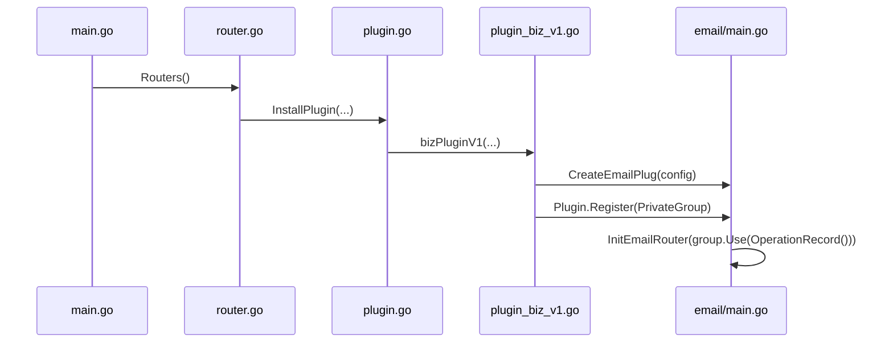
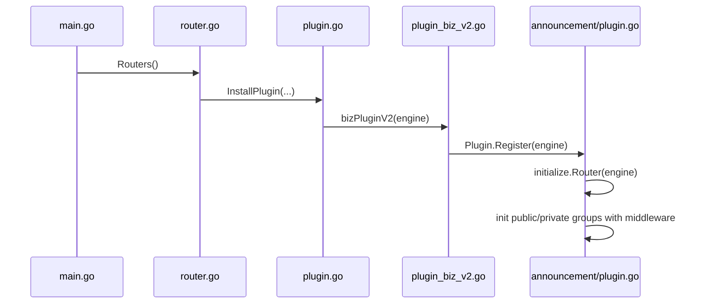

# 插件路由初始化

<cite>
**本文档中引用的文件**  
- [router_biz.go](file://server/initialize/router_biz.go)
- [plugin_biz_v1.go](file://server/initialize/plugin_biz_v1.go)
- [plugin_biz_v2.go](file://server/initialize/plugin_biz_v2.go)
- [plugin.go](file://server/initialize/plugin.go)
- [router.go](file://server/initialize/router.go)
- [announcement/plugin.go](file://server/plugin/announcement/plugin.go)
- [email/main.go](file://server/plugin/email/main.go)
- [announcement/initialize/router.go](file://server/plugin/announcement/initialize/router.go)
- [email/router/sys_email.go](file://server/plugin/email/router/sys_email.go)
- [email/router/enter.go](file://server/plugin/email/router/enter.go)
</cite>

## 目录
1. [引言](#引言)
2. [插件化路由注册机制解析](#插件化路由注册机制解析)
3. [主应用与插件路由的隔离与集成策略](#主应用与插件路由的隔离与集成策略)
4. [插件路由生命周期案例分析](#插件路由生命周期案例分析)
5. [系统解耦与热扩展能力讨论](#系统解耦与热扩展能力讨论)
6. [结论](#结论)

## 引言
本项目采用 Gin 框架构建后端服务,支持通过插件机制实现功能模块的动态扩展。插件路由的初始化是系统启动过程中关键的一环,决定了插件接口如何被正确挂载并对外提供服务。本文将深入解析 `router_biz.go` 如何协同 `plugin_biz_v1/v2` 在系统启动时加载插件路由,并阐述插件路由与主应用路由之间的隔离与集成策略。

## 插件化路由注册机制解析

系统在启动时通过 `Routers()` 函数完成整体路由的初始化工作。该函数位于 `server/initialize/router.go` 文件中,负责创建 Gin 引擎实例、设置中间件、注册基础路由以及调用插件安装逻辑。

插件路由的注册分为两个版本:V1 和 V2,分别对应不同的插件架构设计。

### V1 版本插件注册(基于 RouterGroup)

V1 插件模型以 `email` 插件为代表,其实现依赖于 `*gin.RouterGroup` 接口。其注册流程如下:

1. **定义插件结构体**:`emailPlugin` 实现了 `Register(*gin.RouterGroup)` 方法。
2. **配置注入**:通过 `CreateEmailPlug(...)` 函数接收外部配置参数并初始化全局配置对象。
3. **路由分组注册**:在 `bizPluginV1(...)` 中,调用 `PluginInit(private, ...)` 将插件注册到私有路由组下,路径前缀由插件自身决定(如 `"email"`)。
4. **中间件继承**:由于插件挂载在已应用 JWT 和 Casbin 中间件的 `PrivateGroup` 下,因此自动继承权限校验能力。

**Diagram sources**
- [plugin_biz_v1.go](file://server/initialize/plugin_biz_v1.go#L18-L36)
- [email/main.go](file://server/plugin/email/main.go#L10-L29)
- [email/router/sys_email.go](file://server/plugin/email/router/sys_email.go#L10-L20)

**Section sources**
- [plugin_biz_v1.go](file://server/initialize/plugin_biz_v1.go#L18-L36)
- [email/main.go](file://server/plugin/email/main.go#L10-L29)

### V2 版本插件注册(基于 Engine)

V2 插件模型以 `announcement` 插件为代表,面向更完整的插件生态设计,直接操作 `*gin.Engine`。

1. **接口抽象升级**:使用 `interfaces.Plugin` 接口,定义 `Register(*gin.Engine)` 方法。
2. **集中式注册**:`PluginInitV2(engine, ...)` 遍历所有 V2 插件并统一注册。
3. **全生命周期管理**:插件可在 `Register` 方法中自行调用 `initialize.Api`, `Menu`, `Gorm`, `Router` 等方法完成数据库、菜单、API 的自动初始化。
4. **灵活控制权**:插件拥有对 Engine 的完全访问权限,可自由添加中间件或自定义路由结构。

**Diagram sources**
- [plugin_biz_v2.go](file://server/initialize/plugin_biz_v2.go#L10-L17)
- [announcement/plugin.go](file://server/plugin/announcement/plugin.go#L1-L27)
- [announcement/initialize/router.go](file://server/plugin/announcement/initialize/router.go#L1-L16)

**Section sources**
- [plugin_biz_v2.go](file://server/initialize/plugin_biz_v2.go#L10-L17)
- [announcement/plugin.go](file://server/plugin/announcement/plugin.go#L1-L27)

## 主应用与插件路由的隔离与集成策略

### 命名空间隔离

- **V1 插件**:通过 `RouterPath()` 返回的字符串作为子路径前缀(如 `/api/v1/email`),实现 URL 层面的命名空间隔离。
- **V2 插件**:虽直接操作 Engine,但实际仍遵循主应用的路由前缀规则(`global.GVA_CONFIG.System.RouterPrefix`),并在内部重建 `public` 与 `private` 分组,保持一致的层级结构。

### 中间件链继承

- **V1 插件**:天然继承挂载点的中间件栈。例如,`email` 插件注册于 `PrivateGroup`,自动获得 `JWTAuth` 与 `CasbinHandler` 权限控制。
- **V2 插件**:需在 `initialize.Router(...)` 中手动重建中间件链,确保 `private` 路由组重新应用 `middleware.JWTAuth()` 和 `middleware.CasbinHandler()`,从而实现行为一致性。

### 权限校验机制

- 所有需要认证的插件接口均应注册在 `private` 分组下。
- 利用 Casbin 实现细粒度 RBAC 控制,插件 API 可通过 `middleware.OperationRecord()` 记录操作日志,并结合策略规则进行访问控制。
- 插件在初始化时可通过 `initialize.Api(ctx)` 自动向系统注册其 API 元信息,供前端菜单和权限分配使用。

## 插件路由生命周期案例分析

### announcement 插件(V2 模型)

1. **定义**:`announcement.Plugin = new(plugin)` 导出插件实例。
2. **注册**:`bizPluginV2(engine)` 调用 `Plugin.Register(engine)`。
3. **初始化**:
   - `initialize.Api(ctx)`:注册插件提供的 API 到系统表。
   - `initialize.Menu(ctx)`:生成默认菜单项。
   - `initialize.Gorm(ctx)`:同步数据库结构。
   - `initialize.Router(engine)`:构建路由分组并挂载具体接口。
4. **挂载**:最终路由形如 `/api/v1/info`,受主系统中间件保护。

### email 插件(V1 模型)

1. **构造**:`CreateEmailPlug(...)` 初始化配置。
2. **注册**:`Plugin.Register(PrivateGroup)` 将其挂载至私有路由。
3. **路由绑定**:`InitEmailRouter` 使用 `OperationRecord` 中间件包装 `POST /emailTest` 和 `POST /sendEmail` 接口。
4. **暴露**:最终路径为 `/api/v1/email/emailTest`,具备操作日志记录与权限校验。

## 系统解耦与热扩展能力讨论

插件化路由机制显著提升了系统的模块化程度和可维护性:

- **高内聚低耦合**:每个插件独立封装业务逻辑、数据模型、路由及配置,减少核心代码库的膨胀。
- **热插拔支持**:理论上可通过动态加载 `.so` 文件或远程插件仓库实现运行时插件增删,当前实现已在架构上预留扩展空间。
- **版本兼容性**:V1 与 V2 并存体现了良好的向后兼容设计,允许逐步迁移旧插件。
- **开发效率提升**:新功能可通过插件形式快速开发、测试与部署,无需修改主工程代码。

然而,目前的“热重载”仍依赖于重启应用来触发完整初始化流程(见 `utils.GlobalSystemEvents.RegisterReloadHandler`),真正的无重启热更新尚需进一步结合 Go Plugin 或微服务架构实现。

## 结论

`router_biz.go` 作为业务路由的占位协调者,虽未直接编写路由逻辑,但通过 `initBizRouter` 被调用,确保了插件初始化时机的可控性。整个插件路由体系依托 `plugin_biz_v1/v2` 实现了两种风格的动态注册机制:V1 简洁易用,适合轻量级功能；V2 功能完整,适用于复杂模块。两者均有效实现了插件与主应用在命名空间、中间件和权限层面的隔离与集成,为系统提供了强大的解耦能力和可持续扩展的基础架构。