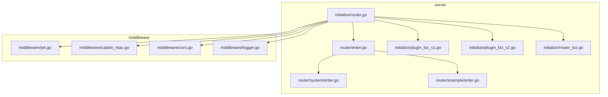
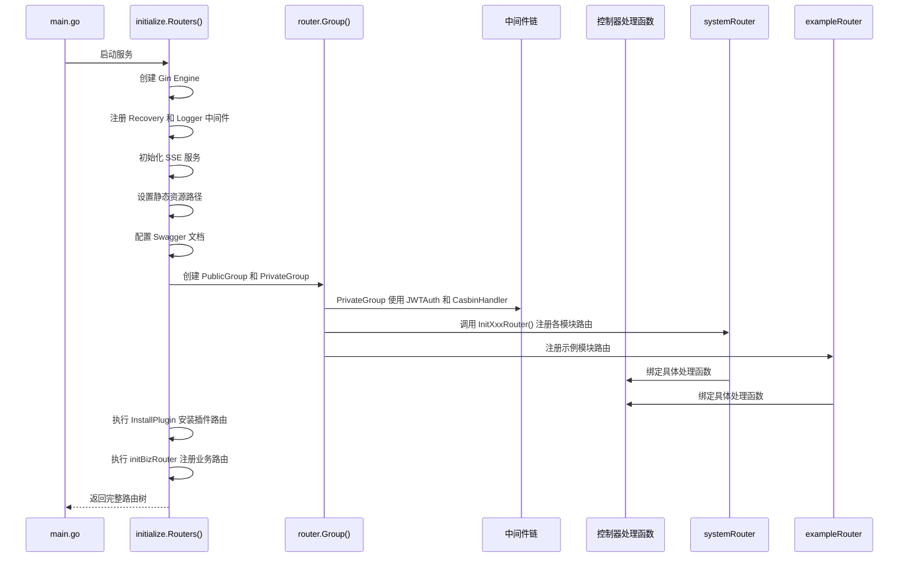
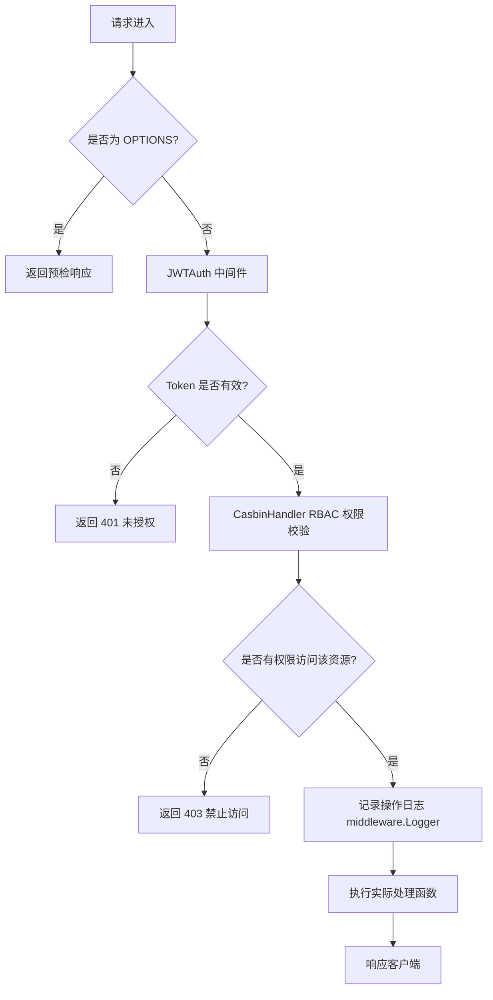
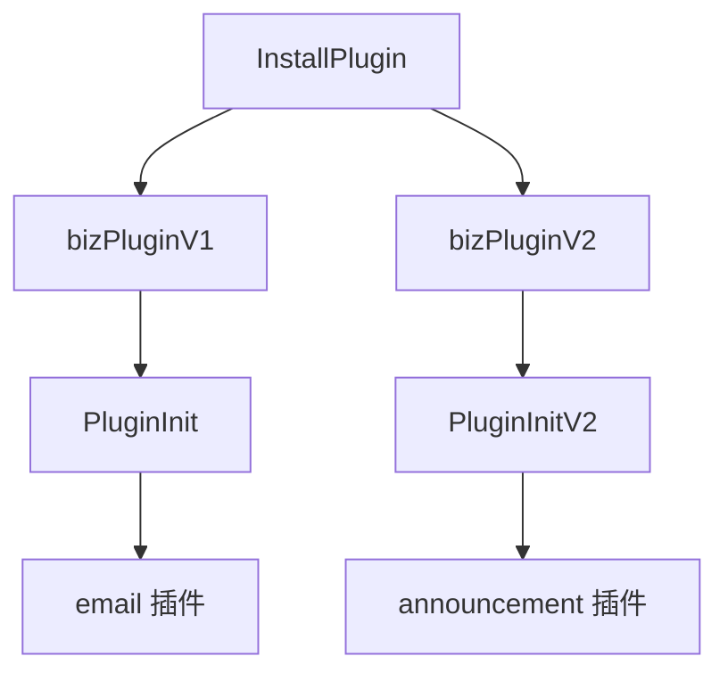

# 路由系统初始化

<cite>
**本文档引用文件**  
- [router.go](file://server/initialize/router.go)
- [enter.go](file://server/router/enter.go)
- [plugin_biz_v1.go](file://server/initialize/plugin_biz_v1.go)
- [plugin_biz_v2.go](file://server/initialize/plugin_biz_v2.go)
- [router_biz.go](file://server/initialize/router_biz.go)
- [jwt.go](file://server/middleware/jwt.go)
- [casbin_rbac.go](file://server/middleware/casbin_rbac.go)
- [cors.go](file://server/middleware/cors.go)
- [logger.go](file://server/middleware/logger.go)
</cite>

## 目录
1. [项目结构](#项目结构)  
2. [核心组件分析](#核心组件分析)  
3. [路由注册与中间件装配流程](#路由注册与中间件装配流程)  
4. [API 分组聚合机制](#api-分组聚合机制)  
5. [中间件链构建](#中间件链构建)  
6. [插件系统动态路由加载](#插件系统动态路由加载)  
7. [性能瓶颈与优化建议](#性能瓶颈与优化建议)  

## 项目结构

**图示来源**  
- [router.go](file://server/initialize/router.go#L1-L124)
- [enter.go](file://server/router/enter.go#L1-L14)

**本节来源**  
- [server/initialize/router.go](file://server/initialize/router.go#L1-L124)
- [server/router/enter.go](file://server/router/enter.go#L1-L14)

## 核心组件分析

Gin 路由系统的初始化由 `Routers()` 函数主导,位于 `server/initialize/router.go`。该函数负责创建 Gin 引擎实例、注册全局中间件、聚合 API 路由组,并最终返回配置完成的路由引擎。

关键组件包括:
- `RouterGroupApp`:集中管理所有模块的路由组(如 system、example)
- `PublicGroup` 和 `PrivateGroup`:分别用于公开接口和需认证接口的路由分组
- 插件安装机制:支持通过 `InstallPlugin` 动态扩展路由功能

**本节来源**  
- [router.go](file://server/initialize/router.go#L1-L124)
- [enter.go](file://server/router/enter.go#L1-L14)

## 路由注册与中间件装配流程

**图示来源**  
- [router.go](file://server/initialize/router.go#L1-L124)
- [jwt.go](file://server/middleware/jwt.go#L14-L76)
- [casbin_rbac.go](file://server/middleware/casbin_rbac.go#L13-L32)

**本节来源**  
- [router.go](file://server/initialize/router.go#L1-L124)

## API 分组聚合机制

系统通过 `server/router/enter.go` 中定义的 `RouterGroupApp` 结构体统一聚合所有 v1 版本的 API 路由。该结构体包含 `System` 和 `Example` 两个子路由组,分别对应不同业务模块。

每个子模块(如 system)在各自的 `enter.go` 文件中实现 `InitXxxRouter()` 方法,接收 `*gin.RouterGroup` 参数并注册其专属路由。主路由初始化函数通过调用这些方法完成路由注册。

这种设计实现了模块化路由管理,便于维护和扩展。

**本节来源**  
- [enter.go](file://server/router/enter.go#L1-L14)
- [router.go](file://server/initialize/router.go#L1-L124)

## 中间件链构建

系统在 `PrivateGroup` 上应用了多层中间件以实现安全控制:

此外,CORS 中间件确保跨域请求被正确处理,日志中间件记录请求上下文信息。

**图示来源**  
- [jwt.go](file://server/middleware/jwt.go#L14-L76)
- [casbin_rbac.go](file://server/middleware/casbin_rbac.go#L13-L32)
- [cors.go](file://server/middleware/cors.go#L10-L27)
- [logger.go](file://server/middleware/logger.go#L27-L38)

**本节来源**  
- [jwt.go](file://server/middleware/jwt.go#L14-L76)
- [casbin_rbac.go](file://server/middleware/casbin_rbac.go#L13-L32)
- [cors.go](file://server/middleware/cors.go#L10-L27)

## 插件系统动态路由加载

系统支持两种版本的插件路由加载机制:

### V1 插件机制 (`plugin_biz_v1.go`)
- 适用于基于 `*gin.RouterGroup` 的插件
- 使用 `PluginInit()` 函数遍历插件列表,在指定前缀下注册路由
- 示例:邮件插件 `email.CreateEmailPlug(...)`

### V2 插件机制 (`plugin_biz_v2.go`)
- 适用于直接挂载到 `*gin.Engine` 的插件
- 使用 `PluginInitV2()` 函数将插件注册到整个引擎
- 示例:公告插件 `announcement.Plugin`

两种机制通过 `InstallPlugin()` 函数统一调用,实现了对不同类型插件的支持。

**图示来源**  
- [plugin_biz_v1.go](file://server/initialize/plugin_biz_v1.go#L1-L37)
- [plugin_biz_v2.go](file://server/initialize/plugin_biz_v2.go#L1-L17)

**本节来源**  
- [plugin_biz_v1.go](file://server/initialize/plugin_biz_v1.go#L1-L37)
- [plugin_biz_v2.go](file://server/initialize/plugin_biz_v2.go#L1-L17)

## 性能瓶颈与优化建议

### 潜在性能瓶颈
1. **Casbin 权限检查**:每次请求都需查询策略数据库,可能成为高频接口的性能瓶颈。
2. **JWT 解析与黑名单校验**:频繁的 Token 解析和 Redis 查询影响响应速度。
3. **中间件堆叠过多**:多个中间件顺序执行增加延迟。

### 优化建议
1. **缓存 Casbin 策略**:使用内存缓存(如 sync.Map 或本地缓存库)减少数据库查询。
2. **JWT 黑名单 TTL 优化**:合理设置 Redis 中 JWT 黑名单的过期时间,避免无限增长。
3. **异步日志写入**:将日志记录改为异步模式,避免阻塞主请求流程。
4. **路由分组精细化**:避免在根分组上注册过多中间件,按需拆分更细粒度的路由组。
5. **启用 Gin 的 Context Pool**:复用 Context 对象降低 GC 压力。

**本节来源**  
- [casbin_rbac.go](file://server/middleware/casbin_rbac.go#L13-L32)
- [jwt.go](file://server/middleware/jwt.go#L14-L76)
- [logger.go](file://server/middleware/logger.go#L27-L38)

