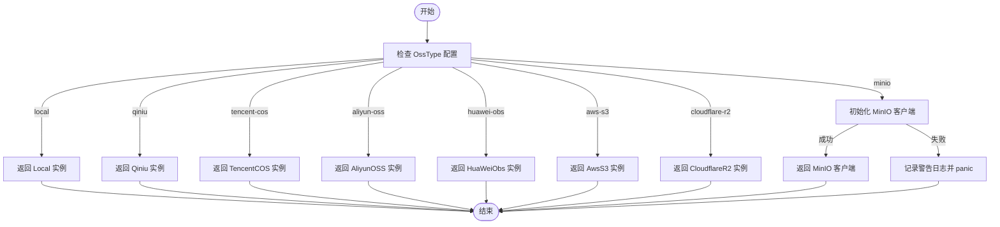

# 对象存储配置

<cite>
**本文档引用的文件**
- [oss_aliyun.go](file://server/config/oss_aliyun.go)
- [oss_aws.go](file://server/config/oss_aws.go)
- [oss_cloudflare.go](file://server/config/oss_cloudflare.go)
- [oss_huawei.go](file://server/config/oss_huawei.go)
- [oss_local.go](file://server/config/oss_local.go)
- [oss_minio.go](file://server/config/oss_minio.go)
- [oss_qiniu.go](file://server/config/oss_qiniu.go)
- [oss_tencent.go](file://server/config/oss_tencent.go)
- [upload.go](file://server/utils/upload/upload.go)
- [aliyun_oss.go](file://server/utils/upload/aliyun_oss.go)
- [aws_s3.go](file://server/utils/upload/aws_s3.go)
- [cloudflare_r2.go](file://server/utils/upload/cloudflare_r2.go)
- [local.go](file://server/utils/upload/local.go)
- [minio_oss.go](file://server/utils/upload/minio_oss.go)
- [obs.go](file://server/utils/upload/obs.go)
- [qiniu.go](file://server/utils/upload/qiniu.go)
- [tencent_cos.go](file://server/utils/upload/tencent_cos.go)
</cite>

## 目录
1. [简介](#简介)
2. [对象存储后端配置详解](#对象存储后端配置详解)
3. [上传客户端动态选择机制](#上传客户端动态选择机制)
4. [CDN 加速与访问权限策略](#cdn-加速与访问权限策略)
5. [典型故障诊断](#典型故障诊断)
6. [总结](#总结)

## 简介
本指南系统化讲解 gin-vue-admin 项目中多种对象存储后端的配置方案,涵盖本地存储、MinIO、阿里云 OSS、腾讯云 COS、AWS S3、华为云 OBS 和 Cloudflare R2。通过分析 `config` 包下的各 `oss_*.go` 文件和 `utils/upload` 包中的实现,详细说明各存储后端特有的配置项、运行时客户端选择逻辑、CDN 设置方法以及常见问题的排查步骤。

## 对象存储后端配置详解

### 本地存储 (Local)
本地存储使用 `Local` 结构体进行配置,主要包含两个路径:
- **Path**: 本地文件访问路径,用于生成前端可访问的 URL。
- **StorePath**: 本地文件实际存储路径,文件将被保存在此目录下。

**Section sources**
- [oss_local.go](file://server/config/oss_local.go#L1-L7)

### 阿里云 OSS (AliyunOSS)
阿里云 OSS 配置包含以下关键字段:
- **Endpoint**: OSS 服务的接入点地址(如 `oss-cn-beijing.aliyuncs.com`)。
- **AccessKeyId / AccessKeySecret**: 访问密钥对,用于身份验证。
- **BucketName**: 存储空间名称。
- **BucketUrl**: 自定义的 CDN 加速域名,上传成功后返回的 URL 将以此为前缀。
- **BasePath**: 在 Bucket 内的根路径前缀。

**Section sources**
- [oss_aliyun.go](file://server/config/oss_aliyun.go#L1-L11)

### 腾讯云 COS (TencentCOS)
腾讯云 COS 的配置项包括:
- **Bucket**: 存储桶名称(格式为 `bucketname-appid`)。
- **Region**: 存储桶所在地域(如 `ap-beijing`)。
- **SecretID / SecretKey**: 密钥信息。
- **BaseURL**: 可选的自定义域名或 CDN 地址。
- **PathPrefix**: 上传文件在存储桶内的路径前缀。

**Section sources**
- [oss_tencent.go](file://server/config/oss_tencent.go#L1-L11)

### AWS S3 (AwsS3)
AWS S3 兼容多种 S3 协议的服务(如 MinIO),其配置较为全面:
- **Bucket**: 存储桶名称。
- **Region**: 区域标识符。
- **Endpoint**: 自定义终端节点,用于连接非 AWS 的 S3 兼容服务(如 MinIO)。
- **SecretID / SecretKey**: 访问凭证。
- **BaseURL**: 外部可访问的基础 URL。
- **PathPrefix**: 文件路径前缀。
- **S3ForcePathStyle**: 是否强制使用路径样式寻址(对于 MinIO 通常设为 `true`)。
- **DisableSSL**: 是否禁用 SSL,生产环境不建议开启。

**Section sources**
- [oss_aws.go](file://server/config/oss_aws.go#L1-L14)

### 华为云 OBS (HuaWeiObs)
华为云 OBS 配置简洁明了:
- **Path**: 文件在 OBS 中的路径前缀。
- **Bucket**: 桶名称。
- **Endpoint**: 服务端点。
- **AccessKey / SecretKey**: 访问密钥。

**Section sources**
- [oss_huawei.go](file://server/config/oss_huawei.go#L1-L10)

### Cloudflare R2 (CloudflareR2)
Cloudflare R2 使用 AWS SDK 进行交互,其配置如下:
- **Bucket**: R2 存储桶名称。
- **BaseURL**: R2 提供的公共访问 URL 或自定义域名。
- **Path**: 文件路径前缀。
- **AccountID**: Cloudflare 账户 ID。
- **AccessKeyID / SecretAccessKey**: R2 生成的访问密钥对。

**Section sources**
- [oss_cloudflare.go](file://server/config/oss_cloudflare.go#L1-L11)

### MinIO (Minio)
MinIO 的配置与 AWS S3 类似,但有特定字段:
- **Endpoint**: MinIO 服务器地址(如 `localhost:9000`)。
- **AccessKeyId / AccessKeySecret**: 登录凭据。
- **BucketName**: 存储桶名。
- **UseSSL**: 是否启用 HTTPS。
- **BasePath**: 桶内基础路径。
- **BucketUrl**: 返回给前端的访问 URL。

**Section sources**
- [oss_minio.go](file://server/config/oss_minio.go#L1-L12)

### 七牛云 Kodo (Qiniu)
七牛云配置包含 CDN 相关选项:
- **Zone**: 存储区域(如 `ZoneHuadong`)。
- **Bucket**: 空间名称。
- **ImgPath**: CDN 加速域名。
- **AccessKey / SecretKey**: 秘钥。
- **UseHTTPS**: 是否使用 HTTPS 协议。
- **UseCdnDomains**: 上传时是否使用 CDN 加速域名。

**Section sources**
- [oss_qiniu.go](file://server/config/oss_qiniu.go#L1-L12)

## 上传客户端动态选择机制

系统通过 `upload.NewOss()` 函数根据运行时配置动态实例化对应的上传客户端。该函数读取全局配置 `global.GVA_CONFIG.System.OssType` 的值,并据此返回相应的 `OSS` 接口实现。

**Diagram sources**
- [upload.go](file://server/utils/upload/upload.go#L8-L47)

**Section sources**
- [upload.go](file://server/utils/upload/upload.go#L8-L47)

## CDN 加速与访问权限策略

### 前端设置
在前端代码中,上传组件应从后端获取完整的文件 URL。例如,在 `web/src/components/upload/image.vue` 中,上传成功后应直接使用后端返回的 `fileUrl`,该 URL 已经包含了 CDN 域名(由 `BucketUrl`, `BaseURL` 等配置项决定)。

### 后端配置
正确配置 CDN 的关键是设置好各个后端的 URL 字段:
- **阿里云 OSS**: 设置 `bucket-url` 为绑定的 CDN 域名。
- **腾讯云 COS**: 设置 `base-url` 为自定义域名。
- **AWS S3 / Cloudflare R2 / MinIO**: 同样通过 `base-url` 或 `bucket-url` 指定外部可访问的地址。

### 权限策略
确保各云服务商的访问密钥具有最小必要权限(如仅限于指定 Bucket 的读写)。对于私有存储,可通过生成预签名 URL 的方式提供临时访问权限,但当前实现默认返回公开可访问的 URL。

## 典型故障诊断

### 跨域上传失败 (CORS)
**现象**: 浏览器报错 `No 'Access-Control-Allow-Origin' header present`。
**诊断步骤**:
1. 检查前端请求的目标域名是否与对象存储服务的 Endpoint 一致。
2. 登录云控制台,检查对应 Bucket 的 CORS 配置是否允许前端域名、HTTP 方法(PUT, POST)和头部(如 `Authorization`)。
3. 确认后端 `config.yaml` 中的 `endpoint` 地址正确无误。

### 凭证过期或无效
**现象**: 报错 `InvalidAccessKeyId`, `SignatureDoesNotMatch` 或 `ExpiredToken`。
**诊断步骤**:
1. 核对 `config.yaml` 中的 `access-key-id`, `secret-access-key`, `secret-id`, `secret-key` 等字段值是否准确。
2. 检查密钥是否已被禁用或删除。
3. 如果使用临时安全令牌(STS),确认其未过期。

### 签名