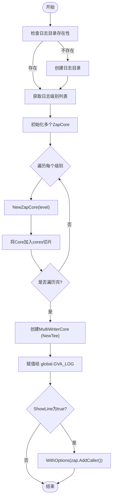

# 日志系统配置

<cite>
**本文档引用文件**
- [zap.go](file://server/config/zap.go)
- [zap.go](file://server/core/zap.go)
- [global.go](file://server/global/global.go)
- [main.go](file://server/main.go)
- [logger.go](file://server/middleware/logger.go)
- [zap_core.go](file://server/core/internal/zap_core.go)
</cite>

## 目录
1. [简介](#简介)
2. [日志系统架构概览](#日志系统架构概览)
3. [核心配置项详解](#核心配置项详解)
4. [Zap 日志记录器初始化流程](#zap-日志记录器初始化流程)
5. [HTTP 请求日志中间件分析](#http-请求日志中间件分析)
6. [日志性能调优策略](#日志性能调优策略)
7. [结论](#结论)

## 简介
本文档详述基于 Zap 日志库的高性能日志系统在 gin-vue-admin 项目中的配置方法与实现机制。重点分析 `zap.go` 中的日志级别、输出路径(文件/控制台)、编码格式(JSON/Console)、切割策略(按大小/时间)等配置项的实际影响。结合 `core/zap.go` 的初始化逻辑,说明如何构建结构化日志记录器实例并被全局使用。同时,解释 `middleware/logger.go` 如何记录 HTTP 请求详情以支持操作审计,并提供关键的性能调优技巧。

## 日志系统架构概览

```mermaid
graph TD
A[配置文件 config.yaml] --> B[Zap 配置结构体]
B --> C[core.Zap() 初始化函数]
C --> D[global.GVA_LOG 全局变量]
D --> E[业务代码日志输出]
F[middleware/logger.go] --> G[HTTP 请求拦截]
G --> H[LogLayout 结构体]
H --> I[DefaultLogger Print 函数]
I --> J[标准输出/JSON序列化]
```

**Diagram sources**
- [config/zap.go](file://server/config/zap.go#L7-L17)
- [core/zap.go](file://server/core/zap.go#L14-L31)
- [global/global.go](file://server/global/global.go#L33)
- [middleware/logger.go](file://server/middleware/logger.go#L27-L88)

**Section sources**
- [config/zap.go](file://server/config/zap.go#L7-L17)
- [core/zap.go](file://server/core/zap.go#L14-L31)
- [global/global.go](file://server/global/global.go#L33)
- [middleware/logger.go](file://server/middleware/logger.go#L27-L88)

## 核心配置项详解

### 日志级别 (Level)
通过 `level` 字段配置,支持 `off`, `fatal`, `error`, `warn`, `info`, `debug`, `trace`。该配置决定了哪些级别的日志会被记录。`Levels()` 方法会根据此字符串生成一个从指定级别到 `FatalLevel` 的所有级别切片,确保更高级别的日志不会被忽略。

### 输出路径 (Director)
`director` 字段定义了日志文件的存储目录。在 `core/zap.go` 的 `Zap()` 函数中,会检查该目录是否存在,若不存在则自动创建。

### 编码格式 (Format)
`format` 字段决定日志的输出格式,可选值为 `json` 或 `console`。当设置为 `json` 时,日志将以 JSON 格式输出,便于机器解析；设置为 `console` 时,则以人类可读的文本格式输出。

### 编码级 (EncodeLevel)
`encode-level` 字段控制日志级别的显示方式,支持 `LowercaseLevelEncoder`(小写)、`LowercaseColorLevelEncoder`(带颜色的小写)、`CapitalLevelEncoder`(大写)和 `CapitalColorLevelEncoder`(带颜色的大写)。

### 切割策略
日志切割由 `internal.NewZapCore` 实现。它利用 `Cutter` 组件,根据 `RetentionDay`(日志保留天数)和日志级别进行文件切割。虽然当前配置未直接暴露按大小切割的选项,但其设计允许按时间和级别进行归档管理。

### 控制台输出 (LogInConsole)
`log-in-console` 布尔值控制是否将日志同时输出到控制台。如果启用,日志会通过 `os.Stdout` 和文件切割器 `cutter` 进行多路复用。

### 显示行号 (ShowLine)
`show-line` 布尔值决定是否在日志中包含调用者的文件名和行号信息。在 `Zap()` 函数中,如果此选项开启,会通过 `zap.AddCaller()` 为日志记录器添加调用者信息。

**Section sources**
- [config/zap.go](file://server/config/zap.go#L7-L17)
- [core/zap.go](file://server/core/zap.go#L14-L31)
- [core/internal/zap_core.go](file://server/core/internal/zap_core.go#L30-L39)

## Zap 日志记录器初始化流程



**Diagram sources**
- [core/zap.go](file://server/core/zap.go#L14-L31)
- [core/internal/zap_core.go](file://server/core/internal/zap_core.go#L10-L18)

**Section sources**
- [core/zap.go](file://server/core/zap.go#L14-L31)
- [main.go](file://server/main.go#L35)
- [global/global.go](file://server/global/global.go#L33)

### 构建结构化日志实例
`core.Zap()` 函数是构建日志记录器的核心。它首先确保日志目录存在,然后从 `global.GVA_CONFIG.Zap.Levels()` 获取所有需要处理的日志级别。对于每一个级别,都通过 `internal.NewZapCore(levels[i])` 创建一个独立的 `zapcore.Core`。这些 Core 最终通过 `zapcore.NewTee(cores...)` 合并成一个统一的日志处理器,实现了不同级别日志的分流处理。最后,根据 `ShowLine` 配置决定是否附加调用者信息。

### 全局使用
在 `main.go` 的 `initializeSystem()` 函数中,`core.Zap()` 被调用,其返回的 `*zap.Logger` 实例被赋值给 `global.GVA_LOG`。这使得整个应用可以通过 `global.GVA_LOG` 访问同一个高性能的日志记录器,例如 `global.GVA_LOG.Error("错误信息", zap.Error(err))`。

## HTTP 请求日志中间件分析


**Diagram sources**
- [middleware/logger.go](file://server/middleware/logger.go#L40-L88)

**Section sources**
- [middleware/logger.go](file://server/middleware/logger.go#L27-L88)

### 记录 HTTP 请求详情
`middleware/logger.go` 中的 `Logger` 结构体定义了一个灵活的日志中间件。`DefaultLogger()` 函数返回一个默认的中间件,用于记录 HTTP 请求的详细信息。

#### 记录内容
- **方法 (Method)**: 通过 `c.Request.Method` 获取。
- **路径 (Path)**: 通过 `c.Request.URL.Path` 获取。
- **耗时 (Cost)**: 在 `c.Next()` 前后分别记录时间戳,计算差值得出。
- **状态码 (Status Code)**: 虽然 `LogLayout` 结构体未显式包含,但 `c.Errors.ByType(gin.ErrorTypePrivate)` 可以间接反映错误状态,实际状态码可通过 `c.Writer.Status()` 获取(当前实现未使用)。
- **其他信息**: 包括查询参数 (`Query`)、IP地址 (`IP`)、用户代理 (`UserAgent`) 和可能的错误信息 (`Error`)。

#### 支持操作审计
该中间件通过 `LogLayout` 结构体将请求信息结构化,并通过 `Print` 函数(默认为 `fmt.Println` 并序列化为 JSON)输出。这种结构化的日志非常适合用于操作审计,因为它包含了完整的上下文信息,可以轻松地被日志收集系统(如 ELK、Fluentd)采集、索引和查询。

## 日志性能调优策略

### 异步写入
尽管当前实现主要依赖于 `zap` 库自身的异步特性(`zap.New()` 默认使用缓冲和后台线程),但 `middleware/logger.go` 的 `DefaultLogger` 使用 `fmt.Println` 是同步的。为了实现真正的异步,应将 `Print` 函数替换为将 `LogLayout` 推送到一个有缓冲的 channel,由单独的 goroutine 负责消费并写入最终目的地(如 Kafka、文件或网络服务)。

### 缓冲区管理
`zap` 库内部已经实现了高效的缓冲机制。关键在于合理配置日志级别,避免在生产环境中开启 `debug` 或 `trace` 级别,以减少不必要的日志生成和缓冲区压力。

### 避免过度采样
- **过滤敏感信息**: 利用 `Logger` 结构体的 `FilterKeyword` 回调,在日志输出前对 `LogLayout` 进行脱敏处理,例如隐藏密码、密钥等字段。
- **条件记录 Body**: `Filter` 回调允许开发者自定义哪些请求需要记录 `Body`。应仅对必要的 API(如 POST/PUT)且非敏感数据的请求开启 `Body` 记录,避免因记录大量数据而导致性能下降和磁盘空间浪费。
- **合理设置日志级别**: 在生产环境使用 `info` 或