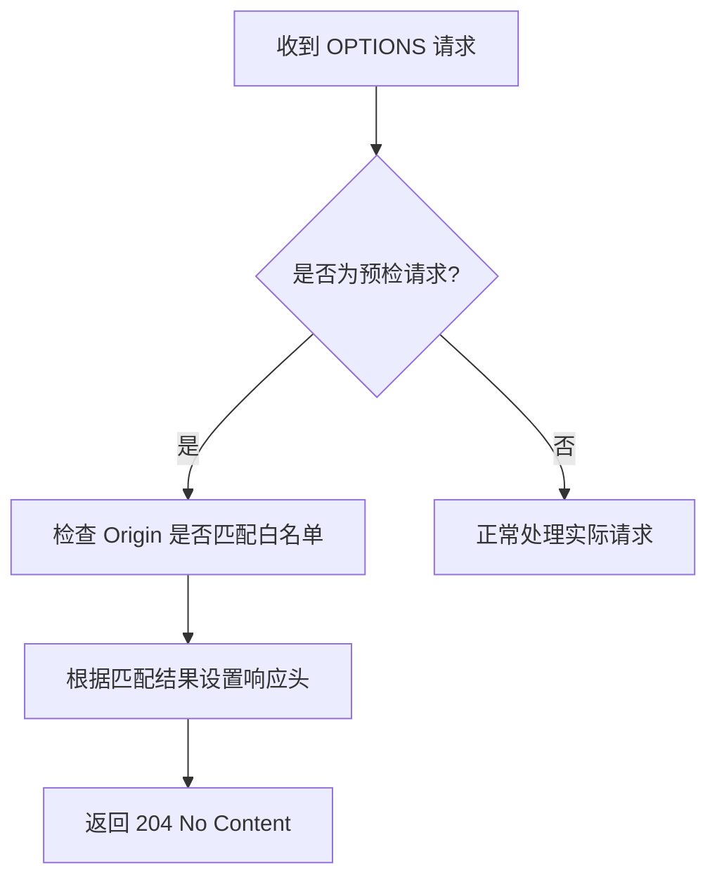

# 跨域资源共享配置

<cite>
**本文档引用文件**
- [cors.go](file://server/middleware/cors.go)
- [cors.go](file://server/config/cors.go)
- [config.yaml](file://server/config.yaml)
- [global.go](file://server/global/global.go)
- [viper.go](file://server/core/viper.go)
</cite>

## 目录
1. [引言](#引言)
2. [CORS 配置结构解析](#cors-配置结构解析)
3. [中间件实现机制](#中间件实现机制)
4. [预检请求处理流程](#预检请求处理流程)
5. [响应头注入逻辑](#响应头注入逻辑)
6. [开发与生产环境策略](#开发与生产环境策略)
7. [常见陷阱与最佳实践](#常见陷阱与最佳实践)
8. [结论](#结论)

## 引言
跨域资源共享（CORS）是现代Web应用中解决同源策略限制的关键机制。本项目通过灵活的配置系统实现了精细化的跨域控制，既支持开发环境的宽松策略，也满足生产环境的安全要求。本文将深入分析其配置参数、实现逻辑及使用建议。

**Section sources**
- [cors.go](file://server/middleware/cors.go#L10-L27)
- [cors.go](file://server/config/cors.go#L0-L13)

## CORS 配置结构解析
系统的CORS配置由两个核心结构体组成：`CORS` 和 `CORSWhitelist`。

### 核心字段语义
- **模式（Mode）**: 控制跨域策略的整体行为，支持 "allow-all"（允许所有）和 "strict-whitelist"（严格白名单）两种模式。
- **白名单（Whitelist）**: 一个包含多个规则项的列表，每个规则定义了特定来源的访问权限。

### 白名单规则字段
```go
type CORSWhitelist struct {
	AllowOrigin      string // 允许的源，必须完全匹配
	AllowMethods     string // 允许的HTTP方法，逗号分隔
	AllowHeaders     string // 允许的请求头，逗号分隔
	ExposeHeaders    string // 允许前端JS读取的响应头
	AllowCredentials bool   // 是否允许发送凭据（如Cookie）
}
```

这些配置在 `config.yaml` 文件中以YAML格式声明，并通过Viper库加载到全局变量 `GVA_CONFIG` 中。

**Section sources**
- [cors.go](file://server/config/cors.go#L0-L13)
- [config.yaml](file://server/config.yaml#L20-L29)

## 中间件实现机制
系统提供了两个CORS中间件：`Cors()` 和 `CorsByRules()`，分别对应简单放行和按规则处理的场景。

### 简单放行模式 (Cors)
此模式无条件放行所有跨域请求：
- 将请求头中的 `Origin` 原样返回给 `Access-Control-Allow-Origin`
- 固定允许一组常用的方法和头部
- 明确开启凭据支持
- 对所有 `OPTIONS` 请求直接返回204状态码

### 规则驱动模式 (CorsByRules)
该模式根据配置进行精细化控制：
1. 首先检查全局模式是否为 "allow-all"，若是则退化为 `Cors()` 行为
2. 否则调用 `checkCors()` 函数，在白名单中查找与当前 `Origin` 完全匹配的规则
3. 若找到匹配规则，则根据该规则设置相应的响应头
4. 在严格白名单模式下，未匹配的请求将被拒绝（除 `/health` 接口外）

**Section sources**
- [cors.go](file://server/middleware/cors.go#L10-L72)
- [global.go](file://server/global/global.go#L30)

## 预检请求处理流程
对于复杂请求（如携带自定义头部或使用PUT/DELETE方法），浏览器会先发送 `OPTIONS` 预检请求。



**Diagram sources**
- [cors.go](file://server/middleware/cors.go#L20-L25)
- [cors.go](file://server/middleware/cors.go#L55-L60)

**Section sources**
- [cors.go](file://server/middleware/cors.go#L10-L72)

## 响应头注入逻辑
当请求通过CORS检查后，中间件会动态注入一系列响应头：

```mermaid
sequenceDiagram
participant 浏览器
participant Gin中间件
participant 业务处理器
浏览器->>Gin中间件 : 发送请求 (含Origin)
activate Gin中间件
Gin中间件->>Gin中间件 : 执行CorsByRules
Gin中间件->>Gin中间件 : 调用checkCors匹配规则
alt 规则匹配成功
Gin中间件->>Gin中间件 : 注入Allow-Origin等响应头
else 规则不匹配且为严格模式
Gin中间件-->>浏览器 : 返回403 Forbidden
deactivate Gin中间件
stop
end
Gin中间件->>业务处理器 : 调用c.Next()执行后续处理
activate 业务处理器
业务处理器-->>浏览器 : 返回实际响应数据
deactivate 业务处理器
deactivate Gin中间件
```

**Diagram sources**
- [cors.go](file://server/middleware/cors.go#L40-L50)
- [cors.go](file://server/middleware/cors.go#L55-L60)

**Section sources**
- [cors.go](file://server/middleware/cors.go#L30-L62)

## 开发与生产环境策略
### 开发环境建议
在开发阶段，可采用宽松策略以提高调试效率：
```yaml
cors:
  mode: allow-all
```
这相当于启用 `Cors()` 中间件，允许任何来源的请求，极大简化前后端联调过程。

### 生产环境建议
生产环境必须采用严格白名单模式：
```yaml
cors:
  mode: strict-whitelist
  whitelist:
    - allow-origin: https://your-production-domain.com
      allow-methods: POST,GET,PUT,DELETE
      allow-headers: Content-Type,Authorization,Token
      expose-headers: Content-Length
      allow-credentials: true
```
确保只允许可信的前端域名访问API，并精确控制允许的方法和头部。

**Section sources**
- [config.yaml](file://server/config.yaml#L20-L29)
- [cors.go](file://server/middleware/cors.go#L30-L62)

## 常见陷阱与最佳实践
### 凭据与通配符冲突
**绝对禁止**同时设置 `Access-Control-Allow-Origin: *` 和 `Access-Control-Allow-Credentials: true`。浏览器会因安全原因拒绝此类响应。若需支持凭据，`AllowOrigin` 必须指定具体的域名，不能使用通配符。

### Origin 匹配精度
当前实现采用**完全匹配**策略。例如，配置 `example.com` 不会匹配 `https://example.com` 或 `www.example.com`。需要精确配置协议、主机名和端口。

### 暴露自定义响应头
如果前端需要通过JavaScript读取自定义响应头（如 `X-RateLimit-Limit`），必须在 `ExposeHeaders` 中明确列出，否则会被浏览器屏蔽。

### 健康检查接口例外
`/health` 接口在严格模式下被特别豁免，即使来源不匹配也不会被拒绝，便于外部监控系统进行健康检测。

**Section sources**
- [cors.go](file://server/middleware/cors.go#L55-L58)
- [cors.go](file://server/config/cors.go#L0-L13)

## 结论
本项目的CORS中间件设计兼顾了灵活性与安全性。开发者应根据部署环境选择合适的模式：开发时使用 `allow-all` 提高效率，生产时切换至 `strict-whitelist` 并精确配置可信来源。务必避免凭据与通配符共存的配置错误，并注意Origin的完全匹配特性。合理的CORS配置不仅能保障API安全，还能确保前后端通信顺畅。