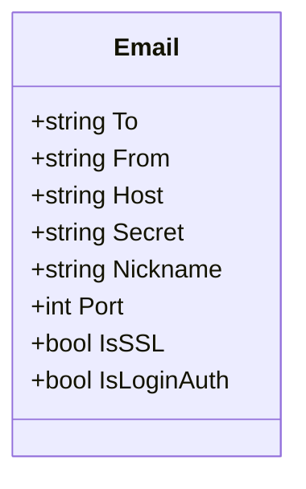
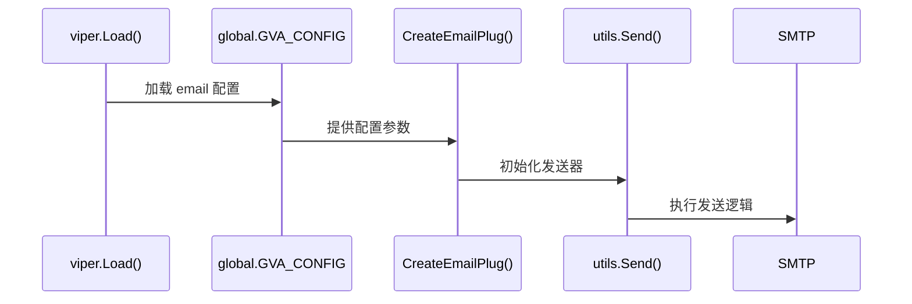
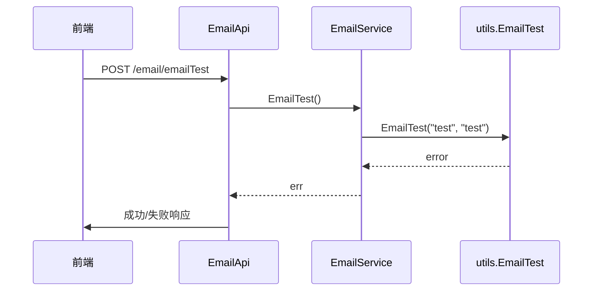

# 邮件服务配置

<cite>
**本文档引用文件**  
- [server/config/email.go](file://server/config/email.go)
- [server/config/config.go](file://server/config/config.go)
- [server/plugin/email/utils/email.go](file://server/plugin/email/utils/email.go)
- [server/middleware/email.go](file://server/middleware/email.go)
- [server/plugin/email/global/gloabl.go](file://server/plugin/email/global/gloabl.go)
- [server/config.yaml](file://server/config.yaml)
- [server/plugin/email/README.MD](file://server/plugin/email/README.MD)
</cite>

## 目录
1. [简介](#简介)
2. [SMTP 配置规范](#smtp-配置规范)
3. [插件系统集成方式](#插件系统集成方式)
4. [异常告警邮件机制](#异常告警邮件机制)
5. [敏感信息保护措施](#敏感信息保护措施)
6. [连通性测试与调试](#连通性测试与调试)

## 简介
本项目通过 `email` 插件模块实现了基于 SMTP 协议的邮件发送功能，支持通用邮件发送、错误日志自动告警等场景。核心配置集中于 `server/config/email.go` 文件中定义的结构体，并通过 Viper 实现配置加载。该机制广泛应用于系统运维监控和用户通知场景。

## SMTP 配置规范

邮件服务的核心配置由 `Email` 结构体定义，包含以下安全敏感字段：



**图示来源**
- [server/config/email.go](file://server/config/email.go#L2-L11)

### 配置项说明

| 字段名 | 说明 |
|--------|------|
| `To` | 收件人邮箱地址，多个以英文逗号分隔 |
| `From` | 发件人邮箱地址 |
| `Host` | SMTP 服务器地址（如：smtp.qq.com） |
| `Secret` | 登录授权码（非邮箱密码） |
| `Nickname` | 发件人昵称（可选） |
| `Port` | SMTP 端口号（通常为 465 或 587） |
| `IsSSL` | 是否启用 SSL 加密传输 |
| `IsLoginAuth` | 是否使用 LOGIN 认证方式（适用于 IBM、微软邮箱服务器） |

此配置在主配置文件 `config.yaml` 中体现如下：
```yaml
email:
  to: xxx@qq.com
  from: xxx@163.com
  host: smtp.163.com
  secret: xxx
  nickname: test
  port: 465
  is-ssl: true
  is-loginauth: false
```

**节来源**
- [server/config/email.go](file://server/config/email.go#L2-L11)
- [server/config/config.go](file://server/config/config.go#L9-L10)
- [server/config.yaml](file://server/config.yaml#L177-L185)

## 插件系统集成方式

邮件模块作为独立插件集成至 GVA 框架中，其初始化过程遵循标准插件注册流程。插件通过读取全局配置对象 `global.GlobalConfig` 获取 SMTP 参数，并封装为通用邮件发送工具。

### 配置注入流程

1. **全局配置初始化**：`viper` 加载 `config.yaml` 至 `Server.Email` 字段。
2. **插件创建**：调用 `email.CreateEmailPlug(...)` 时传入配置参数。
3. **运行时绑定**：中间件与 API 接口通过 `utils` 工具包访问配置。



**图示来源**
- [server/plugin/email/global/gloabl.go](file://server/plugin/email/global/gloabl.go#L2-L4)
- [server/plugin/email/README.MD](file://server/plugin/email/README.MD#L1-L55)

**节来源**
- [server/plugin/email/global/gloabl.go](file://server/plugin/email/global/gloabl.go#L2-L4)
- [server/plugin/email/README.MD](file://server/plugin/email/README.MD#L1-L55)

## 异常告警邮件机制

系统通过 `middleware/email.go` 中间件实现运行时错误自动告警功能。当 HTTP 请求处理失败且响应状态码非 200 时，触发邮件告警。

### 触发条件与流程

- **触发条件**：请求处理完成后状态码不等于 200
- **数据采集**：记录客户端 IP、请求方法、路径、User-Agent、请求体及错误信息
- **发送时机**：`c.Next()` 执行后判断响应状态并决定是否发送

```mermaid
flowchart TD
A[接收请求] --> B{获取用户身份}
B --> C[读取请求体]
C --> D[记录操作日志]
D --> E[c.Next()]
E --> F{状态码≠200?}
F --> |是| G[构造错误邮件内容]
G --> H[调用ErrorToEmail发送]
F --> |否| I[正常返回]
```

**图示来源**
- [server/middleware/email.go](file://server/middleware/email.go#L17-L57)

**节来源**
- [server/middleware/email.go](file://server/middleware/email.go#L17-L57)

## 敏感信息保护措施

为保障账户安全，系统采取多项措施防止敏感凭据泄露：

1. **禁止明文存储密码**：要求使用邮箱提供的“授权码”而非真实密码。
2. **环境变量注入推荐**：建议将 `secret` 等字段通过环境变量注入，避免硬编码或配置文件暴露。
3. **配置文件忽略提交**：生产环境中应确保 `config.yaml` 不被纳入版本控制。
4. **认证方式扩展支持**：提供 `IsLoginAuth` 开关以兼容企业级邮箱服务器的特殊认证需求。

**节来源**
- [server/config/email.go](file://server/config/email.go#L2-L11)
- [server/plugin/email/utils/email.go](file://server/plugin/email/utils/email.go#L55-L87)

## 连通性测试与调试

系统提供内置接口用于测试邮件服务连通性，便于部署阶段验证配置正确性。

### 测试命令示例

```bash
curl -X POST http://localhost:8888/email/emailTest \
  -H "Authorization: Bearer <your-token>" \
  -H "Content-Type: application/json"
```

### 调试流程说明

1. 前端调用 `/email/emailTest` 接口。
2. 后端 `EmailApi.EmailTest` 方法调用 `EmailService.EmailTest()`。
3. 使用预设主题与正文调用 `utils.EmailTest()` 发送测试邮件。
4. 根据返回结果返回成功或失败响应。



**图示来源**
- [server/plugin/email/api/sys_email.go](file://server/plugin/email/api/sys_email.go#L20-L28)
- [server/plugin/email/service/sys_email.go](file://server/plugin/email/service/sys_email.go#L13-L18)
- [server/plugin/email/utils/email.go](file://server/plugin/email/utils/email.go#L44-L47)

**节来源**
- [server/plugin/email/api/sys_email.go](file://server/plugin/email/api/sys_email.go#L20-L28)
- [server/plugin/email/service/sys_email.go](file://server/plugin/email/service/sys_email.go#L13-L18)
- [server/plugin/email/utils/email.go](file://server/plugin/email/utils/email.go#L44-L47)