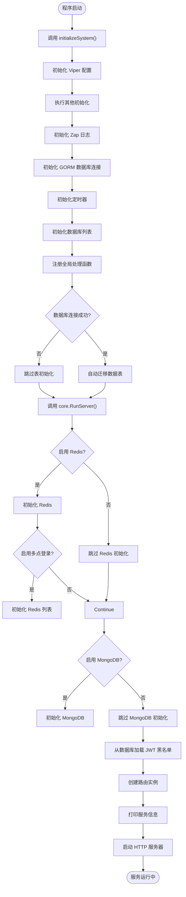
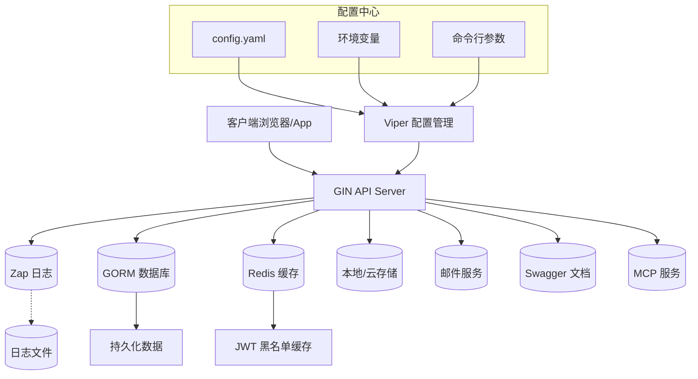

# 后端架构

<cite>
**本文档引用文件**
- [main.go](file://server/main.go)
- [viper.go](file://server/core/viper.go)
- [zap.go](file://server/core/zap.go)
- [gorm.go](file://server/initialize/gorm.go)
- [redis.go](file://server/initialize/redis.go)
- [router.go](file://server/initialize/router.go)
- [server.go](file://server/core/server.go)
- [config.go](file://server/config/config.go)
- [sys_user.go](file://server/model/system/sys_user.go)
- [sys_user.go](file://server/api/v1/system/sys_user.go)
- [sys_user.go](file://server/service/system/sys_user.go)
- [request/sys_user.go](file://server/model/system/request/sys_user.go)
</cite>

## 目录
1. [简介](#简介)
2. [启动流程](#启动流程)
3. [核心组件初始化](#核心组件初始化)
4. [MVC分层结构](#mvc分层结构)
5. [服务器运行机制](#服务器运行机制)
6. [系统上下文图](#系统上下文图)
7. [用户登录序列图](#用户登录序列图)

## 简介
gin-vue-admin 是一个基于 Gin 和 Vue 的全栈开发基础平台,提供快速开发能力。本文档详细阐述其后端架构,从 `main.go` 入口开始的启动流程,涵盖配置加载、日志初始化、数据库与 Redis 连接建立等核心组件的初始化顺序和依赖关系,并解析 MVC 分层结构及核心服务器运行机制。

## 启动流程
应用程序从 `main.go` 文件的 `main()` 函数开始执行,主要分为两个阶段:系统初始化和服务器运行。



**Diagram sources**
- [main.go](file://server/main.go#L29-L50)
- [server.go](file://server/core/server.go#L11-L53)

**Section sources**
- [main.go](file://server/main.go#L29-L50)

## 核心组件初始化
系统在启动时按特定顺序初始化各个核心组件,确保依赖关系正确建立。

### Viper 配置加载
Viper 组件负责加载和管理应用配置。它优先级依次检查命令行参数、环境变量和默认配置文件路径(如 `config.yaml`),支持热重载功能,当配置文件发生变化时自动重新加载。

**Section sources**
- [viper.go](file://server/core/viper.go#L16-L41)

### Zap 日志初始化
Zap 日志库根据配置创建多级别日志输出核心(Core),支持控制台和文件输出,可配置日志级别、格式、存储路径及保留天数等。

**Section sources**
- [zap.go](file://server/core/zap.go#L14-L31)
- [zap.go](file://server/config/zap.go#L7-L17)

### 数据库(GORM)连接
GORM 初始化根据配置中的数据库类型(MySQL、PostgreSQL、SQLite 等)选择对应的驱动进行连接,并将实例赋值给全局变量 `global.GVA_DB`。随后调用 `RegisterTables()` 方法执行 AutoMigrate 自动建表。

**Section sources**
- [gorm.go](file://server/initialize/gorm.go#L13-L34)
- [gorm.go](file://server/initialize/gorm.go#L36-L78)

### Redis 连接建立
若配置启用 Redis,则调用 `Redis()` 函数初始化客户端连接,支持单机和集群模式。若启用多点登录限制,则进一步初始化 `RedisList`。

**Section sources**
- [redis.go](file://server/initialize/redis.go#L38-L44)
- [redis.go](file://server/config/redis.go#L2-L9)

## MVC分层结构
gin-vue-admin 采用标准的 MVC 架构模式,清晰划分职责:

- **API 层**:位于 `server/api/v1/` 目录,接收 HTTP 请求,进行参数校验并调用 Service 层。
- **Service 层**:位于 `server/service/` 目录,处理核心业务逻辑,协调 Model 层操作。
- **Model 层**:位于 `server/model/` 目录,定义数据结构和 ORM 映射。

以下以用户注册为例说明各层协作:

```mermaid
classDiagram
class BaseApi {
+Login(c *gin.Context)
+Register(c *gin.Context)
+GetUserInfo(c *gin.Context)
}
class UserService {
+Login(u *SysUser) (*SysUser, error)
+Register(u SysUser, operatorId uint, operatorName string) (SysUser, error)
+GetUserInfoList(info GetUserList) (interface{}, int64, error)
}
class SysUser {
+Username string
+Password string
+NickName string
+Email string
+Phone string
+Enable int
+UUID uuid.UUID
+AuthorityId uint
+Authorities []SysAuthority
+OperatorId uint
+OperatorName string
}
class LoginRequest {
+Username string
+Password string
+Captcha string
+CaptchaId string
}
class RegisterRequest {
+Username string
+Password string
+NickName string
+Name string
+HeaderImg string
+AuthorityId uint
+Enable int
+AuthorityIds []uint
+Phone string
+Email string
}
class GetUserListRequest {
+Page int
+PageSize int
+Username string
+NickName string
+Phone string
+Email string
}
BaseApi --> UserService : "调用"
UserService --> SysUser : "操作"
BaseApi ..> LoginRequest : "绑定"
BaseApi ..> RegisterRequest : "绑定"
BaseApi ..> GetUserListRequest : "绑定"
```

**Diagram sources**
- [sys_user.go](file://server/api/v1/system/sys_user.go#L27-L75)
- [sys_user.go](file://server/service/system/sys_user.go#L88-L103)
- [sys_user.go](file://server/model/system/sys_user.go#L8-L15)
- [request/sys_user.go](file://server/model/system/request/sys_user.go#L22-L27)

**Section sources**
- [sys_user.go](file://server/api/v1/system/sys_user.go)
- [sys_user.go](file://server/service/system/sys_user.go)
- [sys_user.go](file://server/model/system/sys_user.go)

## 服务器运行机制
`core.RunServer()` 是服务器运行的核心函数,负责最终启动 HTTP 服务。它首先完成 Redis、MongoDB 等可选组件的初始化,然后从数据库加载 JWT 黑名单到缓存,接着通过 `initialize.Routers()` 创建完整的路由树,最后调用底层 `initServer()` 启动监听。

**Section sources**
- [server.go](file://server/core/server.go#L11-L53)

## 系统上下文图
该图展示了 gin-vue-admin 后端系统的主要外部交互和内部核心组件。



**Diagram sources**
- [main.go](file://server/main.go#L29-L50)
- [server.go](file://server/core/server.go#L11-L53)
- [viper.go](file://server/core/viper.go#L16-L41)

## 用户登录序列图
此序列图详细描述了用户登录请求的完整生命周期,涵盖从 API 接收到响应返回的全过程。

```mermaid
sequenceDiagram
    participant Client as "客户端"
    participant API as "BaseApi"
    participant Service as "UserService"
    participant DB as "GORM DB"
    participant Redis as "Redis"
    participant JWT as "JWT 工具"

    Client->>API: POST /base/login (用户名, 密码, 验证码)
    API->>API: 解析JSON请求体
    API->>API: 参数校验
    API->>API: 验证码校验
    alt 验证码错误
        API--