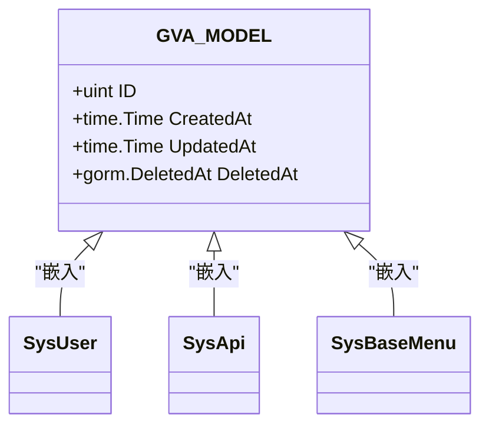
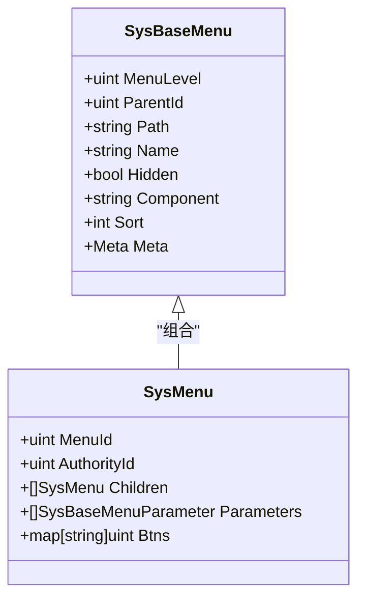
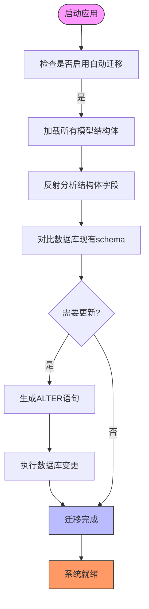

# 数据模型层

<cite>
**本文档引用的文件**
- [basetypes.go](file://server/model/common/basetypes.go)
- [model.go](file://server/global/model.go)
- [sys_user.go](file://server/model/system/sys_user.go)
- [sys_api.go](file://server/model/system/sys_api.go)
- [sys_menu_btn.go](file://server/model/system/sys_menu_btn.go)
- [sys_authority_menu.go](file://server/model/system/sys_authority_menu.go)
- [sys_base_menu.go](file://server/model/system/sys_base_menu.go)
- [sys_authority.go](file://server/model/system/sys_authority.go)
- [sys_user_authority.go](file://server/model/system/sys_user_authority.go)
</cite>

## 目录
1. [简介](#简介)
2. [基础字段复用机制](#基础字段复用机制)
3. 核心结构体详解
   1. [SysUser 用户模型](#sysuser-用户模型)
   2. [SysApi 接口模型](#sysapi-接口模型)
   3. [SysMenu 菜单模型](#sysmenu-菜单模型)
4. [实体关系分析](#实体关系分析)
5. [表名统一设置机制](#表名统一设置机制)
6. [数据库映射对照表](#数据库映射对照表)
7. [GORM 自动迁移原理](#gorm-自动迁移原理)

## 简介
本文档详细阐述 gin-vue-admin 项目中数据模型层的设计与实现。重点解析 `model` 目录下核心结构体(如 SysUser、SysApi、SysMenu)的 GORM 标签含义、字段定义及其业务语义,说明 basetypes.go 中基础字段的复用机制,分析关键实体之间的关联关系,并解释 TableName 方法如何统一设置表前缀。

## 基础字段复用机制

系统通过 `global/model.go` 文件中的 `GVA_MODEL` 结构体实现了基础字段的统一定义和复用。该结构体包含主键 ID、创建时间、更新时间和软删除时间戳等通用字段。



**Diagram sources**
- [model.go](file://server/global/model.go#L0-L14)

**Section sources**
- [model.go](file://server/global/model.go#L0-L14)

## 核心结构体详解

### SysUser 用户模型

`SysUser` 结构体定义了系统用户的完整信息,包括登录凭证、个人信息、权限配置等。

| 字段 | GORM标签 | 业务语义 |
|------|---------|--------|
| UUID | index;comment:用户UUID | 全局唯一标识符,用于安全识别 |
| Username | index;comment:用户登录名 | 登录系统的用户名,建立索引提升查询效率 |
| Password | -;comment:用户登录密码 | 加密存储的密码,JSON序列化时忽略 |
| AuthorityId | default:888;comment:用户角色ID | 关联的角色ID,默认为普通用户(888) |
| Phone | index:idx_phone_not_deleted,unique,condition:deleted_at IS NULL | 手机号唯一且非软删除状态下保证唯一性 |
| OriginSetting | type:text;default:null;column:origin_setting | 存储用户个性化配置的JSON文本字段 |

**Section sources**
- [sys_user.go](file://server/model/system/sys_user.go#L19-L36)

### SysApi 接口模型

`SysApi` 结构体用于管理系统API接口的元数据。

```mermaid
classDiagram
class SysApi {
+uint ID
+time.Time CreatedAt
+time.Time UpdatedAt
+gorm.DeletedAt DeletedAt
+string Path
+string Description
+string ApiGroup
+string Method
}
note right of SysApi.Method
默认值为POST<br/>
支持GET/POST/PUT/DELETE
end note
```

**Diagram sources**
- [sys_api.go](file://server/model/system/sys_api.go#L6-L12)

**Section sources**
- [sys_api.go](file://server/model/system/sys_api.go#L6-L12)

### SysMenu 菜单模型

`SysMenu` 结构体继承自 `SysBaseMenu`,扩展了菜单相关的特定字段。



**Diagram sources**
- [sys_base_menu.go](file://server/model/system/sys_base_menu.go#L0-L43)
- [sys_authority_menu.go](file://server/model/system/sys_authority_menu.go#L2-L9)

**Section sources**
- [sys_base_menu.go](file://server/model/system/sys_base_menu.go#L0-L43)
- [sys_authority_menu.go](file://server/model/system/sys_authority_menu.go#L2-L9)

## 实体关系分析

系统中关键实体之间存在多种关联关系:

```mermaid
erDiagram
SYS_USER ||--o{ SYS_API : "访问"
SYS_USER }|--|| SYS_AUTHORITY : "拥有"
SYS_MENU }o--|| SYS_API : "关联"
SYS_AUTHORITY ||--o{ SYS_MENU : "授权"
SYS_USER ||--o{ SYS_USER_AUTHORITY : "多对多连接"
SYS_AUTHORITY ||--o{ SYS_USER_AUTHORITY : "多对多连接"
SYS_USER {
uint ID PK
uuid.UUID UUID
string Username UK
string NickName
uint AuthorityId FK
}
SYS_AUTHORITY {
uint AuthorityId PK
string AuthorityName
uint ParentId FK
}
SYS_MENU {
uint MenuId PK
uint ParentId
string Path
string Name
}
SYS_USER_AUTHORITY {
uint SysUserId FK
uint SysAuthorityAuthorityId FK
}
```

**Diagram sources**
- [sys_user.go](file://server/model/system/sys_user.go#L19-L36)
- [sys_authority.go](file://server/model/system/sys_authority.go#L0-L23)
- [sys_user_authority.go](file://server/model/system/sys_user_authority.go#L0-L11)

**Section sources**
- [sys_user.go](file://server/model/system/sys_user.go#L19-L36)
- [sys_authority.go](file://server/model/system/sys_authority.go#L0-L23)
- [sys_user_authority.go](file://server/model/system/sys_user_authority.go#L0-L11)

## 表名统一设置机制

所有模型结构体都实现了 `TableName()` 方法来显式指定对应的数据库表名,确保命名规范统一。

```go
func (SysUser) TableName() string {
	return "sys_users"
}

func (SysApi) TableName() string {
	return "sys_apis"
}
```

这种模式使得表名可以独立于结构体名称进行管理,便于维护一致的数据库命名约定(如使用 `sys_` 前缀)。每个模型自行定义表名也提高了灵活性,允许根据需要定制不同的表命名策略。

**Section sources**
- [sys_user.go](file://server/model/system/sys_user.go#L38-L40)
- [sys_api.go](file://server/model/system/sys_api.go#L14-L16)

## 数据库映射对照表

| Go结构体字段 | 数据库列名 | 数据类型 | 约束/说明 |
|------------|----------|--------|---------|
| ID | id | bigint unsigned | 主键,自增 |
| CreatedAt | created_at | datetime | 创建时间戳 |
| UpdatedAt | updated_at | datetime | 更新时间戳 |
| DeletedAt | deleted_at | datetime | 软删除时间戳,带索引 |
| Username | username | varchar(191) | 用户登录名,带索引 |
| AuthorityId | authority_id | bigint unsigned | 角色ID,默认888 |
| Path | path | varchar(191) | API路径或菜单路由 |
| MenuId | menu_id | bigint unsigned | 菜单主键ID |
| AuthorityId (in relation) | sys_authority_authority_id | bigint unsigned | 多对多关联外键 |

## GORM 自动迁移原理

GORM 的 AutoMigrate 功能通过反射分析结构体定义,对比现有数据库模式,自动执行必要的 DDL 操作以使数据库 schema 与 Go 结构体保持同步。其工作流程如下:



AutoMigrate 会智能地添加缺失的列、索引,但不会删除已存在的列,从而保证数据安全。它利用 GORM 的 Dialector 适配不同数据库方言,确保跨数据库兼容性。

**Section sources**
- [initialize/gorm.go](file://server/initialize/gorm.go)
- [ensure_tables.go](file://server/initialize/ensure_tables.go)