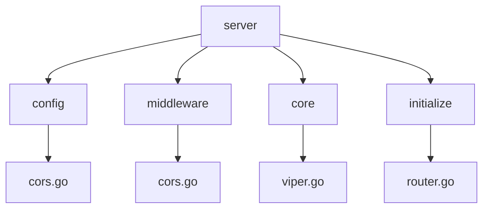
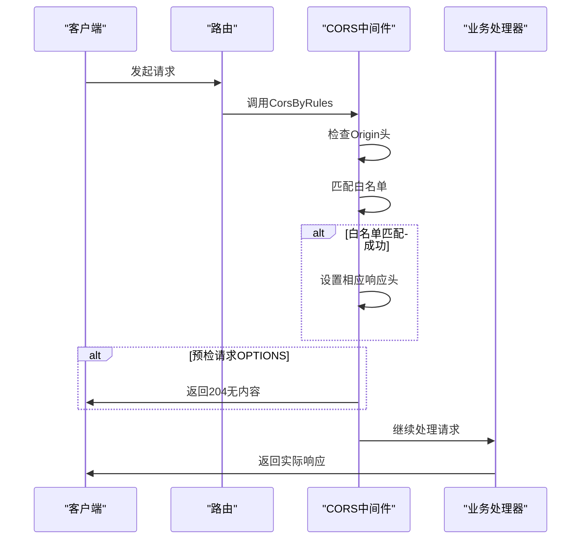
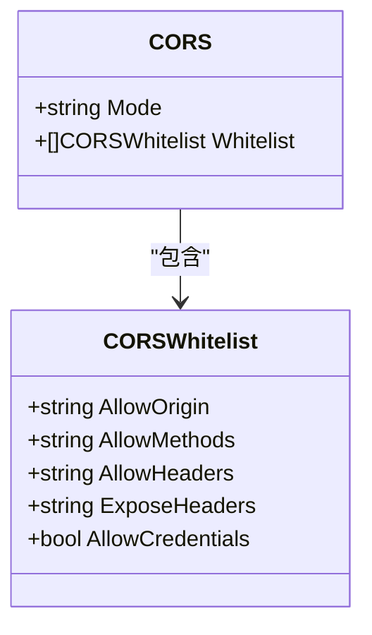
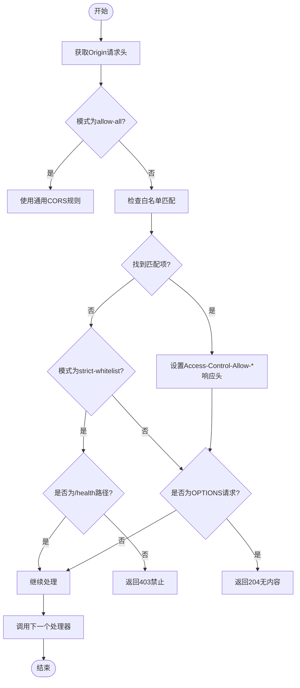
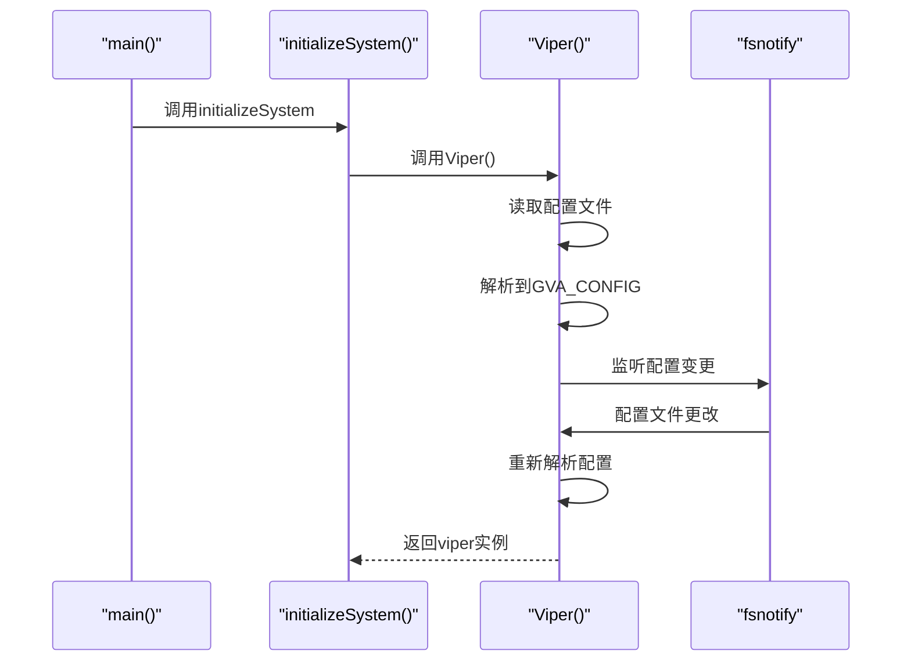
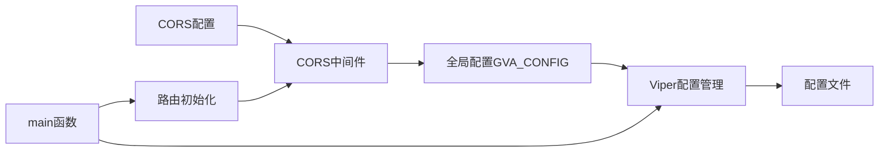

# CORS跨域配置中间件

<cite>
**本文档引用文件**
- [cors.go](file://server/config/cors.go)
- [cors.go](file://server/middleware/cors.go)
- [config.yaml](file://server/config.yaml)
- [config.go](file://server/config/config.go)
- [viper.go](file://server/core/viper.go)
- [router.go](file://server/initialize/router.go)
- [global.go](file://server/global/global.go)
- [main.go](file://server/main.go)
</cite>

## 目录
1. [简介](#简介)
2. [项目结构](#项目结构)
3. [核心组件](#核心组件)
4. [架构概述](#架构概述)
5. [详细组件分析](#详细组件分析)
6. [依赖分析](#依赖分析)
7. [性能考虑](#性能考虑)
8. [故障排除指南](#故障排除指南)
9. [结论](#结论)

## 简介
本文档详细说明了 gin-vue-admin 项目中 CORS 跨域配置中间件的工作机制。重点分析了如何从配置文件加载跨域策略、中间件对预检请求的处理逻辑，以及开发与生产环境的安全配置实践。

## 项目结构

**图示来源**
- [cors.go](file://server/config/cors.go)
- [cors.go](file://server/middleware/cors.go)
- [viper.go](file://server/core/viper.go)
- [router.go](file://server/initialize/router.go)

**本节来源**
- [server/config/cors.go](file://server/config/cors.go)
- [server/middleware/cors.go](file://server/middleware/cors.go)

## 核心组件

CORS 中间件系统由配置定义、配置加载和请求处理三部分组成。`config/cors.go` 定义了跨域策略的数据结构，`middleware/cors.go` 实现了具体的跨域处理逻辑，通过 Viper 配置管理器实现配置热更新。

**本节来源**
- [cors.go](file://server/config/cors.go#L1-L14)
- [cors.go](file://server/middleware/cors.go#L10-L72)
- [config.go](file://server/config/config.go#L38-L39)

## 架构概述

**图示来源**
- [cors.go](file://server/middleware/cors.go#L30-L62)
- [router.go](file://server/initialize/router.go#L50-L51)

## 详细组件分析

### CORS配置结构分析

**图示来源**
- [cors.go](file://server/config/cors.go#L3-L14)

**本节来源**
- [cors.go](file://server/config/cors.go#L3-L14)

### CORS中间件处理流程

**图示来源**
- [cors.go](file://server/middleware/cors.go#L30-L62)
- [cors.go](file://server/middleware/cors.go#L64-L72)

**本节来源**
- [cors.go](file://server/middleware/cors.go#L30-L72)

### 配置加载机制

**图示来源**
- [main.go](file://server/main.go#L38-L50)
- [viper.go](file://server/core/viper.go#L16-L41)

**本节来源**
- [main.go](file://server/main.go#L38-L50)
- [viper.go](file://server/core/viper.go#L16-L41)

## 依赖分析

**图示来源**
- [global.go](file://server/global/global.go#L30)
- [config.go](file://server/config/config.go)
- [viper.go](file://server/core/viper.go)
- [router.go](file://server/initialize/router.go)

**本节来源**
- [global.go](file://server/global/global.go#L30)
- [config.go](file://server/config/config.go)
- [viper.go](file://server/core/viper.go)

## 性能考虑
CORS 中间件采用内存中的白名单匹配机制，时间复杂度为 O(n)，其中 n 为白名单条目数量。建议在生产环境中保持白名单条目精简以确保最佳性能。配置热更新功能避免了服务重启，提高了系统的可用性。

## 故障排除指南

常见跨域问题及解决方案：

1. **Origin不匹配**：确保前端请求的Origin头与配置中的allow-origin完全一致（包括协议和端口）
2. **凭证模式不一致**：当AllowCredentials为true时，AllowOrigin不能为"*"，必须指定具体域名
3. **预检请求失败**：检查AllowMethods和AllowHeaders是否包含实际使用的HTTP方法和请求头
4. **配置未生效**：确认已在router.go中启用CorsByRules中间件而非Cors中间件

**本节来源**
- [cors.go](file://server/middleware/cors.go#L30-L62)
- [config.yaml](file://server/config.yaml#L20-L32)
- [router.go](file://server/initialize/router.go#L50-L51)

## 结论
gin-vue-admin 的 CORS 中间件提供了灵活且安全的跨域解决方案。通过配置驱动的方式，开发者可以精确控制不同环境下的跨域策略，既满足开发调试需求，又保障生产环境安全。建议在生产环境中使用strict-whitelist模式，并严格限制允许的域名、方法和头部字段。