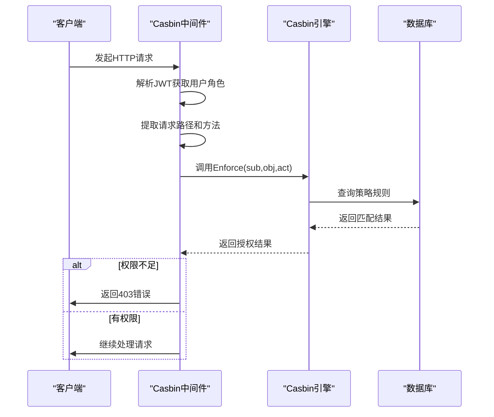
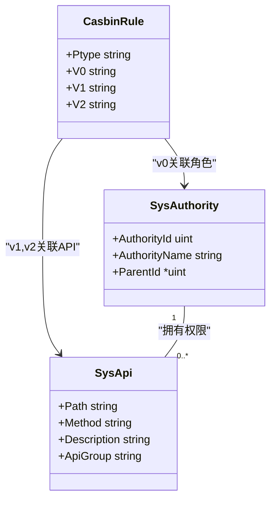
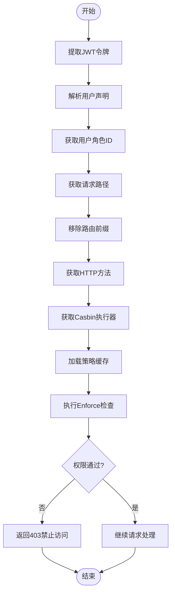
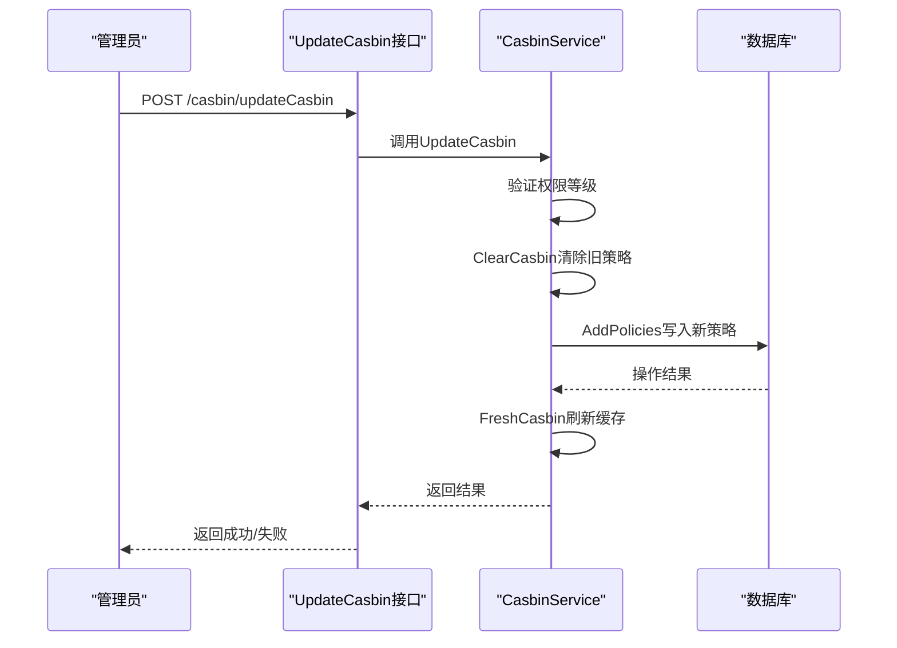

# Casbin RBAC权限中间件

<cite>
**本文档引用文件**  
- [casbin_rbac.go](file://server/middleware/casbin_rbac.go)
- [casbin_util.go](file://server/utils/casbin_util.go)
- [sys_casbin.go](file://server/service/system/sys_casbin.go)
- [sys_api.go](file://server/model/system/sys_api.go)
- [sys_authority.go](file://server/model/system/sys_authority.go)
- [sys_casbin.go](file://server/api/v1/system/sys_casbin.go)
- [sys_menu.go](file://server/api/v1/system/sys_menu.go)
</cite>

## 目录
1. [简介](#简介)
2. [核心工作原理](#核心工作原理)
3. [请求路径与角色匹配策略](#请求路径与角色匹配策略)
4. [Enforce()调用流程图解](#enforce调用流程图解)
5. [权限拒绝响应格式](#权限拒绝响应格式)
6. [动态更新权限策略](#动态更新权限策略)
7. [前端菜单权限同步机制](#前端菜单权限同步机制)
8. [调试模式与缓存机制](#调试模式与缓存机制)
9. [高并发性能调优建议](#高并发性能调优建议)

## 简介
Casbin RBAC权限中间件是gin-vue-admin系统中的核心访问控制组件，基于Casbin框架实现基于角色的访问控制（RBAC）。该中间件通过拦截HTTP请求，结合用户角色、请求路径和方法进行权限校验，实现API级别和按钮级别的细粒度访问控制。

**Section sources**
- [casbin_rbac.go](file://server/middleware/casbin_rbac.go#L1-L32)

## 核心工作原理
Casbin RBAC中间件通过`CasbinHandler()`函数实现权限拦截功能。当请求到达时，中间件从JWT令牌中提取用户信息，获取用户的角色ID、请求路径和HTTP方法，然后调用Casbin的Enforce方法进行权限决策。

中间件首先通过`utils.GetClaims(c)`从Gin上下文中解析JWT令牌获取用户声明，提取用户的AuthorityId作为主体（subject）。接着获取请求的URL路径，并去除系统路由前缀作为对象（object），将HTTP方法作为动作（action）。最后使用这三元组`(sub, obj, act)`调用Casbin引擎的Enforce方法进行权限验证。



**Diagram sources**
- [casbin_rbac.go](file://server/middleware/casbin_rbac.go#L1-L32)
- [casbin_util.go](file://server/utils/casbin_util.go#L18-L51)

**Section sources**
- [casbin_rbac.go](file://server/middleware/casbin_rbac.go#L1-L32)
- [casbin_util.go](file://server/utils/casbin_util.go#L18-L51)

## 请求路径与角色匹配策略
中间件采用精确匹配与通配符匹配相结合的策略。在Casbin模型定义中，使用`keyMatch2`函数实现路径匹配，支持`*`通配符。例如，`/user/*`可以匹配`/user/create`和`/user/delete`等路径。

角色匹配基于用户JWT令牌中的AuthorityId字段，转换为字符串后作为主体标识。系统通过`sys_authority`模型管理角色层次结构，支持父子角色继承关系。权限策略存储在`sys_casbin_rules`表中，以`(v0:角色,v1:路径,v2:方法)`三元组形式保存。



**Diagram sources**
- [sys_casbin.go](file://server/service/system/sys_casbin.go#L0-L172)
- [sys_authority.go](file://server/model/system/sys_authority.go#L0-L23)
- [sys_api.go](file://server/model/system/sys_api.go#L0-L28)

**Section sources**
- [sys_casbin.go](file://server/service/system/sys_casbin.go#L0-L172)
- [sys_authority.go](file://server/model/system/sys_authority.go#L0-L23)

## Enforce()调用流程图解
Enforce方法的调用流程包含多个关键步骤：



**Diagram sources**
- [casbin_rbac.go](file://server/middleware/casbin_rbac.go#L1-L32)
- [casbin_util.go](file://server/utils/casbin_util.go#L18-L51)

**Section sources**
- [casbin_rbac.go](file://server/middleware/casbin_rbac.go#L1-L32)

## 权限拒绝响应格式
当权限校验失败时，中间件返回标准化的JSON响应格式：

```json
{
  "code": 7,
  "data": {},
  "msg": "权限不足"
}
```

该响应由`response.FailWithDetailed(gin.H{}, "权限不足", c)`生成，其中code=7表示权限错误。响应体为空对象，消息字段明确提示"权限不足"。此格式与系统其他API保持一致，便于前端统一处理权限异常。

**Section sources**
- [casbin_rbac.go](file://server/middleware/casbin_rbac.go#L28-L30)

## 动态更新权限策略
系统支持不重启服务的动态权限更新。通过`UpdateCasbin`接口实现权限策略的实时更新：

1. 管理员发起POST请求到`/casbin/updateCasbin`
2. 服务端验证操作者权限等级是否足够
3. 清除该角色原有的所有权限规则
4. 添加新的权限规则到数据库
5. 调用`FreshCasbin()`重新加载策略到内存

关键代码路径：


**Diagram sources**
- [sys_casbin.go](file://server/api/v1/system/sys_casbin.go#L0-L43)
- [sys_casbin.go](file://server/service/system/sys_casbin.go#L0-L50)

**Section sources**
- [sys_casbin.go](file://server/api/v1/system/sys_casbin.go#L0-L43)
- [sys_casbin.go](file://server/service/system/sys_casbin.go#L0-L172)

## 前端菜单权限同步机制
前端菜单权限与后端API权限保持同步，通过以下机制实现：

1. 用户登录后，前端调用`/menu/getBaseMenuTree`获取可访问菜单
2. 后端根据用户角色查询`sys_casbin_rules`表获取权限列表
3. 过滤出具有访问权限的菜单项返回给前端
4. 前端根据返回的菜单数据动态渲染导航

同时，按钮级别权限通过`sys_authority_btn`表管理，在页面加载时根据用户权限显示或隐藏特定按钮。


**Diagram sources**
- [sys_menu.go](file://server/api/v1/system/sys_menu.go#L38-L55)
- [sys_casbin.go](file://server/service/system/sys_casbin.go#L100-L139)

**Section sources**
- [sys_menu.go](file://server/api/v1/system/sys_menu.go#L0-L55)
- [sys_casbin.go](file://server/service/system/sys_casbin.go#L100-L139)

## 调试模式与缓存机制
### 调试模式启用
通过配置文件`config.yaml`中的`system.UseStrictAuth`字段控制严格认证模式。开启后会额外验证权限是否存在于`sys_apis`表中，有助于发现配置错误。

### 策略缓存机制
Casbin使用SyncedCachedEnforcer实现策略缓存，主要特性包括：
- 缓存过期时间：3600秒（1小时）
- 自动从数据库加载策略
- 支持手动刷新缓存
- 内存中缓存策略以提高性能

刷新缓存可通过调用`/api/freshCasbin`接口实现，该接口调用`e.LoadPolicy()`重新从数据库加载所有策略。

**Section sources**
- [casbin_util.go](file://server/utils/casbin_util.go#L18-L51)
- [sys_api.go](file://server/api/v1/system/sys_api.go#L311-L326)

## 高并发性能调优建议
1. **合理设置缓存时间**：根据业务需求调整`SetExpireTime`参数，平衡实时性和性能
2. **批量操作优化**：使用`AddPolicies`和`RemoveFilteredPolicy`进行批量操作
3. **数据库索引优化**：确保`casbin_rule`表的v0、v1、v2字段有适当索引
4. **连接池配置**：优化数据库连接池大小以支持高并发
5. **监控与告警**：监控Enforce调用耗时，设置性能阈值告警
6. **预加载热点数据**：对常用角色的权限策略进行预加载

通过以上优化措施，系统可在高并发场景下保持稳定的权限校验性能。

**Section sources**
- [casbin_util.go](file://server/utils/casbin_util.go#L18-L51)
- [sys_casbin.go](file://server/service/system/sys_casbin.go#L141-L172)