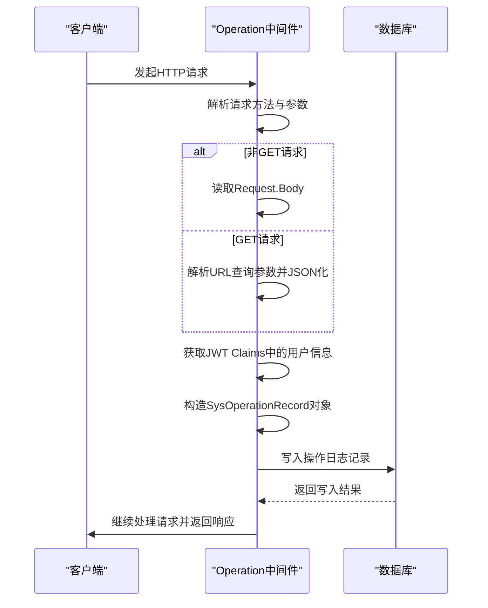
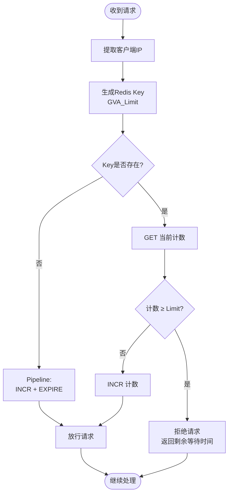
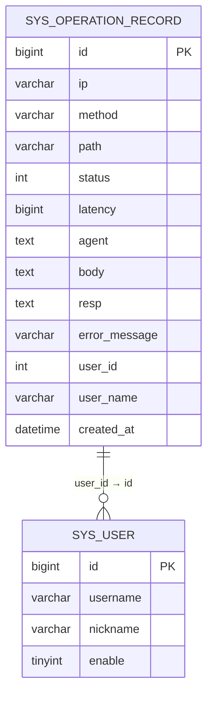

# 操作审计与限流中间件

<cite>
**本文档引用文件**
- [operation.go](file://server/middleware/operation.go)
- [limit_ip.go](file://server/middleware/limit_ip.go)
- [sys_operation_record.go](file://server/model/system/sys_operation_record.go)
- [system.go](file://server/config/system.go)
- [jwt.go](file://server/middleware/jwt.go)
- [casbin_rbac.go](file://server/middleware/casbin_rbac.go)
- [sys_operation_record.go](file://server/api/v1/system/sys_operation_record.go)
- [sys_operation_record.go](file://server/service/system/sys_operation_record.go)
</cite>

## 目录
1. [操作日志记录机制](#操作日志记录机制)
2. [IP级请求频率限制](#ip级请求频率限制)
3. [中间件协作顺序](#中间件协作顺序)
4. [限流响应格式](#限流响应格式)
5. [异常访问监控](#异常访问监控)

## 操作日志记录机制

`operation.go` 中间件负责记录系统关键操作日志，包含用户行为、接口调用及参数快照。该中间件在请求处理前后捕获上下文信息，并持久化至数据库 `sys_operation_record` 表。

对于非 GET 请求，中间件读取请求体（Body）内容并缓存，以便后续记录；对于 GET 请求，则解析查询参数并序列化为 JSON 格式存储。通过 `utils.GetClaims(c)` 获取 JWT 声明中的用户 ID 和用户名，若未获取到则尝试从请求头 `x-user-id` 提取用户标识。

日志记录字段包括：
- **Ip**: 客户端 IP 地址
- **Method**: HTTP 方法（如 POST、GET）
- **Path**: 请求路径
- **Agent**: 用户代理字符串
- **Body**: 请求参数或表单数据（文件上传时标记为 `[文件]`）
- **UserID / UserName**: 操作用户的身份信息
- **Status**: 响应状态码
- **Latency**: 请求处理延迟
- **ErrorMessage**: 错误信息（如有）
- **Resp**: 响应体内容（部分场景下截断）

当日志写入数据库失败时，系统会通过 Zap 日志组件输出错误信息。



**图示来源**
- [operation.go](file://server/middleware/operation.go#L1-L140)
- [sys_operation_record.go](file://server/model/system/sys_operation_record.go#L10-L24)

**本节来源**
- [operation.go](file://server/middleware/operation.go#L1-L140)
- [sys_operation_record.go](file://server/model/system/sys_operation_record.go#L10-L24)

## IP级请求频率限制

基于 Redis 实现的 IP 级请求频率限制机制由 `limit_ip.go` 中间件提供支持，用于防止暴力破解和接口滥用。其核心逻辑依赖于 Redis 的原子操作实现计数器功能。

### 限流算法原理

采用**固定窗口计数器**方式模拟令牌桶思想，具体流程如下：
1. 使用客户端 IP 作为唯一键（Key），格式为 `GVA_Limit<IP>`。
2. 每次请求检查该 Key 是否存在：
   - 若不存在，初始化计数为 1，并设置过期时间（Expire）。
   - 若存在，获取当前计数值：
     - 若超过设定阈值（Limit），拒绝请求并提示等待时间；
     - 否则递增计数。

此机制通过 Redis 的 `INCR` 和 `EXPIRE` 原子性管道操作保证并发安全。

### 配置项说明

配置来源于 `config/system.go`，主要参数如下：

| 配置项 | 字段名 | 含义 | 示例值 |
|--------|--------|------|--------|
| 单位时间内最大请求数 | `LimitCountIP` | 在指定周期内允许的最大请求次数 | 10 |
| 限流周期（秒） | `LimitTimeIP` | 限流统计的时间窗口长度 | 60 |

这些值可在 `config.yaml` 文件中动态调整，无需重启服务。



**图示来源**
- [limit_ip.go](file://server/middleware/limit_ip.go#L1-L92)
- [system.go](file://server/config/system.go#L1-L14)

**本节来源**
- [limit_ip.go](file://server/middleware/limit_ip.go#L1-L92)
- [system.go](file://server/config/system.go#L1-L14)

## 中间件协作顺序

操作审计、JWT 认证与 Casbin 权限控制三者协同工作，确保每条审计日志都包含完整的身份与权限上下文。它们在 Gin 路由链中的执行顺序至关重要。

典型执行顺序为：
1. **JWTAuth()**: 解析并验证 JWT Token，提取用户身份信息（Claims），存入上下文。
2. **CasbinHandler()**: 利用已解析的用户角色（AuthorityId）进行 RBAC 权限校验。
3. **OperationRecord()**: 记录完整请求日志，包含用户 ID、用户名等身份信息。

由于 `OperationRecord` 在最后执行，能够获取到前两个中间件注入的用户上下文，从而保障日志的完整性。

```mermaid
sequenceDiagram
participant Client
participant JWT as JWTAuth
participant Casbin as CasbinHandler
participant Operation as OperationRecord
Client->>JWT : 请求到达
JWT->>JWT : 解析Token，设置claims
alt Token无效
JWT->>Client : 返回401
return
end
JWT->>Casbin : 传递请求
Casbin->>Casbin : 获取AuthorityId，执行Enforce
alt 无权限
Casbin->>Client : 返回403
return
end
Casbin->>Operation : 传递请求
Operation->>Operation : 开始记录日志
Operation->>Operation : 捕获请求参数与用户信息
Operation->>Client : 处理完成，记录响应
```

**图示来源**
- [jwt.go](file://server/middleware/jwt.go#L1-L88)
- [casbin_rbac.go](file://server/middleware/casbin_rbac.go#L1-L33)
- [operation.go](file://server/middleware/operation.go#L1-L140)

**本节来源**
- [jwt.go](file://server/middleware/jwt.go#L1-L88)
- [casbin_rbac.go](file://server/middleware/casbin_rbac.go#L1-L33)
- [operation.go](file://server/middleware/operation.go#L1-L140)

## 限流响应格式

当请求频率超出限制时，系统返回标准化的 JSON 响应，便于前端统一处理。

响应结构如下：

```json
{
  "code": -1,
  "msg": "请求太过频繁, 请 59.876s 秒后尝试"
}
```

其中：
- `code`: 错误码，定义于 `response.ERROR = -1`
- `msg`: 包含具体等待时间（精确到毫秒），提升用户体验

该响应由 `limit_ip.go` 中的 `DefaultCheckOrMark` 函数生成，在检测到超限时调用 `c.JSON()` 输出并中断后续处理。

**本节来源**
- [limit_ip.go](file://server/middleware/limit_ip.go#L1-L92)
- [response.go](file://server/model/common/response/response.go)

## 异常访问监控

通过分析 `sys_operation_record` 表可有效识别异常访问模式。建议结合以下维度进行监控：

1. **高频 IP 检测**：统计单位时间内相同 IP 的请求频次，超过阈值即告警。
2. **失败登录集中检测**：对 `/login` 接口的状态码为非 200 的记录按 IP 分组统计。
3. **敏感接口访问追踪**：监控删除、权限变更等高风险操作的日志。
4. **地理异常检测**：结合 IP 归属地判断是否存在异地快速切换登录行为。

系统提供了完整的 API 支持日志查询：
- `GET /sysOperationRecord/getSysOperationRecordList`：分页获取操作记录
- `GET /sysOperationRecord/findSysOperationRecord`：根据 ID 查询单条记录
- `DELETE /sysOperationRecord/deleteSysOperationRecordByIds`：批量清理日志



**图示来源**
- [sys_operation_record.go](file://server/model/system/sys_operation_record.go#L10-L24)
- [sys_operation_record.go](file://server/api/v1/system/sys_operation_record.go#L1-L124)
- [sys_operation_record.go](file://server/service/system/sys_operation_record.go#L1-L83)

**本节来源**
- [sys_operation_record.go](file://server/model/system/sys_operation_record.go#L10-L24)
- [sys_operation_record.go](file://server/api/v1/system/sys_operation_record.go#L1-L124)
- [sys_operation_record.go](file://server/service/system/sys_operation_record.go#L1-L83)