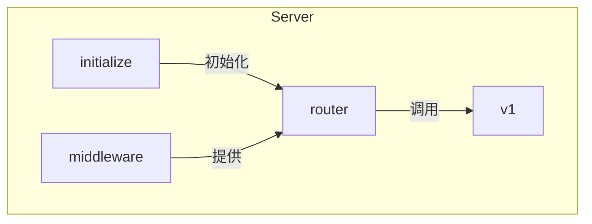
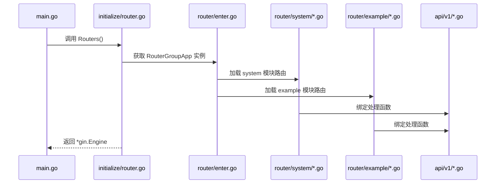
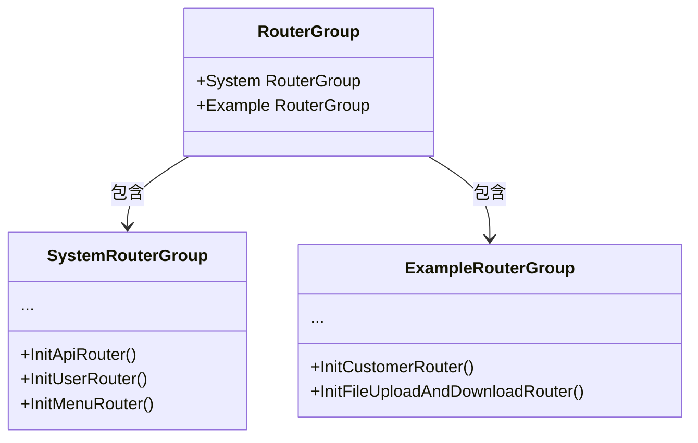
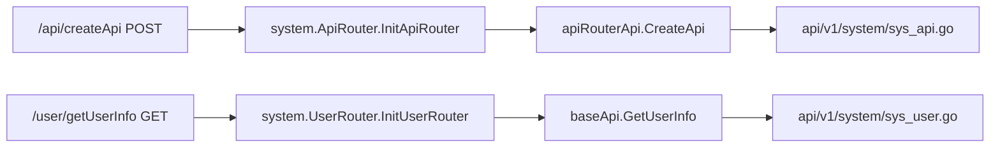
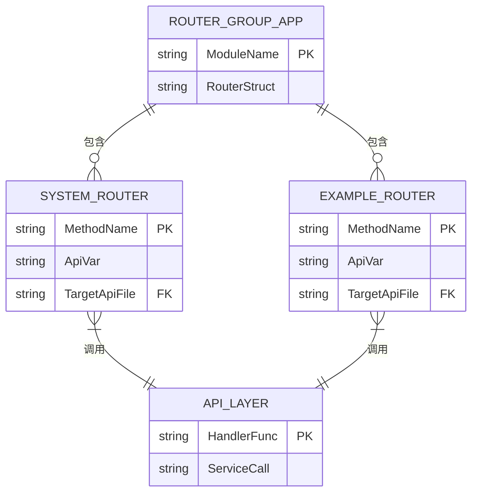

# 路由系统

<cite>
**本文档中引用的文件**  
- [router/enter.go](file://server/router/enter.go)
- [initialize/router.go](file://server/initialize/router.go)
- [router/system/enter.go](file://server/router/system/enter.go)
- [api/v1/enter.go](file://server/api/v1/enter.go)
- [router/system/sys_api.go](file://server/router/system/sys_api.go)
- [router/system/sys_user.go](file://server/router/system/sys_user.go)
- [router/example/enter.go](file://server/router/example/enter.go)
- [router/example/exa_customer.go](file://server/router/example/exa_customer.go)
</cite>

## 目录
1. [简介](#简介)
2. [项目结构](#项目结构)
3. [核心组件](#核心组件)
4. [架构概述](#架构概述)
5. [详细组件分析](#详细组件分析)
6. [依赖分析](#依赖分析)
7. [性能考虑](#性能考虑)
8. [故障排除指南](#故障排除指南)
9. [结论](#结论)

## 简介
gin-vue-admin 是一个基于 Gin 框架和 Vue.js 的全栈开发脚手架，其路由系统采用模块化设计，支持动态注册、权限控制与自动文档生成。本文档深入解析其路由注册机制，涵盖从初始化到分组管理、中间件注入及自定义扩展的完整流程。

## 项目结构

**Diagram sources**
- [server/router](file://server/router)
- [server/api/v1](file://server/api/v1)
- [server/initialize](file://server/initialize)

**Section sources**
- [server/router](file://server/router)
- [server/api/v1](file://server/api/v1)
- [server/initialize](file://server/initialize)

## 核心组件

gin-vue-admin 的路由系统由三大核心部分构成：`router.GroupApp` 全局路由组、`api/v1` 处理函数集合以及 `initialize/router.go` 中的初始化逻辑。通过 `RouterGroupApp` 结构体统一管理不同业务模块（如 system、example）的路由实例，并在启动时通过 `Routers()` 函数完成整体路由引擎的构建与加载。

**Section sources**
- [router/enter.go](file://server/router/enter.go)
- [initialize/router.go](file://server/initialize/router.go)
- [api/v1/enter.go](file://server/api/v1/enter.go)

## 架构概述

**Diagram sources**
- [initialize/router.go](file://server/initialize/router.go#L35-L122)
- [router/enter.go](file://server/router/enter.go#L7)
- [router/system/enter.go](file://server/router/system/enter.go)
- [api/v1/enter.go](file://server/api/v1/enter.go)

## 详细组件分析

### 路由分组注册机制

#### 路由分组结构

**Diagram sources**
- [router/enter.go](file://server/router/enter.go#L7-L13)
- [router/system/enter.go](file://server/router/system/enter.go#L5-L46)
- [router/example/enter.go](file://server/router/example/enter.go#L5-L17)

#### API 处理函数映射

**Diagram sources**
- [router/system/sys_api.go](file://server/router/system/sys_api.go#L10-L33)
- [api/v1/system/sys_api.go](file://server/api/v1/system/sys_api.go)
- [router/system/sys_user.go](file://server/router/system/sys_user.go#L10-L28)
- [api/v1/system/sys_user.go](file://server/api/v1/system/sys_user.go)

### 自定义业务路由添加方法

开发者可通过以下步骤添加自定义路由：

1. 在 `api/v1` 下创建新的处理函数文件；
2. 在 `router` 目录下创建对应路由注册器；
3. 将新路由注册器挂载至 `RouterGroup`；
4. 在 `initialize/router.go` 中调用初始化函数。

该过程实现了高内聚低耦合的设计原则，便于功能扩展与维护。

**Section sources**
- [router/enter.go](file://server/router/enter.go)
- [api/v1/enter.go](file://server/api/v1/enter.go)
- [initialize/router.go](file://server/initialize/router.go)

### 路由分组与前缀处理

系统使用 `global.GVA_CONFIG.System.RouterPrefix` 作为统一前缀，在 `PublicGroup` 和 `PrivateGroup` 中分别注册无需鉴权和需要 JWT 鉴权的接口。所有路由均自动附加此前缀，确保 URL 规范一致。

此外，私有路由组统一应用 `JWTAuth` 和 `CasbinHandler` 中间件，实现身份认证与权限校验的集中管理。

**Section sources**
- [initialize/router.go](file://server/initialize/router.go#L65-L68)

## 依赖分析

**Diagram sources**
- [router/enter.go](file://server/router/enter.go)
- [router/system/enter.go](file://server/router/system/enter.go)
- [api/v1/enter.go](file://server/api/v1/enter.go)

## 性能考虑

路由匹配性能主要受 Gin 框架本身的 Trie 树路由算法保障，具备 O(log n) 时间复杂度。建议避免在路由路径中使用过多通配符或正则表达式，以防止影响查找效率。同时，合理组织路由分组可减少中间件重复执行开销。

对于高频访问接口，可结合 Redis 缓存响应结果，进一步提升吞吐量。

## 故障排除指南

常见路由问题包括：
- 接口 404：检查是否正确调用了路由初始化函数；
- 权限拒绝：确认中间件顺序及 Casbin 策略配置；
- 参数绑定失败：验证请求 Content-Type 与结构体 tag 是否匹配；
- Swagger 文档未更新：重新运行 `swag init` 并重启服务。

建议启用 Gin 的 Logger 中间件以便追踪请求生命周期。

**Section sources**
- [initialize/router.go](file://server/initialize/router.go#L37-L38)
- [middleware/jwt.go](file://server/middleware/jwt.go)
- [middleware/casbin_rbac.go](file://server/middleware/casbin_rbac.go)

## 结论

gin-vue-admin 的路由系统设计清晰、扩展性强，通过分层解耦的方式将路由定义、处理逻辑与服务调用分离，提升了代码可读性与可维护性。其基于 Gin 的高性能路由引擎配合模块化注册机制，适用于中大型后台管理系统开发。遵循既定规范进行自定义扩展，能够快速实现新功能接入。