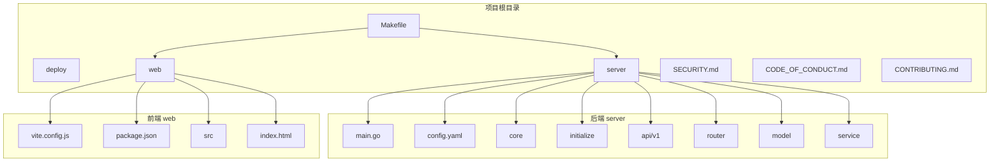

# 开发者指南

<cite>
**本文档引用的文件**
- [Makefile](file://Makefile)
- [README.md](file://README.md)
- [CONTRIBUTING.md](file://CONTRIBUTING.md)
- [SECURITY.md](file://SECURITY.md)
- [CODE_OF_CONDUCT.md](file://CODE_OF_CONDUCT.md)
- [server/main.go](file://server/main.go)
- [server/core/viper.go](file://server/core/viper.go)
- [server/core/server.go](file://server/core/server.go)
- [server/initialize/router.go](file://server/initialize/router.go)
- [server/initialize/gorm.go](file://server/initialize/gorm.go)
- [server/config.yaml](file://server/config.yaml)
- [web/package.json](file://web/package.json)
- [web/vite.config.js](file://web/vite.config.js)
</cite>

## 目录
1. [简介](#简介)
2. [项目结构](#项目结构)
3. [开发环境搭建](#开发环境搭建)
4. [代码规范与分支管理](#代码规范与分支管理)
5. [构建与测试流程](#构建与测试流程)
6. [调试技巧](#调试技巧)
7. [测试策略](#测试策略)
8. [安全与社区准则](#安全与社区准则)
9. [结论](#结论)

## 简介
本指南旨在为希望参与 gin-vue-admin 项目开发或二次开发的贡献者提供全面的技术指导。文档涵盖了从环境配置到代码提交的完整开发流程,重点介绍了项目的构建系统、调试方法和协作规范。

**Section sources**
- [README.md](file://README.md#L0-L385)
- [CONTRIBUTING.md](file://CONTRIBUTING.md#L0-L19)

## 项目结构
gin-vue-admin 是一个前后端分离的全栈开发平台,主要由两个核心部分组成:`server`(后端)和 `web`(前端)。项目还包含部署配置、文档和构建脚本等辅助目录。

- `server`: 基于 Go 语言的 Gin 框架构建的后端服务,负责 API 提供、数据库交互和业务逻辑处理。
- `web`: 基于 Vue.js 和 Element Plus 构建的前端应用,提供用户界面和交互功能。
- `deploy`: 包含 Docker 和 Kubernetes 的部署配置文件。
- `Makefile`: 定义了项目构建、打包和生成文档的便捷命令。

**Diagram sources**
- [server/main.go](file://server/main.go#L0-L51)
- [server/config.yaml](file://server/config.yaml#L0-L248)
- [web/package.json](file://web/package.json#L0-L85)
- [web/vite.config.js](file://web/vite.config.js#L0-L121)

**Section sources**
- [README.md](file://README.md#L0-L385)
- [project_structure](file://)

## 开发环境搭建
为了顺利进行开发,您需要准备以下环境:

### 后端环境
1.  **Go 语言**: 版本要求 >= v1.22。
2.  **依赖管理**: 项目使用 `go mod` 进行依赖管理。在 `server` 目录下运行 `go mod tidy` 可以下载所有依赖。
3.  **数据库**: 项目支持多种数据库(MySQL, PostgreSQL, Oracle, SQL Server, SQLite),默认配置使用 PostgreSQL。请根据 `server/config.yaml` 文件中的配置启动相应的数据库服务。
4.  **Redis**: 用于 JWT 黑名单和多点登录限制,需在 `config.yaml` 中配置 Redis 地址。

### 前端环境
1.  **Node.js**: 版本要求 > v18.16.0。
2.  **包管理器**: 推荐使用 `yarn` 或 `npm`。在 `web` 目录下运行 `yarn install` 或 `npm install` 来安装前端依赖。

### 配置文件
项目的核心配置位于 `server/config.yaml`。您可以根据实际环境修改数据库连接、Redis、OSS 存储等参数。对于开发环境,通常直接修改此文件即可。

**Section sources**
- [README.md](file://README.md#L0-L385)
- [server/config.yaml](file://server/config.yaml#L0-L248)
- [server/core/viper.go](file://server/core/viper.go#L0-L76)

## 代码规范与分支管理
为了保证代码质量和协作效率,请遵循以下规范:

### 分支管理策略
- **主分支 (master)**: 保护分支,仅用于发布稳定版本。
- **开发分支 (develop)**: 主要的开发分支。所有新功能和修复都应基于 `develop` 分支创建特性分支,并最终合并回 `develop`。
- **特性分支 (feature/xxx)**: 用于开发新功能,命名如 `feature/user-authentication`。
- **修复分支 (fix/xxx)**: 用于修复 bug,命名如 `fix/login-bug`。

### Pull Request 流程
1.  Fork 仓库到您的个人账户。
2.  在您的 Fork 中创建一个新的分支。
3.  在分支上完成开发和测试。
4.  提交 Pull Request (PR) 到原仓库的 `develop` 分支。
5.  PR 的 commit 信息格式应为 `[文件名]: 描述信息`,例如 `login.vue: fix login button style`。
6.  维护团队将进行代码审查(Code Review),至少需要两名维护人员批准后才能合并。

**Section sources**
- [CONTRIBUTING.md](file://CONTRIBUTING.md#L0-L19)
- [README.md](file://README.md#L0-L385)

## 构建与测试流程
项目通过 `Makefile` 提供了一系列便捷的构建命令。

### Makefile 命令详解
| 命令 | 描述 |
| :--- | :--- |
| `make build-web-local` | 在本地构建前端应用,生成 `dist` 目录。 |
| `make build-server-local` | 在本地构建后端可执行文件 `server`。 |
| `make build-local` | 本地构建前后端,并将它们打包到 `build` 目录。 |
| `make doc` | 使用 Swag 工具生成 Swagger API 文档。 |
| `make plugin PLUGIN=email` | 将指定插件(如 email)打包成 zip 文件,便于分发。 |

### 测试
- **后端测试**: Go 语言内置了强大的测试框架。单元测试文件通常以 `_test.go` 结尾,可以使用 `go test ./...` 命令运行所有测试。
- **前端测试**: 项目使用 Vite 构建,可以通过 `npm run test` 或 `yarn test` 执行前端测试(如果已配置)。

**Section sources**
- [Makefile](file://Makefile#L0-L75)
- [README.md](file://README.md#L0-L385)

## 调试技巧
### 调试后端应用
1.  **使用 Goland IDE**: 推荐使用 Goland,可以直接打开 `server` 目录并设置断点进行调试。
2.  **VSCode 调试**: 项目提供了 `gin-vue-admin.code-workspace` 工作区文件。打开后,在“运行和调试”面板中选择 `Backend` 或 `Both (Backend & Frontend)` 即可启动调试会话。
3.  **日志**: 项目使用 `zap` 日志库,日志级别和输出路径可在 `config.yaml` 的 `zap` 部分配置。

### 调试前端应用
1.  **使用 VSCode + Volar**: 在 `web` 目录下启动 `npm run serve`,然后使用浏览器开发者工具进行调试。
2.  **Vite Dev Server**: `vite.config.js` 配置了开发服务器的代理,能有效解决跨域问题,方便前后端联调。

**Section sources**
- [README.md](file://README.md#L0-L385)
- [server/main.go](file://server/main.go#L0-L51)
- [server/core/server.go](file://server/core/server.go#L0-L54)
- [web/vite.config.js](file://web/vite.config.js#L0-L121)

## 测试策略
项目采用分层测试策略:
- **单元测试 (Unit Test)**: 针对单个函数或方法进行测试,确保其逻辑正确。后端服务 (`service`) 和工具函数 (`utils`) 是单元测试的重点。
- **集成测试 (Integration Test)**: 测试多个组件之间的交互,例如 API 接口是否能正确调用数据库。
- **自动化文档**: 通过 `swag init` 命令生成的 Swagger 文档,本身就是一种 API 接口的契约测试。

编写单元测试时,应覆盖正常