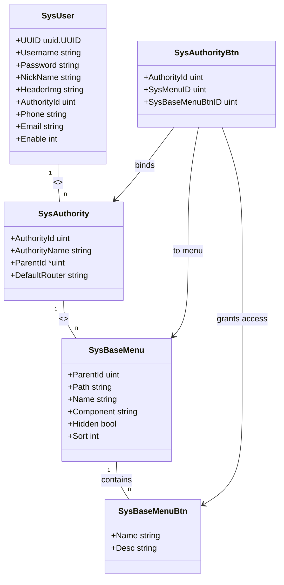
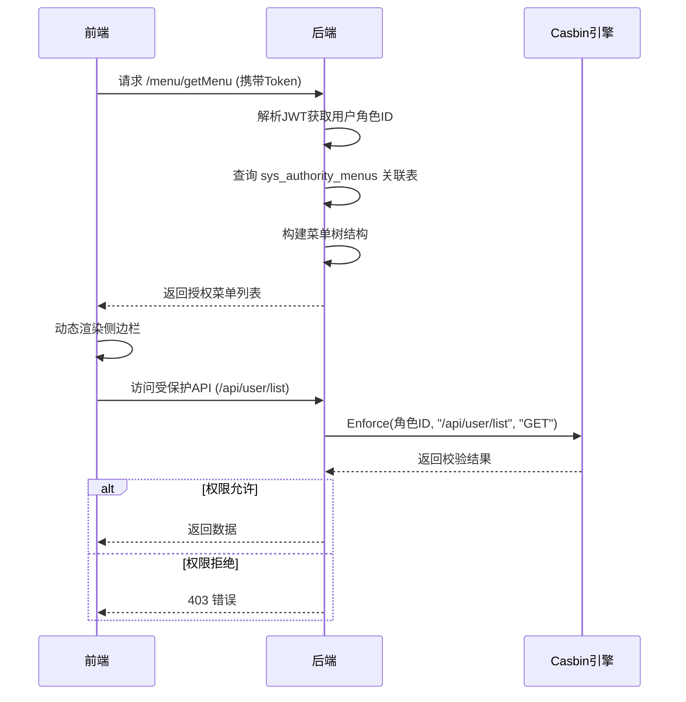

# 核心功能模块

<cite>
**本文档中引用的文件**
- [sys_user.go](file://server/model/system/sys_user.go)
- [sys_authority.go](file://server/model/system/sys_authority.go)
- [sys_base_menu.go](file://server/model/system/sys_base_menu.go)
- [sys_menu_btn.go](file://server/model/system/sys_menu_btn.go)
- [sys_authority_btn.go](file://server/model/system/sys_authority_btn.go)
- [casbin_rbac.go](file://server/middleware/casbin_rbac.go)
- [casbin_util.go](file://server/utils/casbin_util.go)
- [sys_casbin.go](file://server/api/v1/system/sys_casbin.go)
- [sys_casbin.go](file://server/service/system/sys_casbin.go)
</cite>

## 目录
1. [核心数据模型](#核心数据模型)
2. [RBAC权限控制机制](#rbac权限控制机制)
3. [动态菜单系统](#动态菜单系统)
4. [API与按钮级别权限校验流程](#api与按钮级别权限校验流程)
5. [使用示例与配置方法](#使用示例与配置方法)

## 核心数据模型

### SysUser 用户模型
`SysUser` 结构体定义了系统用户的核心信息,包含登录凭证、个人资料和权限关联字段。

**关键字段说明:**
- `UUID`: 用户唯一标识符,用于跨系统识别。
- `Username`: 用户登录名,作为身份验证的主要依据。
- `Password`: 加密存储的密码,JSON序列化时忽略。
- `AuthorityId`: 关联的角色ID,决定用户的默认权限集。
- `Authority`: 外键关联的 `SysAuthority` 对象,表示用户所属角色。
- `Authorities`: 多对多关系,支持用户拥有多个角色。
- `Phone`: 手机号,带唯一索引(软删除条件下)。
- `Enable`: 状态标志,1为正常,2为冻结。

该模型通过 `gorm:"foreignKey:AuthorityId;references:AuthorityId"` 实现与角色的外键绑定,并通过 `many2many:sys_user_authority` 支持多角色分配。

**Section sources**
- [sys_user.go](file://server/model/system/sys_user.go#L19-L36)

### SysAuthority 角色模型
`SysAuthority` 结构体代表系统中的角色实体,实现基于角色的访问控制(RBAC)的基础单元。

**关键字段说明:**
- `AuthorityId`: 角色唯一ID,主键且不可为空。
- `AuthorityName`: 角色名称,便于管理员识别。
- `ParentId`: 可选父角色ID,支持角色继承结构。
- `DataAuthorityId`: 数据权限集合,多对多关联其他角色的数据范围。
- `SysBaseMenus`: 关联的菜单项列表,通过 `many2many:sys_authority_menus` 绑定。
- `DefaultRouter`: 默认首页路由,默认值为 `dashboard`。

此模型支持树形层级结构(通过 `Children` 字段),并能管理其下属用户和菜单权限。

**Section sources**
- [sys_authority.go](file://server/model/system/sys_authority.go#L6-L18)

### SysBaseMenu 菜单基础模型
`SysBaseMenu` 定义前端动态菜单的结构,包含路由信息和显示属性。

**关键字段说明:**
- `ParentId`: 上级菜单ID,构建菜单树。
- `Path`: 前端路由路径,用于URL匹配。
- `Name`: 路由名称,Vue Router使用。
- `Component`: 对应前端组件文件路径。
- `Hidden`: 是否在侧边栏隐藏。
- `Sort`: 排序权重,数值越小越靠前。
- `Meta`: 内嵌结构,包含标题、图标等元信息。
- `Parameters`: 附加的路由参数配置。

菜单与角色通过 `many2many:sys_authority_menus` 多对多表关联,实现按角色动态加载。

**Section sources**
- [sys_base_menu.go](file://server/model/system/sys_base_menu.go#L6-L20)

### 按钮权限模型
系统通过两个模型实现细粒度按钮权限控制:

#### SysBaseMenuBtn 菜单按钮定义
- `Name`: 按钮唯一标识(如 `addUser`, `deleteItem`)。
- `Desc`: 按钮功能描述,辅助管理。
- `SysBaseMenuID`: 所属菜单ID,建立归属关系。

#### SysAuthorityBtn 角色-按钮权限映射
- `AuthorityId`: 角色ID。
- `SysMenuID`: 菜单ID。
- `SysBaseMenuBtnID`: 按钮ID。
- `SysBaseMenuBtn`: 关联的按钮详情对象。

该设计将按钮权限解耦为独立实体,并通过三元组(角色、菜单、按钮)精确控制访问。

**Section sources**
- [sys_menu_btn.go](file://server/model/system/sys_menu_btn.go#L4-L9)
- [sys_authority_btn.go](file://server/model/system/sys_authority_btn.go#L2-L7)



**Diagram sources**
- [sys_user.go](file://server/model/system/sys_user.go#L19-L36)
- [sys_authority.go](file://server/model/system/sys_authority.go#L6-L18)
- [sys_base_menu.go](file://server/model/system/sys_base_menu.go#L6-L20)
- [sys_menu_btn.go](file://server/model/system/sys_menu_btn.go#L4-L9)
- [sys_authority_btn.go](file://server/model/system/sys_authority_btn.go#L2-L7)

## RBAC权限控制机制

系统采用 Casbin 作为权限引擎,实现基于角色的访问控制(RBAC),支持灵活的策略管理和高效校验。

### Casbin 初始化与配置
`GetCasbin()` 函数在首次调用时初始化同步缓存化的 Enforcer 实例,确保高性能策略检查。适配器使用 GORM 连接数据库,持久化策略至 `casbin_rule` 表。

**模型配置说明:**
- **请求定义 (r)**: `sub, obj, act` 分别对应用户角色、资源路径、HTTP方法。
- **匹配器 (m)**: 使用 `keyMatch2` 支持路径通配符(如 `/api/v1/*`)。
- **缓存策略**: 设置60分钟过期时间,平衡性能与实时性。

```go
m = r.sub == p.sub && keyMatch2(r.obj,p.obj) && r.act == p.act
```

**Section sources**
- [casbin_util.go](file://server/utils/casbin_util.go#L15-L52)

### 权限策略管理服务
`CasbinService` 提供完整的策略操作接口:

- `UpdateCasbin()`: 更新指定角色的API权限列表,先清除旧策略再批量添加新规则。
- `GetPolicyPathByAuthorityId()`: 查询某角色拥有的所有路径-方法对。
- `ClearCasbin()`: 移除匹配的过滤策略。
- `SyncPolicy()`: 同步数据库策略到内存,需配合 `FreshCasbin()` 生效。

服务层还实现了权限变更联动机制(`UpdateCasbinApi`),当API路径或方法修改时自动更新相关策略。

**Section sources**
- [sys_casbin.go](file://server/service/system/sys_casbin.go#L20-L173)

## 动态菜单系统

### 菜单生成流程
1. 用户登录后,前端请求 `/menu/getMenu` 获取授权菜单。
2. 后端根据用户角色ID查询 `sys_authority_menus` 关联表。
3. 递归构建菜单树结构,过滤无权访问的节点。
4. 返回JSON格式菜单数据,前端动态渲染侧边栏。

### 前端集成
通过 Vuex 的 `router` 模块管理菜单状态,结合 Vue Router 的异步路由加载机制,在导航守卫中注入用户专属路由表,实现界面元素的按需展示。

**Section sources**
- [sys_authority.go](file://server/model/system/sys_authority.go#L15-L15)
- [sys_base_menu.go](file://server/model/system/sys_base_menu.go#L15-L20)



**Diagram sources**
- [sys_authority.go](file://server/model/system/sys_authority.go#L15-L15)
- [sys_base_menu.go](file://server/model/system/sys_base_menu.go#L15-L20)
- [casbin_rbac.go](file://server/middleware/casbin_rbac.go#L10-L30)

## API与按钮级别权限校验流程

### 中间件拦截机制
`CasbinHandler` 作为Gin中间件注册到需要保护的路由组,执行以下步骤:

1. 从JWT Token中提取用户声明(Claims)。
2. 获取当前请求的路径(去除路由前缀)和HTTP方法。
3. 将角色ID转换为字符串作为 `sub`,路径为 `obj`,方法为 `act`。
4. 调用 `e.Enforce(sub, obj, act)` 进行权限判定。
5. 若失败则返回403错误并终止请求链。

```go
sub := strconv.Itoa(int(waitUse.AuthorityId))
obj := strings.TrimPrefix(path, global.GVA_CONFIG.System.RouterPrefix)
act := c.Request.Method
success, _ := e.Enforce(sub, obj, act)
```

**Section sources**
- [casbin_r