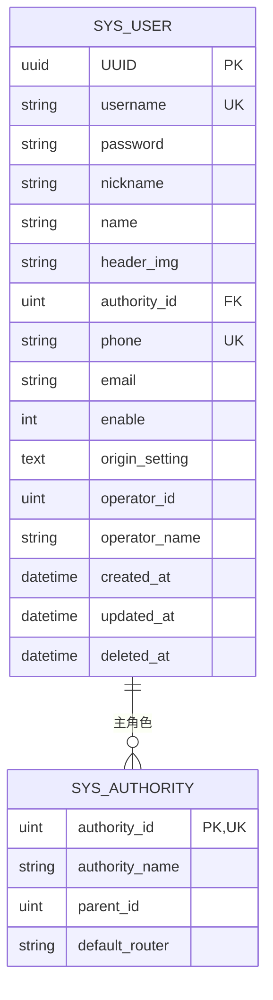

# 用户管理

<cite>
**本文档引用文件**  
- [sys_user.go](file://server/model/system/sys_user.go)
- [sys_authority.go](file://server/model/system/sys_authority.go)
- [sys_user_authority.go](file://server/model/system/sys_user_authority.go)
- [sys_user.go (API)](file://server/api/v1/system/sys_user.go)
- [sys_user.go (Service)](file://server/service/system/sys_user.go)
- [user.js](file://web/src/api/user.js)
- [user.vue](file://web/src/view/superAdmin/user/user.vue)
</cite>

## 目录
1. [简介](#简介)
2. [数据模型设计](#数据模型设计)
3. [用户与角色的多对多关系](#用户与角色的多对多关系)
4. [核心操作流程](#核心操作流程)
5. [前端交互实现](#前端交互实现)
6. [常见问题处理](#常见问题处理)
7. [性能优化建议](#性能优化建议)
8. [总结](#总结)

## 简介
本模块实现了完整的用户生命周期管理功能,涵盖用户创建、更新、删除、密码加密、头像上传等核心业务。系统采用GORM作为ORM框架,通过结构体标签定义数据库约束和字段映射,并结合JWT进行身份认证。用户信息存储在`sys_user`表中,支持唯一用户名、手机号索引及软删除机制。

## 数据模型设计

### SysUser 数据结构说明
`SysUser` 结构体定义了用户的核心属性及其数据库映射规则:

| 字段名 | 类型 | GORM 约束 | 说明 |
|--------|------|-----------|------|
| UUID | uuid.UUID | `index;comment:用户UUID` | 唯一标识符,用于分布式场景下的用户识别 |
| Username | string | `index;comment:用户登录名` | 登录账号,建立索引以提升查询效率 |
| Password | string | `comment:用户登录密码` | 存储加密后的密码哈希值,JSON序列化时忽略 |
| NickName | string | `default:系统用户;comment:用户昵称` | 用户显示名称,默认为“系统用户” |
| Name | string | `default:'';comment:用户姓名` | 真实姓名 |
| HeaderImg | string | `default:https://...;comment:用户头像` | 头像URL地址 |
| AuthorityId | uint | `default:888;comment:用户角色ID` | 主角色ID,外键关联`sys_authority` |
| Phone | string | `index:idx_phone_not_deleted,unique,condition:deleted_at IS NULL;comment:用户手机号` | 手机号唯一且非软删除状态下不可重复 |
| Email | string | `comment:用户邮箱` | 邮箱地址 |
| Enable | int | `default:1;comment:用户是否被冻结 1正常 2冻结` | 账户状态控制 |



**图示来源**
- [sys_user.go](file://server/model/system/sys_user.go#L19-L36)
- [sys_authority.go](file://server/model/system/sys_authority.go#L6-L18)

**本节来源**
- [sys_user.go](file://server/model/system/sys_user.go#L19-L36)

## 用户与角色的多对多关系

### 关联表设计
系统通过中间表 `sys_user_authority` 实现用户与角色的多对多绑定:

```go
type SysUserAuthority struct {
	SysUserId               uint `gorm:"column:sys_user_id"`
	SysAuthorityAuthorityId uint `gorm:"column:sys_authority_authority_id"`
}
```

该结构对应数据库中的联合主键表,确保一个用户可拥有多个角色权限。

### GORM 映射配置
在 `SysUser` 模型中使用如下标签声明多对多关系:
```go
Authorities []SysAuthority `json:"authorities" gorm:"many2many:sys_user_authority;"`
```
同时,在 `SysAuthority` 模型中反向声明:
```go
Users []SysUser `json:"-" gorm:"many2many:sys_user_authority;"`
```

此设计支持灵活的权限分配策略,如管理员可同时具备“超级管理员”和“审计员”双重身份。

```mermaid
erDiagram
SYS_USER ||--o{ SYS_USER_AUTHORITY : ""
SYS_USER_AUTHORITY }o--|| SYS_AUTHORITY : ""
SYS_USER {
uint user_id
string username
}
SYS_USER_AUTHORITY {
uint sys_user_id PK,FN
uint sys_authority_authority_id PK,FN
}
SYS_AUTHORITY {
uint authority_id
string authority_name
}
```

**图示来源**
- [sys_user_authority.go](file://server/model/system/sys_user_authority.go#L3-L6)
- [sys_user.go](file://server/model/system/sys_user.go#L19-L36)
- [sys_authority.go](file://server/model/system/sys_authority.go#L6-L18)

**本节来源**
- [sys_user_authority.go](file://server/model/system/sys_user_authority.go#L3-L6)
- [sys_user.go](file://server/model/system/sys_user.go#L19-L36)

## 核心操作流程

### 用户创建流程
1. 接收前端提交的用户信息(含用户名、密码、手机号等)
2. 校验字段合法性(非空、格式正确)
3. 检查用户名/手机号是否已存在
4. 使用bcrypt对密码进行哈希加密
5. 生成UUID并填充默认值
6. 写入数据库

### 密码加密机制
系统使用 `golang.org/x/crypto/bcrypt` 对密码进行单向加密:
- 加密强度由配置决定(通常cost=10)
- 原始密码永不存储
- 登录时通过 `bcrypt.CompareHashAndPassword` 验证

### 头像上传流程
1. 前端调用OSS相关API获取上传凭证
2. 客户端直传文件至对象存储服务(如MinIO、阿里云OSS)
3. 上传成功后返回图片URL
4. 更新用户`HeaderImg`字段

```mermaid
sequenceDiagram
    participant Frontend as 前端
    participant API as 用户API
    participant Service as 用户服务
    participant DB as 数据库
    participant OSS as 对象存储

    Frontend->>API: POST /user/create
    API->>Service: CreateUser(user)
    Service->>Service: ValidateInput()
    Service->>DB: CheckUsernameExists()
    DB-->>Service: false
    Service->>Service: HashPassword()
    Service->>DB: Save User Record
    DB-->>Service: Success
    Service-->>API: Created User
    API-->>Frontend: 返回用户信息

    Frontend->>OSS: 请求上传凭证
    OSS-->>Frontend: 凭证
    Frontend->>OSS: 上传头像
    OSS-->>Frontend: 图片URL
    Frontend->>API: PATCH /user/updateHeader
    API->>Service: UpdateHeader