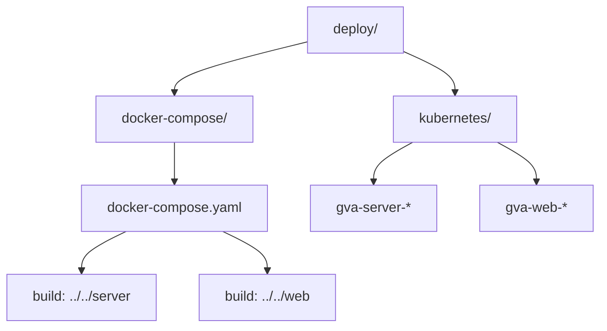
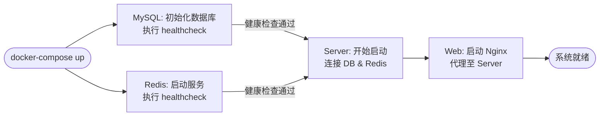
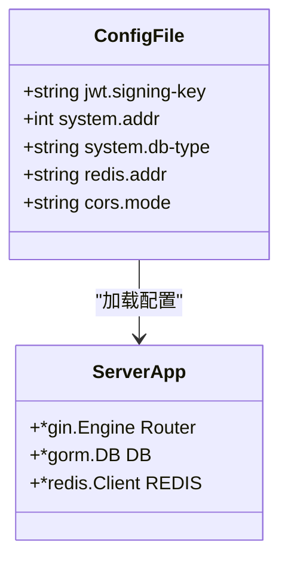

# Docker Compose 一体化部署

<cite>
**本文档中引用的文件**
- [docker-compose.yaml](file://deploy/docker-compose/docker-compose.yaml)
- [Dockerfile](file://server/Dockerfile)
- [Dockerfile](file://web/Dockerfile)
- [config.docker.yaml](file://server/config.docker.yaml)
- [entrypoint.sh](file://deploy/docker/entrypoint.sh)
- [main.go](file://server/main.go)
</cite>

## 目录
1. [简介](#简介)
2. [项目结构与部署路径](#项目结构与部署路径)
3. [核心服务定义解析](#核心服务定义解析)
4. [启动流程与依赖管理](#启动流程与依赖管理)
5. [环境变量与配置映射](#环境变量与配置映射)
6. [网络与持久化配置](#网络与持久化配置)
7. [生产环境优化建议](#生产环境优化建议)
8. [HTTPS 集成方案](#https-集成方案)
9. [常见问题排查](#常见问题排查)
10. [性能监控与日志聚合](#性能监控与日志聚合)

## 简介

本部署文档围绕 `gin-vue-admin` 项目的 `docker-compose.yaml` 文件展开,详细解析其多服务容器编排机制。通过该文件可一键启动包含前端(web)、后端(server)、数据库(mysql)和缓存(redis)在内的完整系统栈。文档将深入分析各服务的构建方式、端口映射、依赖关系、健康检查及网络配置,并提供生产级调优、HTTPS 集成和故障排查指南。

**Section sources**
- [docker-compose.yaml](file://deploy/docker-compose/docker-compose.yaml)

## 项目结构与部署路径

`gin-vue-admin` 的部署资源集中于 `deploy/` 目录下,其中 `docker-compose/` 子目录存放了基于 Docker Compose 的编排文件,而 `kubernetes/` 则提供了 K8s 部署方案。`docker-compose.yaml` 是本次部署的核心,它通过相对路径 `../../server` 和 `../../web` 引用源码根目录下的服务代码进行镜像构建。



**Diagram sources**
- [docker-compose.yaml](file://deploy/docker-compose/docker-compose.yaml)

**Section sources**
- [docker-compose.yaml](file://deploy/docker-compose/docker-compose.yaml)

## 核心服务定义解析

### Web 服务 (Nginx 前端)

Web 服务基于 Nginx 构建,负责静态资源托管和反向代理。其 Dockerfile 使用多阶段构建,首先使用 Node.js 容器完成前端打包,再将生成的 `dist` 目录复制到轻量化的 `nginx:alpine` 镜像中。在 `docker-compose.yaml` 中,它监听宿主机的 8080 端口,并依赖于 `server` 服务启动。

**Section sources**
- [Dockerfile](file://web/Dockerfile)
- [docker-compose.yaml](file://deploy/docker-compose/docker-compose.yaml)

### Server 服务 (Gin 后端)

Server 服务是 Go 编写的 Gin 框架应用。其 Dockerfile 同样采用多阶段构建:第一阶段使用 `golang:alpine` 进行代码编译；第二阶段使用 `alpine:latest` 作为运行时基础镜像,仅复制二进制文件和必要资源。服务通过 `ENTRYPOINT ./server -c config.docker.yaml` 启动,并暴露 8888 端口。

**Section sources**
- [Dockerfile](file://server/Dockerfile)
- [main.go](file://server/main.go)
- [config.docker.yaml](file://server/config.docker.yaml)

### MySQL 数据库服务

MySQL 服务使用官方 `mysql:8.0.21` 镜像,初始化时创建名为 `qmPlus` 的数据库,并设置专用用户 `gva` 及密码。通过 `command` 参数强制指定字符集为 `utf8mb4`,确保中文等多字节字符的正确存储。端口映射为宿主机的 13306 端口。

**Section sources**
- [docker-compose.yaml](file://deploy/docker-compose/docker-compose.yaml)

### Redis 缓存服务

Redis 服务使用 `redis:6.0.6` 镜像,用于会话管理和数据缓存。配置了简单的 `PING` 健康检查,确保服务可用性。端口映射为宿主机的 16379 端口。

**Section sources**
- [docker-compose.yaml](file://deploy/docker-compose/docker-compose.yaml)

## 启动流程与依赖管理

`docker-compose up` 命令将按照 `depends_on` 指定的顺序启动服务。`web` 服务依赖 `server`,而 `server` 服务则依赖 `mysql` 和 `redis` 的健康状态(`service_healthy`)。这意味着 `server` 容器只有在 `mysql` 和 `redis` 通过各自的 `healthcheck` 测试后才会启动,有效避免了因数据库或缓存未就绪而导致的应用启动失败。



**Diagram sources**
- [docker-compose.yaml](file://deploy/docker-compose/docker-compose.yaml)

**Section sources**
- [docker-compose.yaml](file://deploy/docker-compose/docker-compose.yaml)

## 环境变量与配置映射

`server` 服务的运行行为由 `config.docker.yaml` 配置文件驱动。该文件在构建时被复制到镜像内部。关键配置项包括:

- **数据库**: `system.db-type: mysql` 指定使用 MySQL,实际连接信息从 `mysql` 服务继承。
- **Redis**: `redis.addr: 177.7.0.14:6379` 对应 `docker-compose.yaml` 中分配的固定 IP。
- **JWT**: `jwt.signing-key` 用于生成和验证令牌。
- **跨域 (CORS)**: `cors.whitelist` 定义了允许访问的前端域名。



**Diagram sources**
- [config.docker.yaml](file://server/config.docker.yaml)
- [main.go](file://server/main.go)

**Section sources**
- [config.docker.yaml](file://server/config.docker.yaml)
- [main.go](file://server/main.go)

## 网络与持久化配置

### 自定义网络

所有服务均部署在名为 `network` 的自定义桥接网络中,子网为 `177.7.0.0/16`。每个服务被分配了固定的 IPv4 地址(如 `server` 为 `177.7.0.12`),这保证了服务间通信的稳定性和可预测性,避免了因容器重启导致 IP 变更的问题。

### 数据持久化

通过声明两个命名卷(`volumes: mysql, redis`),实现了数据的持久化存储。即使容器被删除,`/var/lib/mysql`(MySQL 数据)和 `/data`(Redis 数据)中的内容也会保留在 Docker 卷中,确保数据不丢失。

**Section sources**
- [docker-compose.yaml](file://deploy/docker-compose/docker-compose.yaml)

## 生产环境优化建议

### 数据库版本升级

可根据需求将 `image: mysql:8.0.21` 升级至更高版本(如 `8.0.30`)以获取性能改进和安全补丁。对于 ARM64 架构(如 M1 Mac),应使用 `image: mysql/mysql-server:8.0.21`。

### 资源限制

为防止某个服务耗尽宿主机资源,可在 `docker-compose.yaml` 中添加 `resources` 配置:
```yaml
server:
  # ... 其他配置
  deploy:
    resources:
      limits:
        cpus: '2.0'
        memory: 2G
      reservations:
        cpus: '0.5'
        memory: 512M
```

### 健康检查与重启策略

现有 `healthcheck` 配置已较为完善。`restart: always` 策略确保服务异常退出后能自动重启。可根据业务 SLA 调整 `interval` 和 `retries` 参数。

**Section sources**
- [docker-compose.yaml](file://deploy/docker-compose/docker-compose.yaml)

## HTTPS 集成方案

为支持 HTTPS,推荐扩展 `docker-compose.yaml` 并引入 Nginx 或 Traefik 作为反向代理。

### 方案一:集成 Nginx

1.  在 `web` 服务前增加一个独立的 `nginx-proxy` 服务。
2.  将 SSL 证书挂载到容器内。
3.  配置 Nginx 将 443 端口的流量解密后转发给 `web` 服务的 8080 端口。

### 方案二:集成 Traefik

1.  添加 `traefik` 服务,启用 Docker Provider。
2.  为 `web` 服务添加 `labels`,配置路由规则和 Let's Encrypt 证书自动申请。
3.  Traefik