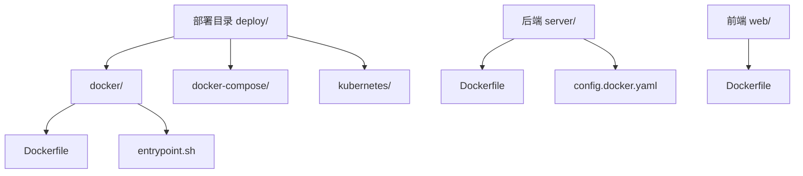
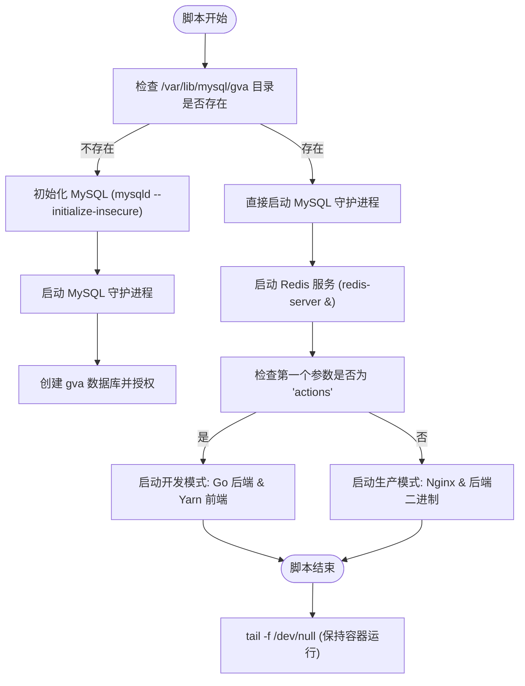

# Docker 部署指南

<cite>
**本文档中引用的文件**
- [Dockerfile](file://deploy/docker/Dockerfile)
- [entrypoint.sh](file://deploy/docker/entrypoint.sh)
- [config.docker.yaml](file://server/config.docker.yaml)
- [server/Dockerfile](file://server/Dockerfile)
- [web/Dockerfile](file://web/Dockerfile)
</cite>

## 目录
1. [简介](#简介)
2. [项目结构与部署文件概览](#项目结构与部署文件概览)
3. [后端服务镜像构建与运行](#后端服务镜像构建与运行)
4. [前端服务镜像构建与运行](#前端服务镜像构建与运行)
5. [一体化部署脚本：entrypoint.sh 解析](#一体化部署脚本：entrypointsh-解析)
6. [配置管理：config.docker.yaml 详解](#配置管理：configdockeryaml-详解)
7. [环境变量注入与容器化配置](#环境变量注入与容器化配置)
8. [多阶段构建与镜像优化策略](#多阶段构建与镜像优化策略)
9. [持久化存储与日志处理](#持久化存储与日志处理)
10. [常见问题排查](#常见问题排查)

## 简介
本文档旨在为 `gin-vue-admin` 项目提供完整的 Docker 容器化部署指导。涵盖使用提供的 Dockerfile 构建前后端服务镜像、entrypoint.sh 初始化脚本的作用机制、config.docker.yaml 配置文件的结构与参数说明、环境变量注入方式、构建与运行命令示例、镜像优化技巧以及常见部署问题的解决方案。

**Section sources**
- [Dockerfile](file://deploy/docker/Dockerfile)
- [entrypoint.sh](file://deploy/docker/entrypoint.sh)
- [config.docker.yaml](file://server/config.docker.yaml)

## 项目结构与部署文件概览
项目在 `deploy/docker/` 目录下提供了用于一体化部署的 Dockerfile 和 entrypoint.sh 脚本，同时在 `server/` 和 `web/` 目录下分别提供了针对后端 Go 服务和前端 Vue 应用的独立 Dockerfile。`config.docker.yaml` 文件位于 `server/` 目录下，是容器化环境专用的配置文件。



**Diagram sources**
- [deploy/docker/Dockerfile](file://deploy/docker/Dockerfile)
- [server/Dockerfile](file://server/Dockerfile)
- [web/Dockerfile](file://web/Dockerfile)

**Section sources**
- [deploy/docker/Dockerfile](file://deploy/docker/Dockerfile)
- [server/Dockerfile](file://server/Dockerfile)
- [web/Dockerfile](file://web/Dockerfile)

## 后端服务镜像构建与运行
后端服务采用多阶段构建（multi-stage build）策略，首先在 `golang:alpine` 镜像中编译 Go 程序，然后将编译产物复制到轻量级的 `alpine:latest` 基础镜像中运行，有效减小最终镜像体积。

### 构建命令
```bash
cd server
docker build -t gva-server:latest .
```

### 运行命令
```bash
docker run -d -p 8888:8888 --name gva-server gva-server:latest
```

若使用 SQLite 数据库，需挂载宿主机目录以实现数据持久化：
```bash
docker run -d \
  -v /host/path/gva.db:/go/src/github.com/flipped-aurora/gin-vue-admin/server/gva.db \
  -p 8888:8888 \
  --name gva-server \
  gva-server:latest
```

**Section sources**
- [server/Dockerfile](file://server/Dockerfile)

## 前端服务镜像构建与运行
前端服务使用 Node.js 环境进行构建，并将构建产物（dist 目录）复制到 Nginx 容器中提供静态文件服务。

### 构建命令
```bash
cd web
docker build -t gva-web:latest .
```

### 运行命令
```bash
docker run -d -p 80:80 --name gva-web gva-web:latest
```

**Section sources**
- [web/Dockerfile](file://web/Dockerfile)

## 一体化部署脚本：entrypoint.sh 解析
`deploy/docker/entrypoint.sh` 脚本负责在容器启动时初始化整个应用栈，包括 MySQL 数据库、Redis 服务和 Nginx Web 服务器。

### 执行流程


**Diagram sources**
- [deploy/docker/entrypoint.sh](file://deploy/docker/entrypoint.sh)

**Section sources**
- [deploy/docker/entrypoint.sh](file://deploy/docker/entrypoint.sh)

## 配置管理：config.docker.yaml 详解
`config.docker.yaml` 是专为 Docker 环境设计的配置文件，定义了应用的各项参数。

### 核心配置项
| 配置项 | 描述 |
| :--- | :--- |
| `jwt.signing-key` | JWT 签名密钥，用于生成和验证令牌 |
| `system.addr` | 后端服务监听端口，默认 8888 |
| `system.db-type` | 默认数据库类型，如 mysql, sqlite |
| `system.oss-type` | 对象存储类型，如 local, qiniu, aliyun-oss |
| `mysql.*` | MySQL 数据库连接参数 |
| `redis.addr` | Redis 服务地址 |
| `aliyun-oss.*` | 阿里云 OSS 存储配置 |

**Section sources**
- [server/config.docker.yaml](file://server/config.docker.yaml)

## 环境变量注入与容器化配置
虽然 `config.docker.yaml` 是主要配置源，但项目通过 Viper 库支持从多种来源读取配置。`core/viper.go` 中的 `getConfigPath()` 函数实现了配置路径的优先级逻辑：命令行参数 > 环境变量 > 默认值。

### 环境变量使用
可通过设置 `GVA_CONFIG` 环境变量来指定配置文件路径：
```bash
docker run -e GVA_CONFIG=/custom/config.yaml -v /host/config.yaml:/custom/config.yaml ...
```

**Section sources**
- [server/core/viper.go#L16-L41](file://server/core/viper.go#L16-L41)
- [server/global/global.go#L30](file://server/global/global.go#L30)

## 多阶段构建与镜像优化策略
项目充分利用了 Docker 的多阶段构建特性，显著提升了安全性并减小了镜像体积。

### 优化措施
- **基础镜像选择**：后端使用 `alpine` 镜像，前端使用 `node:20-slim` 和 `nginx:alpine`。
- **依赖分离**：前端构建中使用 `--mount=type=cache` 挂载 pnpm 缓存，加速重复构建。
- **无缓存构建**：`apk add --no-cache` 确保不保留包管理器缓存。
- **静态链接**：Go 编译时设置 `CGO_ENABLED=0`，生成静态二进制文件，无需依赖外部库。

**Section sources**
- [server/Dockerfile](file://server/Dockerfile)
- [web/Dockerfile](file://web/Dockerfile)

## 持久化存储与日志处理
为确保数据不丢失，关键数据应通过卷（Volume）或绑定挂载（Bind Mount）进行持久化。

### 推荐挂载点
- **数据库文件**：`/var/lib/mysql` (MySQL), 或 SQLite 的 `.db` 文件路径。
- **上传文件**：`uploads/file` 目录，对应 `local.path` 配置。
- **日志文件**：`log` 目录，对应 `zap.director` 配置。

### 日志输出
生产环境中，建议将日志重定向到标准输出（stdout），以便被 Docker 日志驱动收集。`zap.log-in-console: true` 配置确保日志输出到控制台。

**Section sources**
- [server/config.docker.yaml](file://server/config.docker.yaml)
- [server/Dockerfile](file://server/Dockerfile)

## 常见问题排查
### 构建失败
- **原因**：网络问题导致依赖下载失败。
- **解决**：检查 `GOPROXY` 设置，确保为中国代理（如 `https://goproxy.cn`）。

### 端口冲突
- **原因**：宿主机 8888 或 80 端口已被占用。
- **解决**：使用 `-p` 参数映射到其他端口，如 `-p 8889:8888`。

### 依赖缺失
- **原因**：`entrypoint.sh` 中安装的软件包因镜像源失效而失败。
- **解决**：更新 `Dockerfile` 中的 yum/apt 源为国内镜像站。

### 数据库初始化失败
- **原因**：MySQL 数据目录权限问题或磁盘空间不足。
- **解决**：确保挂载目录有足够空间和正确权限。

**Section sources**
- [deploy/docker/Dockerfile](file://deploy/docker/Dockerfile)
- [deploy/docker/entrypoint.sh](file://deploy/docker/entrypoint.sh)