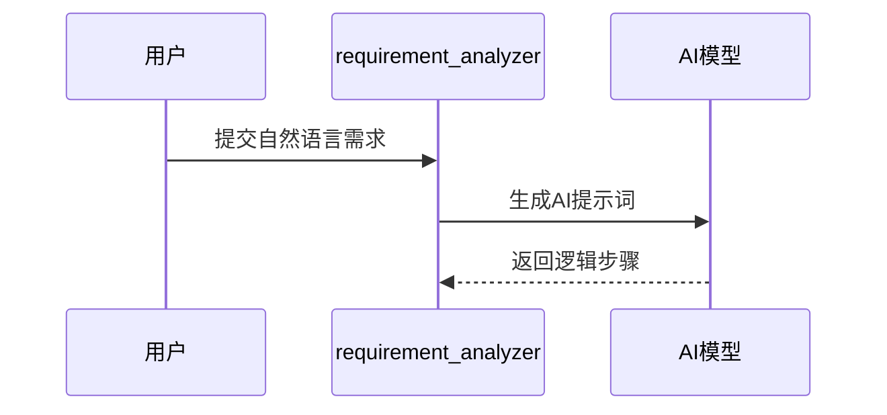
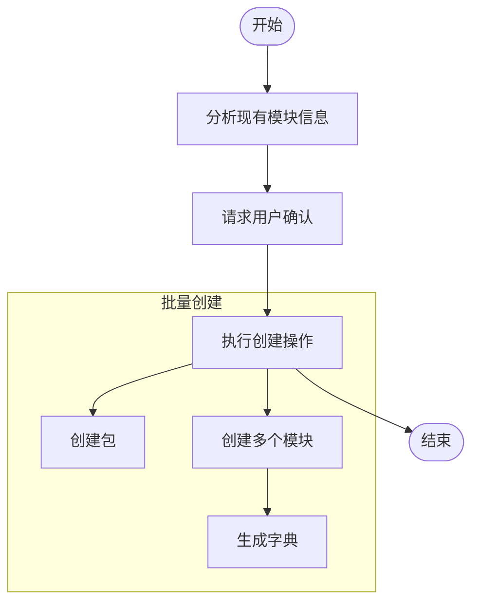
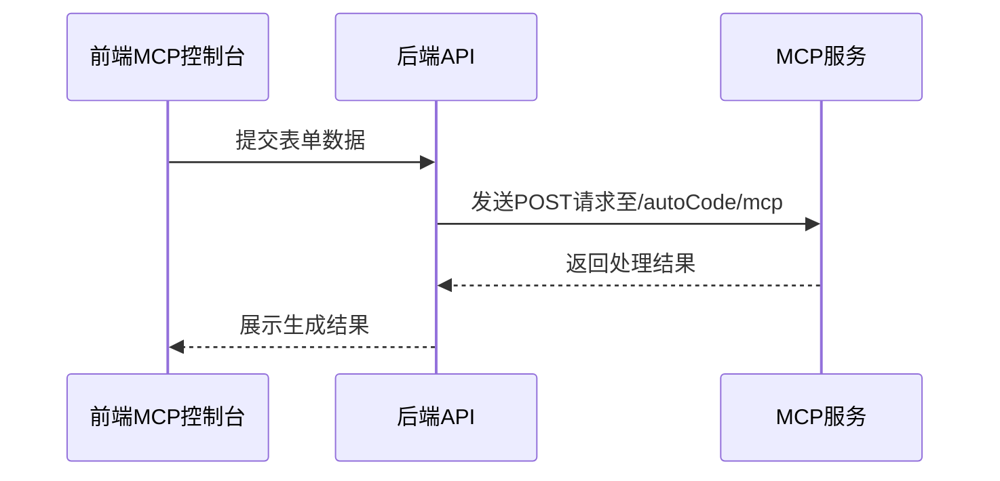

# MCP 协议集成

<cite>
**本文档引用文件**
- [mcp.go](file://server/mcp/enter.go)
- [requirement_analyzer.go](file://server/mcp/requirement_analyzer.go)
- [gva_auto_generate.go](file://server/mcp/gva_auto_generate.go)
- [api_creator.go](file://server/mcp/api_creator.go)
- [menu_creator.go](file://server/mcp/menu_creator.go)
- [execution_plan_schema.md](file://server/mcp/execution_plan_schema.md)
- [mcp.vue](file://web/src/view/systemTools/autoCode/mcp.vue)
- [autoCode.js](file://web/src/api/autoCode.js)
- [mcp.go](file://server/config/mcp.go)
- [mcp.go](file://server/initialize/mcp.go)
</cite>

## 目录
1. [MCP 概述](#mcp-概述)
2. [核心组件协同工作流程](#核心组件协同工作流程)
3. [执行计划指令格式与流程](#执行计划指令格式与流程)
4. [前端 MCP 控制台交互](#前端-mcp-控制台交互)
5. [配置启用与安全考虑](#配置启用与安全考虑)
6. [对比优势与调试技巧](#对比优势与调试技巧)

## MCP 概述

MCP (Model Context Protocol) 是 gin-vue-admin 中连接 AI 模型与代码生成流程的桥梁,旨在支持智能化的上下文感知开发辅助。它通过一系列工具将自然语言需求转化为可执行的代码生成计划,从而实现从需求到功能的快速转化。

**Section sources**
- [mcp.go](file://server/mcp/enter.go#L1-L32)
- [mcp.go](file://server/config/mcp.go#L1-L10)
- [mcp.go](file://server/initialize/mcp.go#L1-L26)

## 核心组件协同工作流程

MCP 的核心组件包括 `requirement_analyzer`、`gva_auto_generate`、`api_creator` 和 `menu_creator` 等,它们协同工作以完成从需求分析到代码生成的全过程。

### 需求分析器 (requirement_analyzer)

`requirement_analyzer` 是所有 MCP 工具的首选入口,负责将用户的自然语言需求转换为 AI 可理解的结构化提示词。其主要职责是接收用户的需求描述,并生成专业的 AI 提示词,要求 AI 将需求梳理为清晰的逻辑步骤。



**Diagram sources**
- [requirement_analyzer.go](file://server/mcp/requirement_analyzer.go#L1-L139)

### 自动化模块生成器 (gva_auto_generate)

`gva_auto_generate` 是核心执行工具,在 `requirement_analyzer` 分析结果后使用。它根据确认的结果执行创建操作,支持批量创建多个模块。该工具还具备自动字典创建功能,当结构体字段使用了字典类型时,系统会自动检查并创建对应的字典及默认选项。



**Diagram sources**
- [gva_auto_generate.go](file://server/mcp/gva_auto_generate.go#L1-L1756)

### API 创建器 (api_creator)

`api_creator` 用于创建后端 API 记录,适用于单独创建 API 或 AI 编辑器自动添加 API 的场景。当使用 `gva_auto_generate` 工具且 `needCreatedModules=true` 时,模块创建会自动生成 API 权限,不应调用此工具。

### 菜单创建器 (menu_creator)

`menu_creator` 用于创建前端菜单记录,适用于单独创建菜单或 AI 编辑器自动添加前端页面的场景。同样地,当使用 `gva_auto_generate` 工具且 `needCreatedModules=true` 时,模块创建会自动生成菜单项,不应调用此工具。

**Section sources**
- [gva_auto_generate.go](file://server/mcp/gva_auto_generate.go#L1-L1756)
- [api_creator.go](file://server/mcp/api_creator.go#L1-L201)
- [menu_creator.go](file://server/mcp/menu_creator.go#L1-L287)

## 执行计划指令格式与流程

执行计划 (`ExecutionPlan`) 结构体包含了创建包和模块所需的所有信息。完整的结构体定义如下:

```go
type ExecutionPlan struct {
    PackageName        string                           `json:"packageName"`
    PackageType        string                           `json:"packageType"`
    NeedCreatedPackage bool                             `json:"needCreatedPackage"`
    NeedCreatedModules bool                             `json:"needCreatedModules"`
    PackageInfo        *request.SysAutoCodePackageCreate `json:"packageInfo,omitempty"`
    ModulesInfo        []*request.AutoCode              `json:"modulesInfo,omitempty"`
    Paths              map[string]string                `json:"paths,omitempty"`
}
```

### 子结构体详细说明

#### SysAutoCodePackageCreate 结构体

```go
type SysAutoCodePackageCreate struct {
    Desc        string `json:"desc"`
    Label       string `json:"label"`
    Template    string `json:"template"`
    PackageName string `json:"packageName"`
}
```

#### AutoCode 结构体(核心字段)

```go
type AutoCode struct {
    Package             string           `json:"package"`
    TableName           string           `json:"tableName"`
    BusinessDB          string           `json:"businessDB"`
    StructName          string           `json:"structName"`
    PackageName         string           `json:"packageName"`
    Description         string           `json:"description"`
    Abbreviation        string           `json:"abbreviation"`
    HumpPackageName     string           `json:"humpPackageName"`
    GvaModel            bool             `json:"gvaModel"`
    AutoMigrate         bool             `json:"autoMigrate"`
    AutoCreateResource  bool             `json:"autoCreateResource"`
    AutoCreateApiToSql  bool             `json:"autoCreateApiToSql"`
    AutoCreateMenuToSql bool             `json:"autoCreateMenuToSql"`
    AutoCreateBtnAuth   bool             `json:"autoCreateBtnAuth"`
    OnlyTemplate        bool             `json:"onlyTemplate"`
    IsTree              bool             `json:"isTree"`
    TreeJson            string           `json:"treeJson"`
    IsAdd               bool             `json:"isAdd"`
    Fields              []*AutoCodeField `json:"fields"`
    GenerateWeb         bool             `json:"generateWeb"`
    GenerateServer      bool             `json:"generateServer"`
}
```

#### AutoCodeField 结构体(字段定义)

```go
type AutoCodeField struct {
    FieldName       string      `json:"fieldName"`
    FieldDesc       string      `json:"fieldDesc"`
    FieldType       string      `json:"fieldType"`
    FieldJson       string      `json:"fieldJson"`
    DataTypeLong    string      `json:"dataTypeLong"`
    Comment         string      `json:"comment"`
    ColumnName      string      `json:"columnName"`
    FieldSearchType string      `json:"fieldSearchType"`
    FieldSearchHide bool        `json:"fieldSearchHide"`
    DictType        string      `json:"dictType"`
    Form            bool        `json:"form"`
    Table           bool        `json:"table"`
    Desc            bool        `json:"desc"`
    Excel           bool        `json:"excel"`
    Require         bool        `json:"require"`
    DefaultValue    string      `json:"defaultValue"`
    ErrorText       string      `json:"errorText"`
    Clearable       bool        `json:"clearable"`
    Sort            bool        `json:"sort"`
    PrimaryKey      bool        `json:"primaryKey"`
    DataSource      *DataSource `json:"dataSource"`
    CheckDataSource bool        `json:"checkDataSource"`
    FieldIndexType  string      `json:"fieldIndexType"`
}
```

#### DataSource 结构体(关联表配置)

```go
type DataSource struct {
    DBName       string `json:"dbName"`
    Table        string `json:"table"`
    Label        string `json:"label"`
    Value        string `json:"value"`
    Association  int    `json:"association"`
    HasDeletedAt bool   `json:"hasDeletedAt"`
}
```

**Section sources**
- [execution_plan_schema.md](file://server/mcp/execution_plan_schema.md#L1-L529)

## 前端 MCP 控制台交互

前端 MCP 控制台 (`mcp.vue`) 提供了一个用户友好的界面,允许开发者提交请求并展示生成结果。通过这个控制台,用户可以输入工具名称、描述以及参数列表,并最终生成相应的代码。



**Diagram sources**
- [mcp.vue](file://web/src/view/systemTools/autoCode/mcp.vue#L1-L152)
- [autoCode.js](file://web/src/api/autoCode.js#L210-L216)

## 配置启用与安全考虑

要启用 MCP 功能,需要在配置文件中正确设置相关参数,如 MCP 名称、版本、SSE 路径等。此外,还需确保服务器的安全性,防止未经授权的访问。

**Section sources**
- [mcp.go](file://server/config/mcp.go#L1-L10)
- [mcp.go](file://server/initialize/mcp.go#L1-L26)

## 对比优势与调试技巧

相较于传统的自动代码生成器,MCP 具有更高的智能化水平和灵活性。它不仅能够解析复杂的自然语言需求,还能通过多步推理生成高质量的代码。为了帮助开发者更好地理解和调试 MCP 的决策过程,建议利用日志分析方法来跟踪每个步骤的执行情况。

**Section sources**
- [gva_auto_generate.go](file://server/mcp/gva_auto_generate.go#L1-L1756)
- [requirement_analyzer.go](file://server/mcp/requirement_analyzer.go#L1-L139)