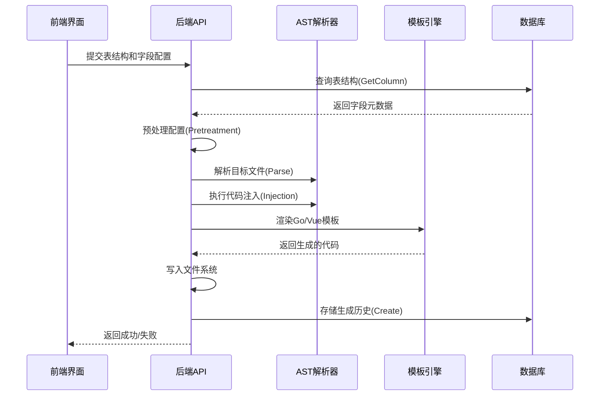

# 自动代码生成器

<cite>
**本文档引用的文件**  
- [sys_auto_code.go](file://server/model/system/request/sys_auto_code.go)
- [template_funcs.go](file://server/utils/autocode/template_funcs.go)
- [sys_auto_code_history.go](file://server/model/system/sys_auto_code_history.go)
- [auto_code_history.go](file://server/service/system/auto_code_history.go)
- [ast.go](file://server/utils/ast/ast.go)
- [package_initialize_gorm.go](file://server/utils/ast/package_initialize_gorm.go)
- [package_initialize_router.go](file://server/utils/ast/package_initialize_router.go)
- [package_enter.go](file://server/utils/ast/package_enter.go)
- [sys_auto_code_mysql.go](file://server/service/system/sys_auto_code_mysql.go)
- [sys_auto_code.go](file://server/api/v1/system/sys_auto_code.go)
- [auto_code_history.go](file://server/api/v1/system/auto_code_history.go)
</cite>

## 目录
1. [简介](#简介)  
2. [核心工作原理](#核心工作原理)  
3. [前端界面与用户配置流程](#前端界面与用户配置流程)  
4. [后端代码生成流程](#后端代码生成流程)  
5. [模板函数详解](#模板函数详解)  
6. [自定义模板支持机制](#自定义模板支持机制)  
7. [生成内容的目录结构](#生成内容的目录结构)  
8. [生成历史记录与回滚机制](#生成历史记录与回滚机制)  
9. [集成关系：GORM、API 路由与 Vue 页面](#集成关系gorm-api-路由与-vue-页面)  
10. [常见问题排查](#常见问题排查)

## 简介

`gin-vue-admin` 的自动代码生成器是一个强大的功能模块，旨在通过解析数据库表结构并结合 Go 模板引擎，快速生成前后端完整代码。该工具极大提升了开发效率，减少了重复性编码工作。用户只需在前端界面选择数据表、配置字段信息，系统即可自动生成 GORM 模型、API 接口、Vue 页面组件等全套资源，并将其注册到系统中。

本文档将深入剖析其内部实现机制，涵盖从用户操作到代码生成、存储、回滚的完整生命周期，帮助开发者理解其设计思想，便于扩展和维护。

## 核心工作原理

自动代码生成器的核心工作原理基于 **AST（抽象语法树）解析** 和 **Go template 模板引擎** 两大技术。

1.  **元数据获取**：当用户在前端选择一个数据库和数据表时，后端 API (`GetColumn`) 会通过 `AutoCodeMysql` 服务执行 SQL 查询，获取该表的所有字段名、数据类型、长度、注释、主键等详细信息。
2.  **结构化配置**：用户在前端界面对这些字段进行配置，如设置是否为必填、是否显示在表格中、搜索方式、关联字典等。这些配置连同表名、结构体名等信息被封装成一个 `AutoCode` 结构体。
3.  **AST 注入**：这是最核心的步骤。系统利用 Go 的 `go/ast` 包解析目标 Go 文件（如 `initialize/router.go`），构建其 AST。然后，根据用户的配置，动态地向 AST 中注入新的代码节点，例如：
    *   在路由初始化函数中添加新的路由分组调用。
    *   在 GORM 初始化函数中添加新的模型迁移语句。
    *   在模块入口文件中导入新包并注册服务。
4.  **模板渲染**：系统使用预定义的 Go template 模板文件。`template_funcs.go` 提供了一系列自定义函数，用于处理字段映射、生成 HTML 表单项、条件查询逻辑等。`AutoCode` 配置作为数据源，填充到这些模板中，最终渲染出完整的 `.go`、`.vue`、`.js` 等源代码文件。
5.  **文件写入**：将渲染好的代码写入项目指定的目录下。

整个过程实现了对现有代码库的非侵入式修改，确保了生成代码与原有架构的一致性。

**Section sources**
- [sys_auto_code_mysql.go](file://server/service/system/sys_auto_code_mysql.go#L70-L83)
- [ast.go](file://server/utils/ast/ast.go#L0-L306)
- [template_funcs.go](file://server/utils/autocode/template_funcs.go#L0-L723)

## 前端界面与用户配置流程

用户通过 `web/src/view/systemTools/autoCode/index.vue` 界面与代码生成器交互。

1.  **选择数据库**：用户首先从下拉菜单中选择一个已配置的业务数据库。
2.  **选择数据表**：系统调用 `GetTables` API 获取所选数据库中的所有表，并展示给用户。
3.  **配置基本信息**：用户输入或确认以下信息：
    *   **Struct 名称**：生成的 Go 结构体名称。
    *   **简称 (Abbreviation)**：用于 API 路径和菜单路径。
    *   **中文描述**：用于 API 分组和菜单标题。
    *   **包名 (Package)**：决定代码生成的目录。
4.  **配置字段**：这是最关键的一步。系统调用 `GetColumn` API 获取表的所有字段，并以列表形式展示。用户可以为每个字段配置：
    *   字段类型（Go 类型）。
    *   是否为主键、必填项。
    *   默认值、错误提示文本。
    *   是否在表单、表格、详情页中显示。
    *   搜索方式（等于、模糊、范围等）。
    *   关联字典或数据源。
5.  **提交生成**：用户确认所有配置无误后，点击“生成”按钮。前端将所有配置信息打包成 JSON，通过 `create` API 发送到后端。

**Section sources**
- [sys_auto_code.go](file://server/api/v1/system/sys_auto_code.go#L100-L156)
- [sys_auto_code.go](file://server/model/system/request/sys_auto_code.go#L0-L286)

## 后端代码生成流程

后端接收前端请求后，启动复杂的代码生成流程。

1.  **参数校验与预处理**：`AutoCodeService` 接收 `AutoCode` 请求对象，调用其 `Pretreatment()` 方法进行校验和预处理，例如检查包名是否为空、处理 Go 关键字冲突等。
2.  **AST 准备**：系统根据配置确定需要修改的目标文件，如 `router.go`、`gorm.go` 等。`ast.Base.Parse()` 方法读取这些文件并解析成 AST。
3.  **代码注入**：
    *   **GORM 注入**：创建 `PackageInitializeGorm` 实例，调用其 `Injection()` 方法。该方法会在 `initialize/gorm.go` 文件的 `bizModel` 函数中查找 `db.AutoMigrate()` 调用，并向其参数列表中添加新模型（如 `&model.User{}`）。
    *   **路由注入**：创建 `PackageInitializeRouter` 实例，调用其 `Injection()` 方法。该方法会在 `initialize/router.go` 文件的 `initBizRouter` 函数中，先检查是否存在对应的路由变量（如 `userRouter`），若不存在则创建赋值语句（`userRouter := router.RouterGroupApp.System.UserRouter`），然后添加路由初始化调用（`userRouter.InitUserRouter(publicGroup)`）。
    *   **模块入口注入**：创建 `PackageEnter` 实例，调用其 `Injection()` 方法。该方法会修改 `api/v1/enter.go` 或 `service/enter.go` 等入口文件，在 `ApiGroup` 或 `ServiceGroup` 结构体中添加新的字段（如 `User user.UserApi`）。
4.  **模板渲染与文件生成**：系统遍历预设的模板文件（位于 `server/source` 和 `web/src/view` 下），使用 `text/template` 引擎和 `template_funcs.go` 中提供的函数，将 `AutoCode` 对象的数据填充进去，生成最终的代码字符串，并写入磁盘。
5.  **元数据持久化**：将本次生成的所有配置信息（即原始的 `AutoCode` 对象）序列化为 JSON，连同生成的文件路径、注入点信息等，一并存入 `sys_auto_code_histories` 数据库表，形成一条历史记录。



**Diagram sources**
- [sys_auto_code.go](file://server/model/system/request/sys_auto_code.go#L0-L286)
- [package_initialize_gorm.go](file://server/utils/ast/package_initialize_gorm.go#L0-L196)
- [package_initialize_router.go](file://server/utils/ast/package_initialize_router.go#L0-L150)
- [package_enter.go](file://server/utils/ast/package_enter.go#L0-L85)
- [template_funcs.go](file://server/utils/autocode/template_funcs.go#L0-L723)

**Section sources**
- [sys_auto_code.go](file://server/model/system/request/sys_auto_code.go#L0-L286)
- [package_initialize_gorm.go](file://server/utils/ast/package_initialize_gorm.go#L0-L196)
- [package_initialize_router.go](file://server/utils/ast/package_initialize_router.go#L0-L150)
- [package_enter.go](file://server/utils/ast/package_enter.go#L0-L85)

## 模板函数详解

`template_funcs.go` 是代码生成器的灵魂，它定义了一套丰富的模板函数，使得模板能够根据不同的配置动态生成正确的代码。

主要函数包括：

*   **`GenerateField`**: 根据 `AutoCodeField` 生成 Go 结构体中的字段定义。它会智能地处理 `gorm` 标签（主键、默认值、注释、索引）、JSON 标签，并根据字段类型（如 `int`, `enum`, `picture`, `json`）生成不同的 Go 类型和标签。
*   **`GenerateFormItem`**: 生成 Vue 表单中的 `<el-form-item>`。它根据字段类型（布尔值、字典、时间、文件等）生成相应的输入控件（如 `el-switch`, `el-select`, `el-date-picker`, `SelectImage`）。
*   **`GenerateTableColumn`**: 生成 Vue 表格中的 `<el-table-column>`。它能处理排序、字典翻译、数据源关联、图片/视频预览等复杂场景。
*   **`GenerateSearchConditions`**: 生成 GORM 查询中的条件判断逻辑。它能根据搜索类型（LIKE, BETWEEN, 等于）生成相应的 `db.Where()` 语句，并正确处理指针和空值检查。
*   **`GenerateSearchFormItem`**: 生成 Vue 搜索表单中的表单项，支持范围搜索、多选等。
*   **`GenerateDefaultFormValue`**: 为 Vue 表单的 `formData` 对象生成初始值，如 `string` 为 `''`, `bool` 为 `false`, `array` 为 `[]`。

这些函数极大地增强了模板的灵活性和表达能力，是实现“一次配置，处处生成”的关键。

**Section sources**
- [template_funcs.go](file://server/utils/autocode/template_funcs.go#L0-L723)

## 自定义模板支持机制

`gin-vue-admin` 支持一定程度的模板自定义，允许开发者根据项目需求调整生成代码的样式。

1.  **模板位置**：所有模板文件都位于 `server/source` (Go 代码) 和 `web/src/view` (Vue 代码) 目录下。例如，`system/user.go` 的模板是 `server/source/system/user.go`。
2.  **修改模板**：开发者可以直接编辑这些模板文件。例如，可以在 `GenerateField` 函数调用前添加一段固定的注释，或者修改 `GenerateFormItem` 生成的 `el-input` 的默认属性。
3.  **注意事项**：
    *   修改模板会影响所有后续的代码生成，请谨慎操作。
    *   应确保修改后的模板仍然包含必要的 `{{ }}` 占位符，以便 `template_funcs.go` 中的函数能够正常工作。
    *   建议在修改前备份原模板。

虽然不支持完全独立的模板文件覆盖机制，但直接修改源码中的模板是一种简单有效的定制方式。

**Section sources**
- [template_funcs.go](file://server/utils/autocode/template_funcs.go#L0-L723)

## 生成内容的目录结构

代码生成器会严格按照配置的 `Package` 和 `PackageName` 将生成的文件放置到正确的目录中。

典型的生成结果如下：

```
server/
├── api/v1/
│   └── your_package/       # 根据 Package 生成
│       └── your_struct.go  # 根据 StructName 生成
├── model/
│   └── your_package/
│       └── your_struct.go
├── service/
│   └── your_package/
│       └── your_struct.go
└── initialize/
    ├── gorm.go             # 被注入 AutoMigrate(&model.YourStruct{})
    └── router.go           # 被注入 yourRouter.InitYourStructRouter(...)
web/
└── src/
    └── view/
        └── your_package/   # 根据 Package 生成
            └── your_struct.vue  # CRUD 页面
```

这种清晰的目录结构保证了项目的可维护性。

## 生成历史记录与回滚机制

每次成功的代码生成都会在 `sys_auto_code_histories` 表中留下一条记录，这是实现安全回滚的基础。

1.  **历史记录 (`SysAutoCodeHistory`)**:
    *   **`request`**: 存储了生成时的完整配置（`AutoCode` 对象的 JSON）。
    *   **`templates`**: 记录了所有生成的文件的相对路径。
    *   **`injections`**: 记录了所有 AST 注入点的信息，包括注入类型、文件路径、具体参数等。
    *   **`flag`**: 标记此记录的状态（0